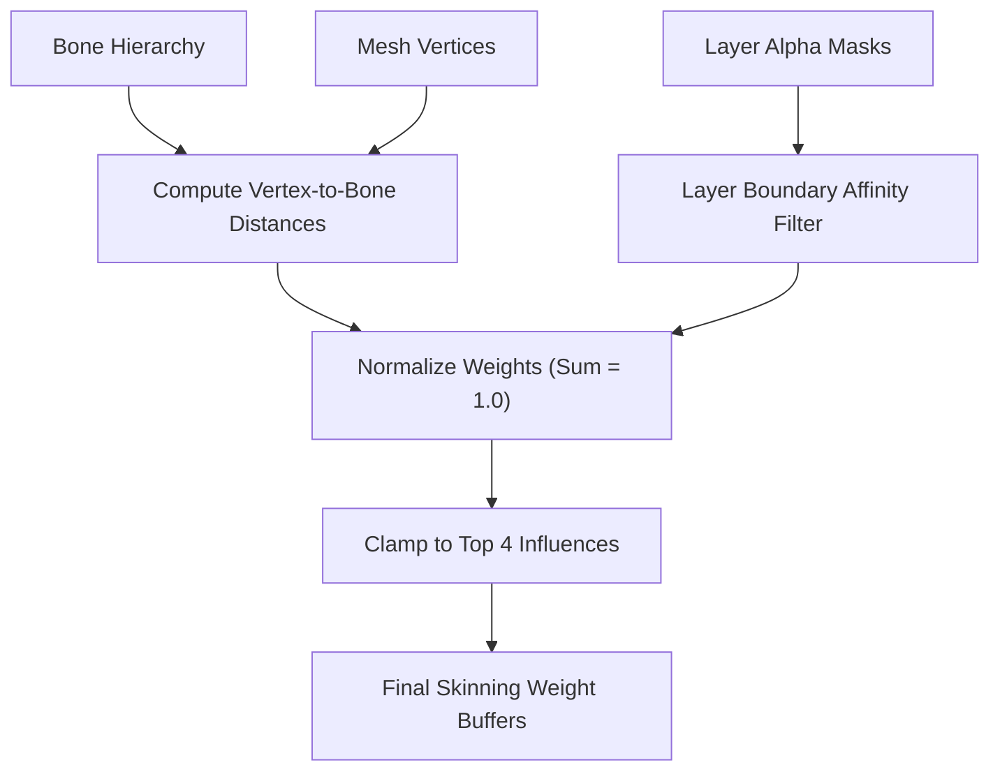

# Parallax Studio — 2D Auto-Rigging & Mesh Topology Standard

This document specifies the Mixamo-style 2D automated rigging pipeline, landmark detection system,
anatomical mesh topology standards (edge loops), and motion template retargeting.

## 1. 2D Auto-Rigging vs. 3D Mixamo

| Feature | 3D Mixamo | Parallax 2D Auto-Rig |
| --- | --- | --- |
| Input Format | 3D Mesh (FBX / OBJ) | Decomposed 2D layers + planar triangle meshes |
| Marker Calibration | 5–7 3D surface points | 10–15 2D joint landmarks on canvas |
| Generated Output | 3D Armature + Skin Weights | 2D Bone Hierarchy + Layer-Aware Skin Weights |
| Motion Library | 3D Motion Capture Clips | Reusable 2D Keyframe Motion Templates |
| Retargeting | 3D Skeletal Retargeting | Proportional Bone Length Retargeting |

## 2. Landmark Detection & Calibration

### 2.1 Standard Humanoid Landmarks

```text
Mandatory Primary Landmarks (10 Joint Centers):

         ①  head_top         Cranial apex
         ②  neck             Cervical joint (head base)
    ③────┼────④              left_shoulder / right_shoulder
    │    │    │
    ⑤    │    ⑥              left_elbow / right_elbow
    │    │    │
    ⑦    ⑧    ⑨              left_wrist / right_wrist / hip_center
         │
    ⑩────┼────⑪              left_hip / right_hip
    │         │
    ⑫         ⑬              left_knee / right_knee
    │         │
    ⑭         ⑮              left_ankle / right_ankle

Optional Articulation Landmarks:
  - left_hand, right_hand     Carpal centers
  - left_foot, right_foot     Tarsal centers
  - spine_mid                 Mid-torso articulation point
  - left_eye, right_eye       Ocular blendshape centers
  - mouth                     Phoneme articulation center
```

### 2.2 Calibration Methods

- **Editor UI**: Animator clicks landmark handles in Setup Mode. Viewport displays real-time skeletal overlays.
- **AI Agent (MCP)**: Agent applies vision analysis to artwork pixel bounds, estimates joint centers,
  and dispatches `rig.set_landmarks` with exact coordinates.

### 2.3 Skeleton Template Taxonomy

| Skeleton Type | Min Landmarks | Typical Bone Count | Use Case |
| --- | --- | --- | --- |
| `humanoid` | 10 | 15–20 | Standard human characters |
| `humanoid-detailed` | 15+ | 25–35 | Articulated hands, facial rigs |
| `chibi` | 10 | 14–18 | Large-headed stylized characters |
| `quadruped` | 12 | 18–24 | Four-legged animals |
| `avian` | 10 | 14–18 | Birds, winged creatures |

### 2.4 Rig-Ready Image Templates

Instead of generating unstructured character poses, users and AI agents select a **Rig-Ready Template**
prior to image generation. The template enforces strict proportions and neutral T-pose or A-pose alignment,
enabling instantaneous auto-rigging with zero to minimal calibration.

#### Rig-Ready Template Schema

```jsonc
{
  "templateId": "humanoid-front-tpose",
  "name": "Humanoid — Front View — T-Pose",
  "skeletonType": "humanoid",
  "view": "front",
  "pose": {
    "name": "t-pose",
    "description": "Standing straight, arms extended horizontally, legs shoulder-width",
    "promptHint": "standing straight, arms extended horizontally to sides, T-pose, legs shoulder-width apart, facing camera directly"
  },
  "proportions": {
    "headTopY": 5,          // 5% from canvas top
    "neckY": 18,            // 18%
    "shoulderY": 22,        // 22%
    "shoulderWidth": 35,    // 35% canvas width
    "elbowY": 42,           // 42%
    "wristY": 58,           // 58%
    "hipY": 50,             // 50%
    "hipWidth": 18,         // 18% canvas width
    "kneeY": 72,            // 72%
    "ankleY": 92            // 92%
  },
  "estimatedLandmarks": {
    "head_top":        { "x": 50, "y": 5 },
    "neck":            { "x": 50, "y": 18 },
    "left_shoulder":   { "x": 32, "y": 22 },
    "right_shoulder":  { "x": 68, "y": 22 },
    "left_elbow":      { "x": 18, "y": 42 },
    "right_elbow":     { "x": 82, "y": 42 },
    "left_wrist":      { "x": 8,  "y": 58 },
    "right_wrist":     { "x": 92, "y": 58 },
    "hip_center":      { "x": 50, "y": 50 },
    "left_hip":        { "x": 41, "y": 52 },
    "right_hip":       { "x": 59, "y": 52 },
    "left_knee":       { "x": 40, "y": 72 },
    "right_knee":      { "x": 60, "y": 72 },
    "left_ankle":      { "x": 39, "y": 92 },
    "right_ankle":     { "x": 61, "y": 92 }
  },
  "basePrompt": "full body character, front view, T-pose, arms extended horizontally, flat lighting, transparent background, centered"
}
```

When dragging handles in the UI, bone lengths, orientations, and weights update reactively without
restarting the pipeline.

## 3. Auto-Skeleton Synthesis

From confirmed landmarks, the engine synthesizes an acyclic bone tree:

```text
Humanoid Bone Hierarchy Mapping:
  Landmark Segment           → Bone Name          Parent Bone
  ───────────────────────────────────────────────────────────
  hip_center → neck          → spine              (root)
  neck → head_top            → head               spine
  neck → left_shoulder       → left_clavicle      spine
  left_shoulder → left_elbow → left_upper_arm     left_clavicle
  left_elbow → left_wrist    → left_forearm       left_upper_arm
  neck → right_shoulder      → right_clavicle     spine
  right_shoulder → right_elbow → right_upper_arm  right_clavicle
  right_elbow → right_wrist  → right_forearm      right_upper_arm
  hip_center → left_hip      → left_hip_bone      spine
  left_hip → left_knee       → left_thigh         left_hip_bone
  left_knee → left_ankle     → left_shin          left_thigh
  hip_center → right_hip     → right_hip_bone     spine
  right_hip → right_knee     → right_thigh        right_hip_bone
  right_knee → right_ankle   → right_shin         right_thigh
```

Bone origin equates to start landmark. Bone vector establishes resting length and rotational angle.
Topological sorting validates acyclic graphs.

## 4. Layer-Aware Proximity Skin Weighting



Standard Euclidean distance weighting fails in 2D because foreground arms physically overlap background torsos.
Parallax Studio solves this via **Layer-Aware Weighting**:
1. **Geometric Proximity**: Evaluates perpendicular distance from vertex to bone segments.
2. **Layer Affinity Filtering**: Vertices residing in the `left-arm` layer prioritize `left_upper_arm` and
   `left_forearm` bones, suppressing influence from overlapping `spine` or `torso` bones.
3. **Seam Overlap Blending**: At designated joint overlap zones, weights smoothly blend between parent and child bones.
4. **Normalization**: Constrained to top 4 influences, normalized strictly to $\sum w_i = 1.0 \pm 0.001$.

## 5. 2D Mesh Topology Standards

Mirroring 3D sub-division modeling where edge loops preserve limb volume during bending,
2D planar animation meshes require structured edge flow.

### 5.1 3D vs. 2D Mesh Topology Equivalents

| 3D Principle | 2D Planar Equivalent |
| --- | --- |
| Concentric edge loops around bending joints | Parallel vertex rings across joint pivot on texture |
| Higher quad density in deformation zones | Denser triangle tessellation at articulated joints |
| Low poly in rigid bone shafts | Coarse triangle tessellation along bone midsections |
| Quad loops around ocular/oral orifices | Closed concentric vertex loops around eyes and mouth |
| UV seams along hidden edges | Planar 1-to-1 texture UV mapping |

### 5.2 Articulation Topology Patterns

#### Facial Topology (`head`)

- **Eye Loops**: $6–8$ closed boundary vertices enclosing each ocular aperture to facilitate clean blinking without warping brows.
- **Mouth Loops**: $8–10$ boundary vertices surrounding the lip contour to support phoneme morphs.
- **Cervical Loop**: Transverse edge loop spanning the neck base for head rotation.
- **Cranial Apex**: Coarse tessellation across forehead and hair masses.

#### Torso Topology (`torso`)

- Transverse shoulder edge loop aligned with the clavicle-to-arm pivot.
- Transverse lumbar edge loop enabling spine flexion and lateral bending.
- Pelvic boundary edge loop separating legs from hips.

#### Limb Topology (`arm` & `leg`)

- **Double Edge Loop Invariant**: Articulated hinge joints (elbows and knees) mandate **$\ge 2$ concentric edge loops**.
  Single-edge joints collapse volume during acute bends ($> 45^\circ$).
- Coarse midsection tessellation along the humerus, radius, femur, and tibia.
- Overlap margins at limb terminals: $\ge 10\%$ of total bone length overlapping adjacent layers.

### 5.3 Layer-to-Bone Topology Mapping

| Layer ID | Mesh Density | Required Edge Loops | Primary Bone Target |
| --- | --- | --- | --- |
| `head` | High (expressions) | Neck transverse loop, ocular/oral rings | `head` |
| `torso` | Medium | Clavicle seam, lumbar waist, pelvic seam | `spine` |
| `pelvis` | Low–Medium | Upper hip waist, lower acetabular seams | `spine` (root) |
| `upper_arm` | Medium | Clavicle overlap, dual elbow concentric loops | `left_upper_arm` / `right_upper_arm` |
| `forearm` | Medium | Dual elbow concentric loops, carpal wrist seam | `left_forearm` / `right_forearm` |
| `hand` | Low | Carpal wrist seam | `left_hand` / `right_hand` |
| `thigh` | Medium | Pelvic overlap, dual patellar knee loops | `left_thigh` / `right_thigh` |
| `shin` | Medium | Dual patellar knee loops, ankle seam | `left_shin` / `right_shin` |
| `foot` | Low | Ankle seam | `left_foot` / `right_foot` |

### 5.4 Pre-Rigging Topology Checklist

1. $\ge 1$ transverse loop at shoulders, hips, and neck.
2. $\ge 2$ concentric loops across elbows and knees.
3. $\ge 10\%$ bone length artwork overlap at articulated seams.
4. $6–8$ closed vertex rings around eye contours (if facial morphs enabled).
5. $8–10$ closed vertex rings around mouth contours (if lip-sync enabled).
6. Zero degenerate triangles ($\text{area} > 0$).
7. All vertex weights normalized to $1.0 \pm 0.001$.

## 6. Motion Templates & Retargeting

### 6.1 Core Reusable Templates

| Category | Template ID | Description | Required Bones |
| --- | --- | --- | --- |
| Idle | `idle-breathe` | Subtle vertical chest oscillation | `spine`, `head` |
| Idle | `idle-look-around` | Subtle head yaw and eye sweep | `head`, `spine` |
| Locomotion | `walk-cycle` | Loopable standard humanoid walk cycle | All limbs, `spine` |
| Locomotion | `run-cycle` | High-cadence athletic run loop | All limbs, `spine` |
| Gesture | `wave-hand` | Single-arm conversational wave | `left_upper_arm`, `left_forearm` |
| Gesture | `nod-yes` | Vertical cranial affirmation | `head`, `neck` |
| Action | `jump-in-place` | Crouch, impulse, air hold, landing squash | All bones |

### 6.2 Proportional Retargeting Engine

Animation templates serialize local rotations (degrees) and relative translational displacements.
When applied to a target skeleton:
1. Bone IDs in the template map to identical bone names in the character rig.
2. Rotations apply directly regardless of character scale.
3. Translational offsets scale proportionally to target bone lengths:
   $$\Delta x_{\text{target}} = \Delta x_{\text{template}} \times \left(\frac{L_{\text{target}}}{L_{\text{template}}}\right)$$
4. Missing bones retain neutral rest poses without throwing exceptions.
5. Extraneous bones on the character remain unmutated in their rest poses.

## 7. MCP Tools for Auto-Rigging

| Tool | Action | Description |
| --- | --- | --- |
| `rig.detect_landmarks` | read | Heuristic boundary analysis proposing joint coordinates |
| `rig.set_landmarks` | write | Sets joint landmark coordinates |
| `rig.get_landmarks` | read | Queries active calibrated landmarks |
| `rig.auto_skeleton` | write | Synthesizes bone tree from landmarks + skeleton type |
| `rig.auto_weights` | write | Evaluates proximity weights with layer masking |
| `rig.preview_skeleton` | read | Renders skeleton overlay atop character artwork |
| `animation.list_templates` | read | Queries available motion templates |
| `animation.apply_template` | write | Retargets motion template onto character rig |
| `animation.adjust_template` | write | Modifies keyframes of applied motion clip |

## 8. Documentation References

- [IMAGE_WORKFLOW.md](IMAGE_WORKFLOW.md) — Layer decomposition and AI asset handoff
- [DEFORMATION_PIPELINE.md](DEFORMATION_PIPELINE.md) — Linear blend skinning and transformation order
- [MCP_TOOLS.md](MCP_TOOLS.md) — Tool specifications and execution schemas
- [PROJECT_FORMAT.md](PROJECT_FORMAT.md) — `rig.json` and `landmarks.json` schema definitions
- [PLAN.md](PLAN.md) section 2 — Multi-view and rigging Master Plan
