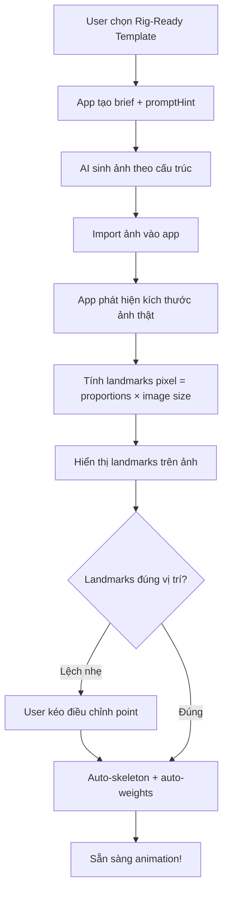
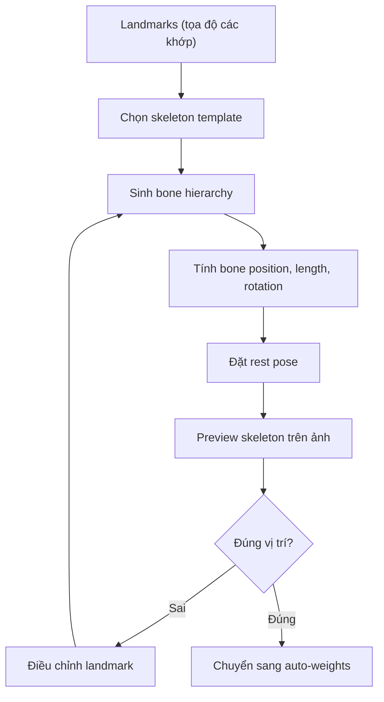
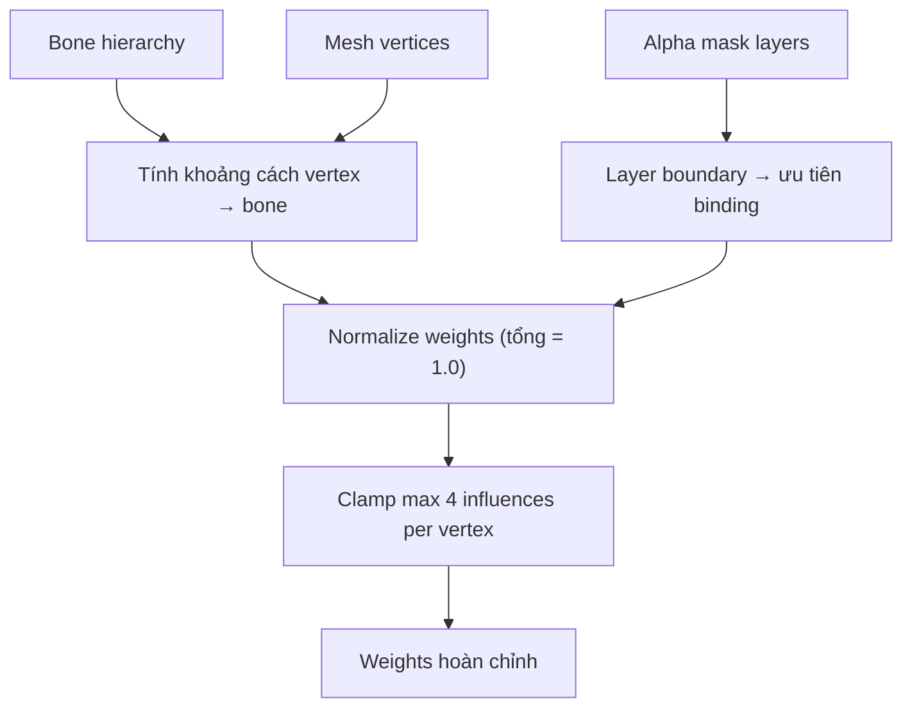
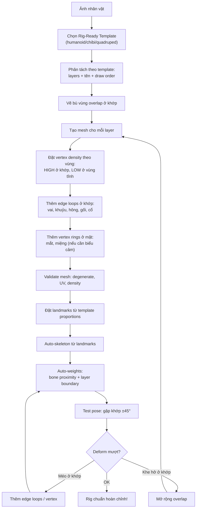
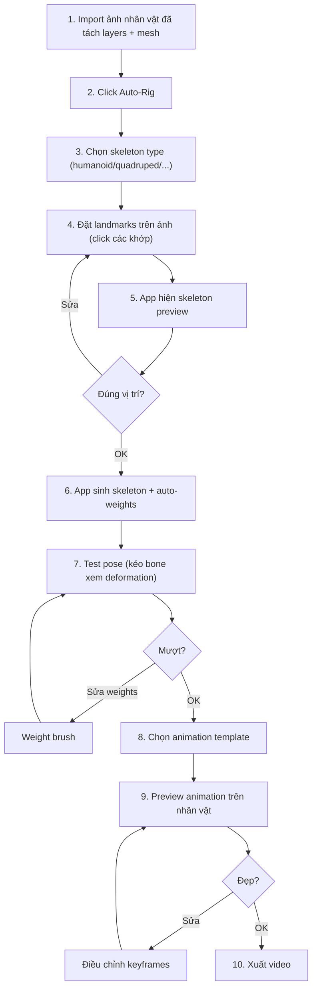

# Auto-Rig: gắn xương và weights tự động kiểu Mixamo cho 2D

Trạng thái: đề xuất thiết kế. Chưa triển khai; tài liệu mô tả cơ chế để AI agent
và người dùng đánh dấu các điểm khớp, từ đó app tự sinh skeleton, weights và
có thể áp animation mẫu — tương tự Mixamo nhưng cho 2D animation.

## 1. So sánh với Mixamo

| Khía cạnh | Mixamo (3D) | Parallax Auto-Rig (2D) |
| --- | --- | --- |
| Input | Model 3D (FBX/OBJ) | Ảnh 2D đã tách layers + mesh |
| Đánh dấu | 5–7 điểm trên model 3D | 10–15 landmarks trên ảnh 2D |
| Output | Skeleton + weights + animation | Bone hierarchy + weights + clip templates |
| Animation library | 2500+ motion capture clips | Bộ 2D animation templates (walk, idle, wave...) |
| Retarget | Áp clip lên model khác | Áp template lên nhân vật khác cùng skeleton type |

## 2. Landmark system — Đánh dấu điểm khớp

### 2.1 Bộ landmarks cho nhân vật người

```text
Landmarks bắt buộc (10 điểm):

         ①  head_top         Đỉnh đầu
         ②  neck             Cổ (gốc đầu)
    ③────┼────④              left_shoulder / right_shoulder
    │    │    │
    ⑤    │    ⑥              left_elbow / right_elbow
    │    │    │
    ⑦    ⑧    ⑨              left_wrist / right_wrist / hip_center
         │
    ⑩────┼────⑪              left_hip / right_hip
    │         │
    ⑫         ⑬              left_knee / right_knee
    │         │
    ⑭         ⑮              left_ankle / right_ankle

Landmarks tùy chọn (mở rộng):
  - left_hand, right_hand         Bàn tay (nếu tách layer)
  - left_foot, right_foot         Bàn chân
  - spine_mid                     Giữa lưng
  - left_eye, right_eye           Mắt (cho biểu cảm)
  - mouth                         Miệng
  - tail_base, tail_tip           Đuôi (nhân vật có đuôi)
  - wing_left, wing_right         Cánh
```

### 2.2 Cách đánh dấu

**Từ UI:** Người dùng click lên ảnh nhân vật để đặt từng landmark. App hiển thị
skeleton preview ngay khi đủ landmarks tối thiểu.

**Từ AI agent:** Agent dùng vision phân tích ảnh, xác định vị trí các khớp,
rồi gọi MCP tool truyền tọa độ landmarks.

```text
AI workflow:
  1. Agent xem ảnh nhân vật (vision)
  2. Agent nhận diện: đây là nhân vật người, anime style
  3. Agent ước lượng vị trí: neck ≈ (512, 280), left_shoulder ≈ (420, 320)...
  4. Agent gọi rig.set_landmarks với danh sách tọa độ
  5. App hiển thị skeleton preview → agent xem → sửa nếu lệch
```

### 2.3 Template skeleton types

| Type | Landmarks tối thiểu | Bone count | Dùng cho |
| --- | --- | --- | --- |
| `humanoid` | 10 (đầu → mắt cá) | 15–20 | Nhân vật người |
| `humanoid-detailed` | 15+ (thêm tay, chân, mắt, miệng) | 25–35 | Nhân vật chính cần biểu cảm |
| `quadruped` | 12 (đầu, cổ, lưng, 4 chân) | 18–24 | Động vật 4 chân |
| `bird` | 10 (đầu, thân, 2 cánh, 2 chân, đuôi) | 14–18 | Chim, rồng |
| `custom` | Tùy chỉnh | Tùy chỉnh | Quái vật, robot, cây... |

### 2.4 Rig-Ready Image Template — Cấu hình tạo ảnh sẵn sàng rig

Thay vì tạo ảnh tự do rồi đánh dấu landmarks thủ công, người dùng chọn một
**Rig-Ready Template** trước khi tạo ảnh. Template này quy định cấu trúc để
ảnh sinh ra tuân thủ sẵn, nên auto-rig áp **ngay lập tức** — chỉ cần kéo
point nếu lệch vài pixel.

#### Rig-Ready Template chứa gì

```jsonc
{
  "templateId": "humanoid-front-tpose",
  "name": "Nhân vật người — Chính diện — T-Pose",
  "skeletonType": "humanoid",
  "view": "front",

  // Pose chuẩn hóa: AI phải tạo ảnh theo pose này
  "pose": {
    "name": "t-pose",
    "description": "Đứng thẳng, hai tay dang ngang, chân mở rộng vai",
    "promptHint": "standing straight, arms extended horizontally to sides, T-pose, legs shoulder-width apart, facing camera directly"
  },

  // Tỷ lệ cơ thể chuẩn (đơn vị: phần trăm chiều cao canvas)
  "proportions": {
    "headTopY": 5,          // đỉnh đầu ≈ 5% từ trên
    "neckY": 18,            // cổ ≈ 18%
    "shoulderY": 22,        // vai ≈ 22%
    "shoulderWidth": 35,    // vai rộng ≈ 35% canvas
    "elbowY": 42,           // khuỷu tay ≈ 42%
    "wristY": 58,           // cổ tay ≈ 58%
    "hipY": 50,             // hông ≈ 50%
    "hipWidth": 18,         // hông rộng ≈ 18% canvas
    "kneeY": 72,            // đầu gối ≈ 72%
    "ankleY": 92            // mắt cá ≈ 92%
  },

  // Danh sách layers bắt buộc
  "requiredLayers": [
    "head", "torso", "pelvis",
    "left-upper-arm", "left-forearm", "left-hand",
    "right-upper-arm", "right-forearm", "right-hand",
    "left-thigh", "left-shin", "left-foot",
    "right-thigh", "right-shin", "right-foot"
  ],

  // Landmarks ước lượng (% canvas width × height)
  // App tính tọa độ pixel thật từ kích thước ảnh
  "estimatedLandmarks": {
    "head_top":        { "x": 50, "y": 5 },
    "neck":            { "x": 50, "y": 18 },
    "left_shoulder":   { "x": 32, "y": 22 },
    "right_shoulder":  { "x": 68, "y": 22 },
    "left_elbow":      { "x": 18, "y": 42 },
    "right_elbow":     { "x": 82, "y": 42 },
    "left_wrist":      { "x": 8,  "y": 58 },
    "right_wrist":     { "x": 92, "y": 58 },
    "hip_center":      { "x": 50, "y": 50 },
    "left_hip":        { "x": 41, "y": 52 },
    "right_hip":       { "x": 59, "y": 52 },
    "left_knee":       { "x": 40, "y": 72 },
    "right_knee":      { "x": 60, "y": 72 },
    "left_ankle":      { "x": 39, "y": 92 },
    "right_ankle":     { "x": 61, "y": 92 }
  },

  // Prompt mẫu cho AI sinh ảnh
  "basePrompt": "full body character, front view, T-pose, arms extended horizontally, flat lighting, transparent background, no shadow, centered in canvas"
}
```

#### Bộ templates mặc định

| Template ID | Pose | View | Skeleton | Layers | Dùng cho |
| --- | --- | --- | --- | --- | --- |
| `humanoid-front-tpose` | T-pose | front | humanoid | 15 | Nhân vật người — rigging tối ưu |
| `humanoid-front-apose` | A-pose | front | humanoid | 15 | Nhân vật người — pose tự nhiên hơn |
| `humanoid-quarter-tpose` | T-pose | quarter | humanoid | 15 | Góc nghiêng cho multi-view |
| `chibi-front-tpose` | T-pose | front | humanoid | 11 | Nhân vật chibi (đầu to, thân nhỏ) |
| `quadruped-side` | Đứng 4 chân | side | quadruped | 10 | Động vật 4 chân |
| `bird-side` | Đứng, cánh xếp | side | bird | 8 | Chim/rồng |

Chibi có tỷ lệ khác (đầu ≈ 35% chiều cao), nên cần template riêng. Không dùng
template `humanoid` cho nhân vật chibi — landmarks sẽ lệch toàn bộ.

#### Luồng sử dụng



**Điểm quan trọng:** Vì ảnh tạo theo cấu trúc chuẩn (T-pose, tỷ lệ quy định),
landmarks ước lượng từ template sẽ **gần đúng ngay** — user chỉ cần kéo
điều chỉnh nếu AI vẽ tay hơi cao hơn hoặc chân hơi rộng hơn dự kiến.

#### Chỉnh landmark bằng kéo (Drag-to-adjust)

```text
Trước khi chỉnh:          Sau khi kéo:
    ①                         ①
    │                         │
 ③──┼──④  ← vai template  ③──┼──④  ← khớp vị trí thật
 │  │  │                    │  │  │
 ⑤  │  ⑥  ← khuỷu lệch    ⑤  │  ⑥  ← khuỷu chính xác
                             (kéo ⑤ xuống 10px)
```

Khi user kéo một landmark:
1. Skeleton cập nhật real-time (bone length/angle thay đổi).
2. Weights tự động recalculate nếu bật auto-weights.
3. Preview deformation cập nhật ngay.
4. Không cần chạy lại toàn bộ pipeline.

#### AI agent flow với Rig-Ready Template

```text
User: "Tạo nhân vật chiến binh, anime style"

Agent thực hiện:
 1. rig.list_templates → danh sách Rig-Ready Templates
 2. Chọn "humanoid-front-tpose" → lấy basePrompt + promptHint
 3. Kết hợp prompt user + template:
    "anime warrior character, full body, front view, T-pose,
     arms extended horizontally, flat lighting, transparent bg"
 4. [Gọi tool sinh ảnh] → ảnh theo cấu trúc T-pose
 5. asset.import_image → import
 6. rig.apply_rig_template("humanoid-front-tpose", imageSize)
    → App tự tính landmarks + auto-skeleton + auto-weights
 7. rig.preview_skeleton → agent xem: "vai hơi cao 5px"
 8. rig.adjust_landmark("left_shoulder", {x: 320, y: 230})
    → cập nhật skeleton + weights ngay
 9. rig.test_pose → deformation OK ✓
10. Asset sẵn sàng!
```

Tổng thời gian từ prompt → rig: **~30 giây** thay vì vài phút đánh dấu thủ công.

## 3. Auto-skeleton: từ landmarks sinh bone hierarchy

### 3.1 Pipeline



### 3.2 Quy tắc sinh bone

Từ landmarks, app sinh bone theo bảng mapping cố định cho mỗi template:

```text
Template humanoid — Bone mapping:

  Landmark pair              → Bone name          Parent
  ─────────────────────────────────────────────────────────
  hip_center → neck          → spine              (root)
  neck → head_top            → head               spine
  neck → left_shoulder       → left_clavicle      spine
  left_shoulder → left_elbow → left_upper_arm     left_clavicle
  left_elbow → left_wrist    → left_forearm       left_upper_arm
  neck → right_shoulder      → right_clavicle     spine
  right_shoulder → right_elbow → right_upper_arm  right_clavicle
  right_elbow → right_wrist  → right_forearm      right_upper_arm
  hip_center → left_hip      → left_hip_bone      spine
  left_hip → left_knee       → left_thigh         left_hip_bone
  left_knee → left_ankle     → left_shin          left_thigh
  hip_center → right_hip     → right_hip_bone     spine
  right_hip → right_knee     → right_thigh        right_hip_bone
  right_knee → right_ankle   → right_shin         right_thigh
```

Bone position = vị trí landmark bắt đầu. Bone length = khoảng cách đến
landmark kết thúc. Rotation = hướng từ landmark bắt đầu đến landmark kết thúc.

### 3.3 Kiểm tra sau khi sinh

- Hierarchy phải acyclic (topological sort thành công).
- Không có bone trùng vị trí (length = 0).
- Đối xứng: left/right bones có length tương đương (cho phép ±10% cho pose
  nghiêng). Cảnh báo nếu lệch quá nhiều, không tự reject.
- Rest pose hợp lệ: InverseBindMatrix tính được cho mọi bone.

## 4. Auto-weights: tự động đặt trọng số

### 4.1 Thuật toán



### 4.2 Heat diffusion + Layer-aware weights

Thuật toán kết hợp hai nguồn thông tin:

**1. Bone proximity (cơ bản):**
- Mỗi vertex tính khoảng cách đến mọi bone.
- Weight tỷ lệ nghịch với khoảng cách: vertex gần bone hơn → weight cao hơn.

**2. Layer boundary (đặc thù 2D):**
- Vertex thuộc layer `left-arm` → ưu tiên bind vào bone `left_upper_arm` hoặc
  `left_forearm`, ngay cả khi bone `spine` gần hơn theo pixel.
- Alpha mask của layer xác định vùng sở hữu của mỗi bộ phận.
- Vùng overlap giữa hai layers (ví dụ vai): blend weights mượt giữa hai bones.

Kết quả: weights tốt hơn so với chỉ dùng khoảng cách — vì thông tin layer
giúp phân biệt các bộ phận chồng lên nhau trong 2D.

### 4.3 Kiểm tra weights

- Tổng weight per vertex = 1.0 ± 0.001.
- Tối đa 4 bone influences per vertex.
- Không có vertex với weight = 0 cho mọi bone (orphan vertex).
- Test pose: xoay từng bone ±45° → kiểm tra vùng deform có hợp lý.

## 5. Mesh topology chuẩn cho 2D animation rigging

Giống 3D cần edge flow chuẩn quanh khớp/mắt/miệng, 2D animation mesh cũng cần
topology đúng ở từng bộ phận để deformation mượt. Đây là cầu nối giữa
**phân tách nhân vật** → **tạo mesh** → **gắn rig chuẩn**.

### 5.1 Nguyên tắc so sánh 3D vs 2D mesh

| Nguyên tắc 3D | Tương đương 2D |
| --- | --- |
| Edge loops quanh khớp xoay (vai, khuỷu, gối) | Vòng vertex dọc theo đường khớp trên texture |
| Quads ở vùng deform, tris ở vùng tĩnh | Mật độ tam giác cao ở vùng deform, thưa ở vùng tĩnh |
| Topology flow theo hướng cơ | Vertex flow theo hướng chuyển động của bộ phận |
| Pole vertex ≤ 5 edges | Không có tam giác suy biến (area ≈ 0) |
| Clean UV unwrap | UV = vị trí pixel trên texture (tự nhiên cho 2D) |

### 5.2 Mesh topology chuẩn cho từng bộ phận

#### Đầu (head)

```text
Mesh pattern — mặt trước:

    ·───·───·───·───·          Trán: ít vertex, ít chuyển động
    │ ╲ │ ╱ │ ╲ │ ╱ │
    ·───●───·───●───·          ● = lông mày: nhiều vertex hơn
    │ ╱ │ ╲ │ ╱ │ ╲ │
    ●───·───·───·───●          ● = đuôi mắt: vertex ring quanh mắt
    │ ╲ │ ╱█╲│╱█│ ╱ │          █ = mắt: vòng vertex kín quanh mắt
    ●───·───·───·───●              cho phép chớp mắt, nheo mắt
    │ ╱ │ ╲ │ ╱ │ ╲ │
    ·───·───●───·───·          ● = mũi
    │ ╲ │ ╱ │ ╲ │ ╱ │
    ·───●───●───●───·          ● = miệng: vòng vertex quanh miệng
    │ ╱ │ ╲ │ ╱ │ ╲ │              cho phép mở miệng, cười, nói
    ·───·───●───·───·          ● = cằm
    │ ╲ │ ╱ │ ╲ │ ╱ │
    ·───·───·───·───·          Cổ: edge loop ngang cho xoay đầu
```

**Quy tắc mesh đầu:**
- Vòng vertex kín quanh mỗi mắt (6–8 vertex) → chớp mắt, nheo, mở to.
- Vòng vertex quanh miệng (8–10 vertex) → mở, cười, buồn, nói.
- Edge loop ngang ở cổ → xoay đầu qua lại không méo.
- Trán và đỉnh đầu: thưa vertex (ít chuyển động).
- Nếu không cần biểu cảm: chỉ cần edge loop ở cổ, mắt/miệng mesh thưa.

#### Thân (torso)

```text
Mesh pattern:

    ·─────·─────·          Vai: edge loop ngang
    │ ╲   │   ╱ │              ↓ phải trùng với khớp vai
    ·───●─┼─●───·          ● = shoulder joint vertices
    │ ╱ │ │ │ ╲ │
    ·───·─┼─·───·          Ngực: vertex trung bình
    │ ╲ │ │ │ ╱ │
    ·───·─┼─·───·          Eo: edge loop ngang
    │ ╱ │ │ │ ╲ │              ↓ cho phép cong lưng/bụng
    ·───●─┼─●───·          ● = hip joint vertices
    │ ╲   │   ╱ │
    ·─────·─────·          Hông: edge loop ngang
```

**Quy tắc mesh thân:**
- Edge loop ngang ở vai → nơi bone clavicle kết thúc, arm bone bắt đầu.
- Edge loop ngang ở eo/bụng → cho phép cong spine (nghiêng, xoay).
- Edge loop ngang ở hông → nơi leg bone bắt đầu.
- Vertex dọc ở giữa thân cho deform cong sang bên.

#### Tay (arm) — Cánh tay trên + dưới

```text
Mesh pattern — cánh tay trên:

    ●───·───●          ● = shoulder vertices (overlap với torso)
    │ ╲ │ ╱ │          Edge loop ngang ở vai
    ·───·───·
    │ ╱ │ ╲ │          Giữa cánh tay: thưa hơn
    ·───·───·
    │ ╲ │ ╱ │
    ●───·───●          ● = elbow vertices
    │ ╱ │ ╲ │          Edge loop ngang ở khuỷu tay
    ·───·───·              → QUAN TRỌNG: 2 vòng edge loop

Mesh pattern — cánh tay dưới:

    ●───·───●          ● = elbow vertices (overlap với upper arm)
    │ ╲ │ ╱ │
    ·───·───·          Giữa: thưa
    │ ╱ │ ╲ │
    ●───·───●          ● = wrist vertices
                       Edge loop ngang ở cổ tay
```

**Quy tắc mesh tay:**
- **2 edge loops ở khuỷu tay** — khuỷu là khớp xoay lớn, cần ≥ 2 vòng vertex
  để gập tay không méo. Đây là nơi quan trọng nhất cho mesh tay.
- Edge loop ở vai: vertex phải overlap với torso mesh.
- Edge loop ở cổ tay: ranh giới với bàn tay.
- Giữa cánh tay: vertex thưa, ít deform.

#### Chân (leg) — Đùi + ống chân

```text
Mesh pattern — đùi:

    ●───·───●          ● = hip vertices (overlap với pelvis)
    │ ╲ │ ╱ │
    ·───·───·          Giữa đùi: thưa
    │ ╱ │ ╲ │
    ·───·───·
    │ ╲ │ ╱ │
    ●───·───●          ● = knee vertices
    │ ╱ │ ╲ │          2 edge loops ở đầu gối
    ●───·───●

Mesh pattern — ống chân:

    ●───·───●          ● = knee vertices
    │ ╲ │ ╱ │
    ·───·───·          Giữa: thưa
    │ ╱ │ ╲ │
    ●───·───●          ● = ankle vertices
```

**Quy tắc mesh chân:**
- **2 edge loops ở đầu gối** — tương tự khuỷu tay.
- Edge loop ở hông: overlap với pelvis.
- Edge loop ở mắt cá: ranh giới với bàn chân.

### 5.3 Bảng tương ứng: Layer → Mesh → Bone

| Layer (bộ phận ảnh) | Mesh density | Edge loops ở đâu | Bone(s) bind | Ghi chú |
| --- | --- | --- | --- | --- |
| head | High (biểu cảm) hoặc Medium | Cổ, quanh mắt, quanh miệng | head | Morph targets cho biểu cảm |
| torso | Medium | Vai, eo, hông | spine | Cong lưng, xoay nhẹ |
| pelvis | Low–Medium | Hông trên, hông dưới | spine (gốc) | Ít deform |
| upper-arm | Medium | Vai (overlap torso), khuỷu ×2 | upper_arm | Gập khuỷu |
| forearm | Medium | Khuỷu (overlap upper-arm), cổ tay | forearm | Xoay cổ tay |
| hand | Low | Cổ tay | hand | Ít deform (trừ ngón tay) |
| thigh | Medium | Hông (overlap pelvis), gối ×2 | thigh | Gập gối |
| shin | Medium | Gối (overlap thigh), mắt cá | shin | Nhấc chân |
| foot | Low | Mắt cá | foot | Ít deform |

### 5.4 Vertex density map — Mật độ vertex theo vùng

```text
Nhân vật người (front view) — Mật độ vertex:

    ┌─────────────────────┐
    │      ░░░░░░░░       │   ░ = LOW: trán, đỉnh đầu
    │    ▓▓████████▓▓     │   ▓ = MEDIUM: má, tai
    │    ▓▓█EYES██▓▓     │   █ = HIGH: mắt (vòng vertex)
    │      ▓▓▓▓▓▓▓▓       │
    │      ██MOUTH██      │   █ = HIGH: miệng
    │      ▓▓▓▓▓▓▓▓       │
    │    ████NECK████     │   █ = HIGH: cổ (edge loop xoay đầu)
    ├──███──┤    ├──███──┤   █ = HIGH: vai (khớp)
    │  ▓▓▓  │    │  ▓▓▓  │   ▓ = MEDIUM: thân
    │  ▓▓▓  │    │  ▓▓▓  │
    ├──███──┤    ├──███──┤   █ = HIGH: khuỷu tay
    │  ▓▓▓  │    │  ▓▓▓  │
    │  ███  │    │  ███  │   █ = HIGH: cổ tay
    │  ░░░  │    │  ░░░  │   ░ = LOW: bàn tay
    │       │ ▓▓ │       │   ▓ = MEDIUM: bụng, eo
    │       ├████┤       │   █ = HIGH: hông (khớp)
    │       │ ▓▓ │       │
    │       │ ▓▓ │       │   ▓ = MEDIUM: đùi
    │       ├████┤       │   █ = HIGH: đầu gối
    │       │ ▓▓ │       │
    │       │ ▓▓ │       │   ▓ = MEDIUM: ống chân
    │       ├████┤       │   █ = HIGH: mắt cá
    │       │ ░░ │       │   ░ = LOW: bàn chân
    └───────┴────┴───────┘
```

### 5.5 Quy tắc overlap giữa layers ở khớp

Khi phân tách nhân vật thành layers, vùng khớp phải **overlap** giữa hai
layer liền kề. Mesh ở vùng overlap có weights blend giữa hai bones:

```text
Layer upper-arm          Layer forearm
┌──────────┐             ┌──────────┐
│          │             │          │
│  arm     │             │  forearm │
│          │             │          │
│  ●───●───●─ ─ ─ ─     │          │
│  │ overlap│ ←─ vùng    ─ ─ ─●───●─│──●
│  ●───●───●─ ─ ─ ─     │    │overlap│
│          │      ↑      │    ●───●─│──●
└──────────┘  cả hai     └──────────┘
              layer có
              pixel ở đây

Weights ở vùng overlap:
  - Vertex gần upper-arm bone: w(upper_arm) = 0.8, w(forearm) = 0.2
  - Vertex ở giữa overlap:     w(upper_arm) = 0.5, w(forearm) = 0.5
  - Vertex gần forearm bone:   w(upper_arm) = 0.2, w(forearm) = 0.8
```

**Quy tắc overlap:**
- Overlap ≥ 10% bone length (ví dụ: upper-arm dài 100px → overlap ≥ 10px).
- Vertex ở vùng overlap thuộc **cả hai layers** — cả hai cần vẽ pixel ở đó.
- Mesh ở overlap: weights gradient mượt, không nhảy đột ngột.
- Nếu không có overlap → khi gập khớp sẽ lộ khe hở giữa hai layers.

### 5.6 Pipeline tổng hợp: phân tách → mesh → rig



### 5.7 Kiểm tra mesh-rig sẵn sàng

| Kiểm tra | Tiêu chí | Lỗi nếu thiếu |
| --- | --- | --- |
| Edge loops ở mọi khớp | ≥ 1 vòng vertex tại vai, khuỷu, hông, gối, cổ | Méo khi gập |
| Edge loops khuỷu/gối | ≥ 2 vòng vertex | Gập mạnh bị gấp nếp |
| Overlap ở khớp | ≥ 10% bone length | Khe hở khi gập |
| Vertex rings ở mắt | 6–8 vertex vòng kín (nếu cần biểu cảm) | Morph mắt bị méo |
| Vertex rings ở miệng | 8–10 vertex vòng kín (nếu cần lip sync) | Morph miệng bị méo |
| Layer → bone mapping | Mỗi layer map đúng vào bone(s) | Weights sai |
| No degenerate triangles | Mọi tam giác area > 0 | Render lỗi |
| Consistent across views | Mesh topology tương thích giữa views | Morph cross-view lỗi |

## 6. Animation templates — Thư viện chuyển động 2D

### 6.1 Bộ templates cơ bản

| Category | Template name | Mô tả | Bones cần |
| --- | --- | --- | --- |
| Idle | `idle-breathe` | Thở nhẹ, dao động nhỏ | spine, head |
| Idle | `idle-look-around` | Ngó xung quanh | head, spine |
| Walk | `walk-cycle` | Đi bộ loop | tất cả chân, tay, spine |
| Walk | `walk-slow` | Đi chậm | tất cả chân, tay, spine |
| Run | `run-cycle` | Chạy loop | tất cả |
| Wave | `wave-hand` | Vẫy tay | arm (một bên) |
| Nod | `nod-yes` | Gật đầu | head, neck |
| Nod | `nod-no` | Lắc đầu | head, neck |
| Jump | `jump-in-place` | Nhảy tại chỗ | tất cả |
| Emotion | `happy-bounce` | Nhún vui vẻ | spine, head, arms |
| Emotion | `sad-slump` | Cúi đầu buồn | spine, head |
| Talk | `talk-gesture` | Nói chuyện có cử chỉ tay | head, arms |

### 6.2 Cấu trúc template

```jsonc
{
  "templateId": "walk-cycle",
  "name": "Walk Cycle",
  "category": "walk",
  "skeletonType": "humanoid",       // phải khớp skeleton type của asset
  "duration": 1.0,                  // giây, 1 cycle
  "loopable": true,
  "requiredBones": ["spine", "head", "left_thigh", "left_shin",
                    "right_thigh", "right_shin", "left_upper_arm",
                    "left_forearm", "right_upper_arm", "right_forearm"],
  "keyframes": {
    "spine": [
      { "time": 0.0, "rotation": 0, "translate": { "y": 0 } },
      { "time": 0.25, "rotation": 2, "translate": { "y": 5 } },
      { "time": 0.5, "rotation": 0, "translate": { "y": 0 } },
      { "time": 0.75, "rotation": -2, "translate": { "y": 5 } }
    ],
    "left_thigh": [
      { "time": 0.0, "rotation": -30 },
      { "time": 0.5, "rotation": 30 }
    ]
    // ... các bones khác
  }
}
```

### 6.3 Retarget — áp template lên nhân vật khác

Template lưu rotation/translation tương đối cho từng bone. Khi áp lên nhân vật
mới có cùng skeleton type:

1. Khớp tên bone của template với tên bone của nhân vật.
2. Scale translation theo tỷ lệ kích thước bone (nhân vật to → bước dài hơn).
3. Rotation áp trực tiếp (không phụ thuộc kích thước).
4. Preview → agent hoặc user kiểm tra, điều chỉnh nếu cần.

**Ràng buộc:**
- Template `humanoid` chỉ áp lên skeleton type `humanoid`.
- Bones thiếu trong template → giữ rest pose (không phá nhân vật).
- Bones thừa trong nhân vật không có trong template → giữ rest pose.
- Scale chỉ theo tỷ lệ bone length, không tự ý thay đổi phong cách animation.

## 7. Luồng hoàn chỉnh: Mixamo-style cho 2D

### 7.1 User flow (UI)



### 7.2 AI agent flow (MCP)

```text
Agent nhận yêu cầu: "Tạo nhân vật đi bộ"

 1. asset.prepare_image_brief → brief cho AI sinh ảnh
 2. [Gọi tool sinh ảnh] → ảnh nhân vật
 3. asset.import_image → import ảnh
 4. asset.attach_layer × N → tách và gắn layers
 5. mesh.generate → tạo mesh tự động

 --- Auto-Rig bắt đầu ---
 6. rig.detect_landmarks → AI phân tích ảnh, đề xuất vị trí khớp
 7. rig.set_landmarks → đặt landmarks (agent điều chỉnh nếu cần)
 8. rig.auto_skeleton(type: "humanoid") → sinh skeleton từ landmarks
 9. rig.auto_weights → tự động đặt weights
10. rig.test_pose(bone: "left_thigh", rotation: 30) → preview
11. Agent xem preview (vision): "deformation OK ✓"

 --- Animation template ---
12. animation.list_templates(skeleton: "humanoid") → danh sách
13. animation.apply_template("walk-cycle") → áp walk animation
14. animation.preview_frame(time: 0.25) → xem frame giữa
15. Agent xem: "walk cycle mượt ✓"

16. export.start_job → xuất video
```

### 7.3 Thời gian ước lượng

| Bước | User (UI) | AI agent (MCP) |
| --- | --- | --- |
| Đánh dấu landmarks | 30–60 giây | 5–10 giây (vision + 1 API call) |
| Auto-skeleton | Instant | Instant |
| Auto-weights | 1–3 giây | 1–3 giây |
| Chọn + áp template | 10–20 giây | 2–5 giây |
| **Tổng (sau khi có mesh)** | **~2 phút** | **~20 giây** |

## 8. MCP tools cho auto-rig

Đây là các tool mới bổ sung vào [MCP_TOOLS.vi.md](MCP_TOOLS.vi.md):

| Tool | Loại | Mô tả |
| --- | --- | --- |
| `rig.detect_landmarks` | read | App phân tích ảnh, đề xuất landmarks (nếu có heuristic) |
| `rig.set_landmarks` | write | Đặt landmarks theo tọa độ agent chỉ định |
| `rig.get_landmarks` | read | Đọc landmarks hiện tại |
| `rig.auto_skeleton` | write | Sinh skeleton từ landmarks + template type |
| `rig.auto_weights` | write | Tự động đặt weights theo bone proximity + layer |
| `rig.preview_skeleton` | read | Trả ảnh skeleton overlay lên nhân vật |
| `animation.list_templates` | read | Danh sách animation templates khả dụng |
| `animation.apply_template` | write | Áp template lên skeleton hiện tại |
| `animation.adjust_template` | write | Sửa keyframes của template đã áp |

## 9. Giới hạn

- Auto-weights dựa vào bone proximity + layer mask: tốt cho nhân vật có layers
  tách rõ ràng, kém hơn nếu layers chồng lấp phức tạp.
- Animation templates có giới hạn phong cách — walk cycle template cho anime
  khác chibi. User/agent có thể cần điều chỉnh keyframes sau khi áp.
- Retarget chỉ hoạt động khi skeleton types khớp — không áp template `humanoid`
  lên skeleton `quadruped`.
- Landmarks phải đặt đúng — sai một vài pixel ở cổ hoặc hông tạo deformation
  xấu. Cần preview và iteration.
- App có thể đề xuất landmarks bằng heuristic đơn giản (tìm trung tâm layer,
  đầu/cuối bone dựa trên alpha shape), nhưng AI agent với vision sẽ chính xác hơn.

## 10. Liên kết

- [IMAGE_WORKFLOW.vi.md](IMAGE_WORKFLOW.vi.md) mục 6–8 — tách layers, mesh, AI pipeline
- [DEFORMATION_PIPELINE.vi.md](DEFORMATION_PIPELINE.vi.md) — thứ tự deformation
- [MCP_TOOLS.vi.md](MCP_TOOLS.vi.md) — catalog tools (bao gồm auto-rig tools)
- [PROJECT_FORMAT.vi.md](PROJECT_FORMAT.vi.md) — rig data format
- [PLAN.vi.md](PLAN.vi.md) mục 2 — cơ chế nhiều góc nhìn từ ảnh
- [GLOSSARY.vi.md](GLOSSARY.vi.md) — thuật ngữ: bone, weights, landmark, rest pose
