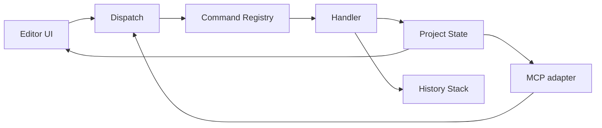
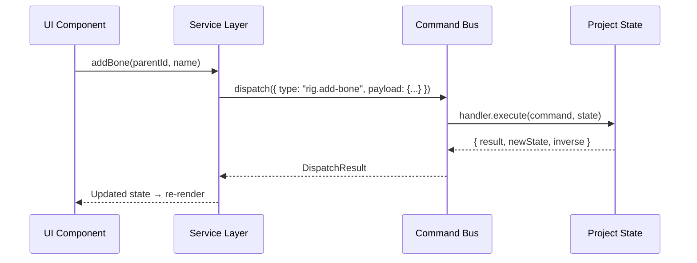

# Command Bus, undo/redo, and transactions

Status: proposed design. This has not been implemented in the source; this document defines
the architecture and constraints for Milestones 0–1.

## 1. Role

The Command Bus is the sole coordination layer for every project-state change. Both the UI and
MCP go through the Command Bus instead of mutating state directly. This ensures:

- A single source of truth for project state.
- Consistent undo/redo regardless of whether a change originates from the UI or MCP.
- Every change has a revision, audit trail, and replay capability.



## 2. Command structure

Each command is an immutable object that describes the **intent of a change**, not how the
change is performed.

```ts
interface Command<TPayload = unknown, TResult = unknown> {
  /** Command type used to find the handler. Example: "rig.add-bone" */
  readonly type: string;

  /** Input data for the command */
  readonly payload: TPayload;

  /** Unique ID for this dispatch (UUID v4) */
  readonly commandId: string;

  /** Project revision at the time the command was created */
  readonly baseRevision: number;
}
```

### Type naming convention

```text
<domain>.<action>

Examples:
  asset.create
  asset.import-image
  asset.attach-view
  rig.add-bone
  rig.set-weights
  animation.set-keyframe
  animation.delete-clip
  scene.add-instance
  scene.set-camera
  export.start-job
  export.cancel-job
  project.save
```

The domain matches a directory in `packages/application/src/commands/`.

## 3. Handler

Each command type has exactly one handler. The handler receives the command and current state,
then returns the result and undo information.

```ts
interface CommandHandler<TPayload, TResult> {
  readonly type: string;

  /** Validate the payload and state before execution */
  validate(command: Command<TPayload>, state: ProjectState): ValidationResult;

  /** Execute the command and return the result and inverse command for undo */
  execute(
    command: Command<TPayload>,
    state: ProjectState,
  ): CommandResult<TResult>;
}

interface CommandResult<TResult> {
  /** Result returned to the caller */
  result: TResult;

  /** New state after applying the command */
  newState: ProjectState;

  /** Reverse command for undo. null if the command cannot be undone */
  inverse: Command | null;

  /** New revision */
  newRevision: number;
}
```

### Handler rules

- A handler does not import React, the DOM, Three.js, or direct I/O.
- A handler only reads the old state and creates a new state; it does not mutate the old state
  in place.
- Validation is separate from execution so the caller can use a dry run to check the command.
- A validation failure returns a readable message and does not throw an uncontrolled exception.

## 4. Registry and dispatch

```ts
class CommandBus {
  private handlers = new Map<string, CommandHandler>();
  private history: HistoryStack;

  /** Register a handler for a command type */
  register(handler: CommandHandler): void;

  /** Dispatch and execute a command */
  dispatch<TPayload, TResult>(
    command: Command<TPayload>,
  ): DispatchResult<TResult>;

  /** Dispatch multiple commands as one transaction */
  dispatchBatch(commands: Command[]): BatchResult;
}
```

### Conflict detection

- The command's `baseRevision` is compared with the current revision.
- If the revisions do not match, the handler decides whether it can proceed or must reject.
- By default, commands that create or delete entities reject on conflict; a command that changes
  a property may merge if it does not overlap the conflicting property.

## 5. Transaction (batch)

When multiple commands must execute atomically:

```ts
interface BatchResult {
  /** Success means all commands were committed */
  success: boolean;

  /** On failure, state is rolled back to its value before the batch */
  error?: string;

  /** Results for individual commands, when successful */
  results: CommandResult[];

  /** One inverse used to undo the complete batch */
  batchInverse: Command[];
}
```

### Batch rules

- All or nothing: if command N fails, roll back commands 1 through N-1.
- A batch creates one entry in the history stack, not N separate entries.
- MCP commonly uses a batch for compound operations, for example creating an asset, importing
  an image, generating a mesh, and creating a rig in one operation.
- A batch has a command-count limit (50 by default) to prevent excessively large transactions.

## 6. Undo/redo

### Strategy: command-based inverse

When executed, each command returns an inverse command. Undo dispatches that inverse command.

```text
User action:    rig.add-bone { name: "arm", parentId: "spine" }
State:          bone "arm" added, revision 43
Inverse:        rig.delete-bone { boneId: "arm-uuid" }

Undo:           dispatch inverse → bone "arm" removed, revision 44
Redo:           dispatch original command again → bone "arm" added again, revision 45
```

### History stack

```ts
interface HistoryStack {
  /** Add a new entry and clear the redo stack after it */
  push(entry: HistoryEntry): void;

  /** Undo: dispatch the inverse and move the entry to the redo stack */
  undo(): UndoResult;

  /** Redo: dispatch the original command and move it back to the undo stack */
  redo(): RedoResult;

  /** Entry limit (100 by default) */
  readonly maxEntries: number;

  /** Clear history when switching projects or when requested */
  clear(): void;
}

interface HistoryEntry {
  /** Original command that was executed */
  command: Command;

  /** Inverse command for undo */
  inverse: Command;

  /** Timestamp */
  timestamp: number;

  /** Short description displayed in the UI */
  description: string;
}
```

### Limits and edge cases

- The history stack has a fixed limit (100 entries by default, configurable).
- The oldest entry is removed when the stack is full, so undo is not unlimited.
- Dispatching a new command clears the redo stack (standard behavior).
- A batch command creates one entry; undoing a batch dispatches all inverses in reverse order.
- A command without an inverse, such as video export, is not added to the history stack.

## 7. Revision and persistence

- Every successfully committed command increments the manifest `revision` by 1.
- Saving a project writes the current revision to the manifest.
- Loading a project restores the revision from the manifest; the history stack starts empty.
- An export job stores `snapshotRevision`, the revision at the time the job starts.

### Relationship with autosave

- Autosave writes the entire current state together with the revision.
- The history stack is **not** persisted through autosave/load in the first version.
  Persisting history is a later feature and requires inverse commands to be serialized.

## 8. UI integration



- A UI component does not create a Command directly; it calls through the service layer.
- The service layer creates the command with the correct type, payload, and baseRevision.
- A state change causes the UI to re-render through a React state/context subscription.
- Ctrl+Z / Ctrl+Y causes the service to call `history.undo()` / `history.redo()`.

## 9. MCP integration

- An MCP tool handler calls the same service layer as the UI.
- Batch commands are especially useful for MCP because an agent commonly performs several
  consecutive steps (create asset, import, mesh, rig) that need atomicity.
- MCP returns `commandId` and `revision` so the agent can track progress.
- Retry: the same `commandId` does not create a duplicate entity (idempotency check).

## 10. Error handling

| Error type | Handling |
| --- | --- |
| Validation failure | Return an error with a readable message; state remains unchanged |
| Revision conflict | Reject or merge depending on the command type |
| Handler exception | Catch, log, leave state unchanged, and return an internal error |
| Partial batch failure | Roll back every command in the batch |
| Inverse execution failure | Log the error; state may be inconsistent and requires recovery |

An inverse execution failure is the most serious case. The system must:
- Log the complete original command and the inverse that failed.
- Provide a recovery mechanism that reloads the project from the last save.
- Never silently ignore the failure; the UI must notify the user.

## 11. References

- [PLAN.md](PLAN.md) section 5 — the Command Bus is the central coordinator
- [PROJECT_FORMAT.md](PROJECT_FORMAT.md) — revision in the manifest
- [MODULE_MAP.md](MODULE_MAP.md) — `packages/application/src/commands/` and
  `packages/application/src/history/`
- [CODING_RULES.md](CODING_RULES.md) section 5 — module boundaries
