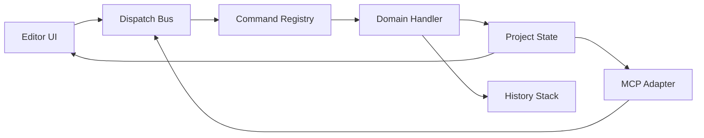
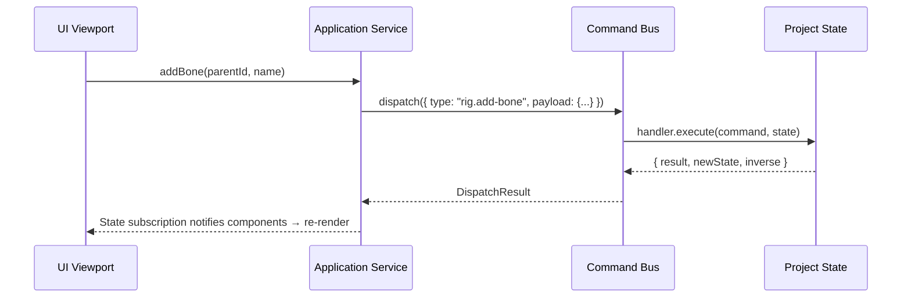

# Parallax Studio — Command Bus, Transactions & Undo/Redo

This document specifies the authoritative Command Bus architecture, transactional execution,
and undo/redo history mechanics. Codified under `packages/application/`.

## 1. Architectural Role

The Command Bus is the sole authoritative gateway for mutating project state.
Both the Editor UI and external MCP tools dispatch commands through this bus rather than mutating
in-memory state directly. This guarantees:

- A single authoritative source of truth for project state.
- Identical undo/redo semantics whether mutations originate from user clicks or AI agent tools.
- Complete audit trails, monotonic revision numbering, and deterministically replayable mutations.



## 2. Command Structure

Every command is an immutable data object specifying an **intent to mutate**, not the imperative mutation steps.

```ts
export interface Command<TPayload = unknown, TResult = unknown> {
  /** Unique command type identifier, e.g. "rig.add-bone" */
  readonly type: string;

  /** Strongly typed input payload conforming to domain contracts */
  readonly payload: TPayload;

  /** Unique dispatch instance UUID v4 for idempotency checking */
  readonly commandId: string;

  /** Expected project revision at the moment of command creation */
  readonly baseRevision: number;
}
```

### Naming Conventions

Commands follow `<domain>.<action>` names matching directories in `packages/application/src/commands/`:

```text
asset.create
asset.import-image
asset.attach-view
mesh.generate
mesh.refine
rig.add-bone
rig.adjust-landmark
rig.set-weights
animation.set-keyframe
animation.delete-clip
scene.add-instance
scene.set-camera
export.start-job
export.cancel-job
project.save
```

## 3. Command Handlers

Every command type is handled by exactly one registered domain handler.
Handlers receive the immutable command and current project state, executing validation and pure transformations.

```ts
export interface CommandHandler<TPayload, TResult> {
  readonly type: string;

  /** Pure validation of payload against current project state prior to execution */
  validate(command: Command<TPayload>, state: ProjectState): ValidationResult;

  /** Pure state transformation producing updated state and compensating inverse command */
  execute(
    command: Command<TPayload>,
    state: ProjectState,
  ): CommandResult<TResult>;
}

export interface CommandResult<TResult> {
  result: TResult;
  newState: ProjectState;
  inverse: Command | null;
  newRevision: number;
}
```

### Handler Invariants

- Handlers must never import React, the DOM, Three.js, or file system APIs.
- Handlers produce new state objects immutably; in-place mutations on existing state are prohibited.
- Validation is decoupled from execution, enabling dry-run checks prior to commit.
- Validation failures return structured error messages; unhandled exceptions are prohibited.

## 4. Registry and Dispatch

```ts
export class CommandBus {
  private handlers = new Map<string, CommandHandler>();
  private history: HistoryStack;

  register(handler: CommandHandler): void;
  dispatch<TPayload, TResult>(command: Command<TPayload>): DispatchResult<TResult>;
  dispatchBatch(commands: Command[]): BatchResult;
}
```

### Concurrency & Conflict Detection

- The incoming `baseRevision` is validated against the active state revision.
- In single-user desktop mode, out-of-order commands with non-conflicting field targets
  may merge cleanly; structural mutations (creating or deleting assets/bones) reject on revision conflict.

## 5. Transactions (Batch Execution)

When multiple operations must commit atomically:

```ts
export interface BatchResult {
  success: boolean;
  error?: string;
  results: CommandResult[];
  batchInverse: Command[];
}
```

### Transaction Rules

- All-or-nothing atomicity: if command $N$ in a batch fails, commands $1 \dots N-1$ are rolled back immediately.
- A batch creates a single composite entry in the undo/redo history stack.
- MCP agents utilize batching for composite workflows (e.g., create asset + import artwork + generate mesh + auto-rig).
- Batch size is capped at 50 commands per transaction to bound memory pressure.

## 6. Undo/Redo Engine

### Inverse Command Pattern

Every executed command generates a concrete inverse command. Undo executes the inverse command.

```text
Action:         rig.add-bone { name: "arm", parentId: "spine" }
State:          Bone "arm" added, Revision 43
Inverse:        rig.delete-bone { boneId: "arm-uuid" }

Undo Trigger:   Dispatch inverse → Bone "arm" deleted, Revision 44
Redo Trigger:   Dispatch original command → Bone "arm" restored, Revision 45
```

### History Stack

```ts
export interface HistoryStack {
  push(entry: HistoryEntry): void;
  undo(): UndoResult;
  redo(): RedoResult;
  readonly maxEntries: number;
  clear(): void;
}

export interface HistoryEntry {
  command: Command;
  inverse: Command;
  timestamp: number;
  description: string;
}
```

- Default history depth is capped at 100 entries.
- Oldest entries drop off the stack when capacity is reached.
- Committing a new forward command purges the redo stack.
- Non-undoable commands (e.g., starting an offline export job) do not push onto the history stack.

## 7. Monotonic Revisions and Persistence

- Every successfully committed command increments the global project `revision` by exactly 1.
- Saving a project serializes the current revision into `manifest.json`.
- Opening a project restores the revision; the history stack initializes empty.
- Export render jobs capture `snapshotRevision` to ensure frame consistency.
- Autosave snapshots persist the active revision; transient history stacks are not saved across disk reboots in V1.

## 8. Client Integration

### Editor UI Integration



- UI components invoke the Application Service client rather than formatting raw commands.
- `Ctrl+Z` and `Ctrl+Y` shortcuts dispatch `history.undo()` and `history.redo()`.

### MCP Integration

- MCP tool handlers invoke the identical Application Service endpoints.
- Tool responses return `commandId` and new `revision` for agent verification.
- Idempotency: re-dispatching with the same `commandId` returns the cached result without duplicate execution.

## 9. Error Recovery Matrix

| Error Condition | Resolution Strategy |
| --- | --- |
| Validation Failure | Return user-facing error message; state remains unmutated |
| Revision Conflict | Reject or merge depending on command type |
| Handler Exception | Catch exception, log error, preserve existing state |
| Batch Partial Failure | Roll back all prior commands in the batch in reverse order |
| Inverse Failure | Critical error: log diagnostic state and trigger project recovery reload |

## 10. Documentation References

- [PLAN.md](PLAN.md) section 5 — Command Bus as core synchronization hub
- [PROJECT_FORMAT.md](PROJECT_FORMAT.md) — Revision tracking in `manifest.json`
- [MODULE_MAP.md](MODULE_MAP.md) — Ownership in `packages/application/`
- [CODING_RULES.md](CODING_RULES.md) section 5 — Architectural boundaries
