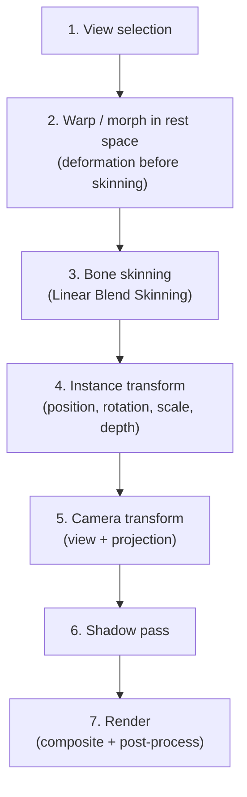

# Deformation Pipeline and Processing Order

Status: proposed design. This is a core technical contract—preview and export
must produce the same result at the same point in time when using this pipeline.

## 1. Official deformation order



This order is invariant. Every code path—the preview loop, export frames, and
MCP test pose—must invoke the steps in exactly this order. A code path must not
skip steps, reverse their order, or add a private step of its own.

## 2. Details of each step

### Step 1 — View Selection

**Input:** Asset instance, viewing direction relative to the camera, and control
parameters when a clip or parameter is used instead of automatic selection.

**Processing:**
- Determine the appropriate view from the asset's view set.
- Compare the viewing direction with the available angles: front,
  quarter-left, quarter-right, side, and so on.
- Apply a hysteresis threshold to prevent flicker at the boundary between two
  views. The default is ±5°, configurable per asset.
- If the asset has no suitable view, retain the current view and log a warning.
  Do not simulate one angle by deforming the previous view into the next view.

**Output:** The selected view ID, which determines which mesh, texture, pivot,
and bindings are used.

**Coordinate space:** Not applicable. This step selects data and does not
transform vertices.

### Step 2 — Warp and morph in rest space

**Input:** The selected view's mesh, warp-grid parameters, and morph-target
weights.

**Processing:**
- Apply warp-grid deformation to vertex positions in rest space.
- Apply morph targets, if any, according to their blend weights.
- Internal order: warp first, then morph, because morphs typically refine a
  result whose direction has already been roughly corrected by the warp.

**Constraints:**
- Morphing works only between meshes with compatible topology: the same vertex
  count and the same triangle indices. If topology differs, switch views
  discretely at an appropriate point in time; do not interpolate vertices.
- The default warp-grid resolution is 4×4 control points and may be increased
  to 8×8 for more complex deformation. A grid larger than 16×16 requires a
  reason and a performance review.

**Coordinate space:** Rest space—the original texture coordinate space before
bone skinning moves vertices according to the skeleton.

### Step 3 — Bone skinning (Linear Blend Skinning)

**Input:** Vertex positions after warp/morph from step 2, bone transforms at the
current frame, bind-pose matrices, and weights.

**Processing:**

```text
v' = Σ (weight_i × BoneMatrix_i × InverseBindMatrix_i × v)
```

Where:
- `v` = vertex position after warp/morph
- `BoneMatrix_i` = world transform of bone i at the current frame
- `InverseBindMatrix_i` = inverse of the bind-pose matrix of bone i
- `weight_i` = the vertex's skin weight for bone i; the sum is 1.0
- `v'` = vertex position in asset local space

**Constraints:**
- No more than four bone influences per vertex. Common GPU skinning supports
  four; increasing this number requires shader and performance validation.
- Weights must be normalized: total weight per vertex = 1.0 ± 0.001.
- The bone hierarchy must be acyclic. Validate it when loading a rig.
- Transform propagation follows parent → child in topological order.

**Coordinate space:** The result is in asset local space.

### Step 4 — Instance transform

**Input:** Vertex positions in asset local space from step 3 and the instance
transform: position, rotation, scale, and depth.

**Processing:**
- Apply scale → rotation → translation in the standard order.
- `depth` (z) determines draw order and distance from the camera for parallax.

**Coordinate space:** World space—the shared coordinate system of the scene.

### Step 5 — Camera transform

**Input:** Vertex positions in world space from step 4 and camera parameters.

**Processing:**
- View matrix: place and orient the camera in the world.
- Projection matrix: orthographic or perspective.
- Orthographic: parallax through depth-based scale and camera-pan offset.
- Perspective: natural parallax according to z-distance.

**Coordinate space:** Clip space, then screen space after the viewport
transform.

### Step 6 — Shadow pass

**Input:** The deformed mesh after steps 3–4, light parameters, and shadow
receivers.

**Processing:**
- Render the mesh from the light source's point of view into a shadow map.
- Use the deformed texture alpha so the shadow follows the silhouette rather
  than a rectangle.
- Shadow receivers, such as floors and walls, are simple planes supplied by the
  app.

**Two shadow modes:**

| Mode | Description | Use case |
| --- | --- | --- |
| Silhouette shadow | Shadow cast in the light direction with accurate alpha | Realistic style |
| Artistic shadow | Soft shadow with a customizable shape | Artistic style |

**Constraints:**
- Switching views must update the corresponding shadow; do not create two
  shadows from two views.
- A flat card has no volume, so shadows from side or rear angles have natural
  limitations.
- Balance shadow-map resolution between quality and performance; the default is
  1024×1024.

### Step 7 — Render (composite)

**Input:** Mesh in screen space, textures, shadow map, and material properties.

**Processing:**
- Draw layers in draw order and apply material properties: color, alpha, and
  tint.
- Combine the normal map and light direction to create a sense of volume.
- Composite shadows onto shadow receivers.
- Post-process with anti-aliasing and color correction, if present.

## 3. Coordinate-system conventions

| Space | Origin | Direction | Unit |
| --- | --- | --- | --- |
| Texture / UV | Top-left corner of the image | X→, Y↓ | Pixel in the source image |
| Rest space | Asset pivot | X→, Y↑ | Pixel in the artwork |
| Asset local space | Pivot after skinning | X→, Y↑ | Pixel |
| World space | Scene origin | X→, Y↑, Z+ outward | Pixel in scene units |
| Clip space | Viewport center | X[-1,1], Y[-1,1], Z[-1,1] | NDC |
| Screen space | Top-left corner of the canvas | X→, Y↓ | Pixel in the viewport |

> **Note:** UV space uses Y↓ according to image convention, while rest/world
> space uses Y↑ according to mathematical convention. Conversion must be
> explicit; do not assume Y points in the same direction.

## 4. Pose sampling over time

```text
time = frameIndex / outputFps

poseAtTime(time):
  1. For each track in the timeline:
     - Find the clip containing this time
     - Interpolate keyframes according to the easing function
  2. Combine the results: bone transforms, warp params, morph weights, view params
  3. Return PoseSnapshot
```

- The sampler is shared by preview and export; there is no separate
  interpolation algorithm.
- Export samples every frame: `frameIndex = 0, 1, 2, ..., totalFrames - 1`.
- Preview may skip frames when the viewport is slow; export does not.
- `outputFps` is the frame rate of the exported file (24/30/60/120), while
  `previewFps` is the viewport target; the two values are independent.

## 5. Warp-grid details

```text
n×m control grid:

  (0,0)───(1,0)───(2,0)───(3,0)
    │       │       │       │
  (0,1)───(1,1)───(2,1)───(3,1)
    │       │       │       │
  (0,2)───(1,2)───(2,2)───(3,2)
    │       │       │       │
  (0,3)───(1,3)───(2,3)───(3,3)
```

- Each control point has an offset (dx, dy) from its default position in the
  uniform grid.
- Map each mesh vertex to a grid cell, bilinearly interpolate from the cell's
  four corners, and use the result as that vertex's displacement.
- Rest state: every offset = (0, 0).
- Animation: keyframe the offsets over time.

## 6. Morph targets

```ts
interface MorphTarget {
  /** Descriptive name: "smile", "blink-left", "surprised" */
  name: string;

  /** Delta positions for each vertex: positions[i] += delta[i] × weight */
  deltas: Array<{ dx: number; dy: number }>;

  /** Weight range: 0.0 (not applied) to 1.0 (fully applied) */
  minWeight: 0;
  maxWeight: 1;
}
```

- Multiple morph targets may be active simultaneously through additive
  blending.
- Application order: accumulate every `delta × weight`, then apply the sum to
  the vertex. Accumulation order does not affect the result because addition is
  commutative.
- Topology must match the base mesh: the same vertex count and the same indices.

## 7. Test contract

The following invariants must be tested:

1. **Preview/export consistency:** Render the same scene at the same time using
   the same pipeline. Pixel output must match, allowing anti-aliasing
   differences but no difference in mesh or pose position.

2. **Deformation order:** Reversing steps 2 and 3 must produce a clearly
   different result, so the test must verify the correct order.

3. **Weight normalization:** Total weight per vertex = 1.0 ± 0.001.

4. **Acyclic hierarchy:** Loading a rig must complete a topological sort
   successfully.

5. **View switch:** Switching views must update the mesh, texture, bindings, and
   shadow.

6. **Topology guard:** Morphing between meshes with different topology must be
   rejected or use a discrete switch.

7. **Frame completeness:** Exporting N seconds at F FPS produces exactly N×F
   frames with correct timestamps.

## 8. Known limitations

- A flat 2D card has no real volume; strong rotation reveals its thinness.
- Self-shadowing on a flat card is limited. A more complex shadow proxy is a
  later extension.
- Linear Blend Skinning has a candy-wrapper artifact when a bone rotates more
  than 180°. The solution, dual-quaternion skinning, is an extension outside
  the first release.
- Additive morph blending may move vertices beyond the boundary when total
  weight exceeds 1. Clamp or warn according to product behavior.

## 9. Links

- [PLAN.md](PLAN.md) sections 2, 4, and 6 — deformation mechanisms and
  requirements
- [MODULE_MAP.md](MODULE_MAP.md) — `core/deformation/`, `core/rig/`,
  `core/geometry/`, and `runtime/meshes/`
- [RENDER_PROFILES.md](RENDER_PROFILES.md) — sampling FPS and quality
- [COMMAND_BUS.md](COMMAND_BUS.md) — commands controlling pose and rig
