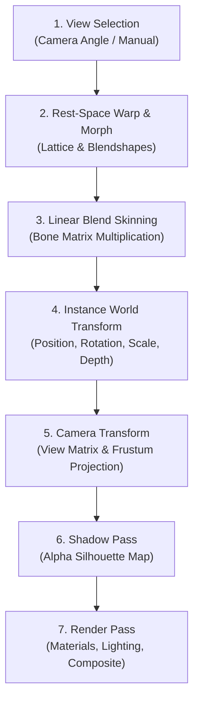

# Parallax Studio — Canonical Deformation Pipeline

This document defines the mathematical order of operations, coordinate space transformations,
and invariant test contracts for 2.5D mesh deformation. Both the interactive Three.js viewport
and the headless video exporter execute this exact pipeline.

## 1. Canonical Deformation Order



This sequence is an inviolable architectural invariant. All rendering execution paths
(interactive preview loop, offline export loop, MCP test pose generator) must evaluate
transformations strictly in this order. Skipping or reordering steps is prohibited.

## 2. Pipeline Step Specifications

### Step 1 — View Selection

- **Inputs**: Placed instance, relative camera vector, animator override parameters.
- **Process**:
  - Compares the camera azimuth against available asset view sets (front, quarter-left, quarter-right, side, back).
  - Evaluates an angular **hysteresis threshold** (default $\pm 5^\circ$) to prevent high-frequency flickering
    when the camera vector hovers along view boundaries.
  - If a requested perspective is missing, retains the active view and logs a diagnostic warning;
    never attempts to stretch or distort front artwork to simulate back views.
- **Outputs**: Active View ID $\to$ binds the specific textured layers, pivots, and bone bindings.
- **Coordinate Space**: Categorical data selection; geometric coordinates unmutated.

### Step 2 — Rest-Space Warp & Morph Deformers

- **Inputs**: Mesh vertices for the active view, warp grid lattice offsets, morph target delta vectors.
- **Process**:
  - Applies $N \times M$ control lattice bilinear interpolation to vertex coordinates in rest space.
  - Adds active morph target delta vectors scaled by scalar blend weights:
    $$v_{\text{deformed}} = v_{\text{warp}} + \sum (w_k \cdot \Delta v_k)$$
  - Execution order: Lattice warp first, morph targets second.
- **Constraints**:
  - Morph blending requires identical, compatible mesh topologies (identical vertex count and triangle indices).
    Topology divergence forces a discrete view switch.
  - Default warp resolution is $4 \times 4$; maximum bounded at $8 \times 8$. Lattices exceeding $16 \times 16$ are rejected.
- **Coordinate Space**: **Rest Space** (artwork texture coordinate space, prior to skeletal translation).

### Step 3 — Skeletal Linear Blend Skinning (LBS)

- **Inputs**: Rest-space deformed vertices $v$, bone world matrices, inverse bind matrices, skin weights.
- **Process**:
  $$v' = \sum_{i=1}^{4} w_i \cdot M_i \cdot B_i^{-1} \cdot v$$
  Where:
  - $v$ = vertex coordinate from Step 2
  - $M_i$ = current world transformation matrix of bone $i$
  - $B_i^{-1}$ = inverse bind pose matrix of bone $i$
  - $w_i$ = normalized skinning weight for bone $i$ ($\sum w_i = 1.0$)
  - $v'$ = evaluated vertex coordinate in asset local space
- **Constraints**:
  - Strictly constrained to a maximum of 4 bone influences per vertex.
  - Normalized weights: $\sum w_i = 1.0 \pm 0.001$.
  - Skeletal hierarchy must be an acyclic directed tree. Parent transforms propagate topologically to children.
- **Coordinate Space**: **Asset Local Space**.

### Step 4 — Instance World Transform

- **Inputs**: Skinned vertices in local space, instance transform parameters (position, rotation, scale, z-depth).
- **Process**:
  - Evaluates standard TRS matrix multiplication: $T \cdot R \cdot S$.
  - Planar depth $z$ establishes draw order and relative camera parallax offset.
- **Coordinate Space**: **World Space** (scene units).

### Step 5 — Camera Projection Transform

- **Inputs**: World-space vertices, active camera parameters.
- **Process**:
  - Multiplies world vertices by the camera View Matrix.
  - Multiplies by the Projection Matrix (Orthographic or Perspective).
  - Orthographic projection: Parallax simulated via depth-based planar scaling and translation.
  - Perspective projection: Natural optical parallax derived from z-distance.
- **Coordinate Space**: **Clip Space / Normalized Device Coordinates (NDC)** $\to$ Screen Pixels.

### Step 6 — Dynamic Shadow Pass

- **Inputs**: Deformed world-space meshes, directional light properties, shadow receiver planes.
- **Process**:
  - Renders deformed geometry from the directional light's perspective into an off-screen depth shadow map.
  - Uses the texture's alpha channel to cast silhouette-accurate shadows conforming to limb deformations.
  - Renders shadows onto planar receiver backdrops (ground, walls) without volumetric 3D modeling.
- **Modes**:
  - *Silhouette Shadow*: Physically directed hard/soft shadow following light vectors.
  - *Artistic Shadow*: Stylized, grounded ambient contact shadow.
- **Constraints**:
  - View switching must instantly update shadow-casting geometry to prevent duplicate shadow artifacts.
  - Default shadow map resolution: $1024 \times 1024$ (configurable to $2048 \times 2048$ for 4K exports).

### Step 7 — Final Composite & Render Pass

- **Inputs**: Screen-space geometry, textures, shadow depth maps, normal maps, material parameters.
- **Process**:
  - Traverses layers according to view draw order.
  - Evaluates normal map perturbation against directional lights to impart volumetric shading.
  - Composites shadows over receivers.
  - Applies color grading and anti-aliasing passes.

## 3. Coordinate Spaces Reference

| Coordinate Space | Origin | Axes | Units |
| --- | --- | --- | --- |
| Texture / UV | Top-Left corner of source image | $+X \to$, $+Y \downarrow$ | Pixels / Normalized $[0, 1]$ |
| Rest Space | Asset artwork pivot point | $+X \to$, $+Y \uparrow$ | Pixels (Source artwork) |
| Asset Local Space | Skinned asset origin | $+X \to$, $+Y \uparrow$ | Pixels (Local) |
| World Space | Scene center $(0, 0, 0)$ | $+X \to$, $+Y \uparrow$, $+Z \odot$ (Out of screen) | Scene pixels |
| Clip Space | Viewport center | $X [-1, 1], Y [-1, 1], Z [-1, 1]$ | NDC |
| Screen Space | Top-Left corner of canvas | $+X \to$, $+Y \downarrow$ | Device physical pixels |

> **Critical Axis Rule**: Texture UV coordinates operate with $+Y$ pointing downward, whereas
> mathematical rest and world spaces operate with $+Y$ pointing upward. Coordinate conversions must be explicit.

## 4. Temporal Sampling Protocol

```text
timestamp = frameIndex / outputFps

evaluatePose(timestamp):
  For each timeline track:
    1. Locate the active clip spanning timestamp
    2. Interpolate keyframe properties via easing functions
  Assemble CompositePose:
    - Bone matrix map
    - Warp lattice displacement map
    - Morph target weight vector
    - Active view selection
  Return CompositePose
```

- Pose sampling logic is shared universally between interactive preview and video export.
- Offline export evaluates every consecutive frame: `frameIndex = 0, 1, ..., totalFrames - 1`.
- Viewport preview drops display frames when GPU load spikes; offline export never drops frames.

## 5. Bilinear Warp Lattice Mathematics

```text
N x M Control Lattice:

  (0,0)───(1,0)───(2,0)───(3,0)
    │       │       │       │
  (0,1)───(1,1)───(2,1)───(3,1)
    │       │       │       │
  (0,2)───(1,2)───(2,2)───(3,2)
    │       │       │       │
  (0,3)───(1,3)───(2,3)───(3,3)
```

1. Each control point stores a displacement offset $(\Delta x, \Delta y)$ relative to its resting uniform grid coordinate.
2. For each mesh vertex $v$ located within grid cell $(i, j)$ at normalized cell coordinates $(u, v) \in [0, 1]^2$:
   $$\Delta v = (1 - u)(1 - v)\Delta P_{i,j} + u(1 - v)\Delta P_{i+1,j} + (1 - u)v\Delta P_{i,j+1} + uv\Delta P_{i+1,j+1}$$
3. Resting state: All offsets are $(0, 0)$.

## 6. Test Invariant Contracts

1. **Preview/Export Equivalence Contract**:
   Rendering an identical scene at timestamp $t$ via preview and export pipelines must yield
   identical vertex positions and material passes.
2. **Deformation Order Verification Contract**:
   Inverting Step 2 (Warp) and Step 3 (Skinning) must produce measurable geometric variance;
   unit tests assert non-equivalence to ensure execution order is not reversed.
3. **Weight Normalization Contract**:
   Vertex shader inputs assert $\sum_{i=1}^{4} w_i = 1.0 \pm 0.001$.
4. **Topology Guard Contract**:
   Morph target blending between diverging mesh vertex counts or index buffers must throw a recoverable validation error.
5. **Frame Completeness Contract**:
   Exporting $D$ seconds at $F$ FPS must produce exactly $D \times F$ sequentially indexed frames.

## 7. Known Physical Limitations

- Planar 2D cards lack true 3D volume; extreme camera tilts reveal paper-thin silhouettes.
- Self-shadowing on a single planar card is geometrically limited; multi-layer separation is recommended for pronounced depth.
- Standard Linear Blend Skinning experiences volume collapse ("candy-wrapper" twisting) when a bone rotates beyond $180^\circ$.

## 8. Documentation References

- [PLAN.md](PLAN.md) sections 2, 4, 6 — Core deformation requirements
- [MODULE_MAP.md](MODULE_MAP.md) — Package ownership (`packages/core/src/deformation/`, `packages/runtime/`)
- [RENDER_PROFILES.md](RENDER_PROFILES.md) — Framerate sampling and hardware presets
- [COMMAND_BUS.md](COMMAND_BUS.md) — Command dispatching for pose and rig mutations
