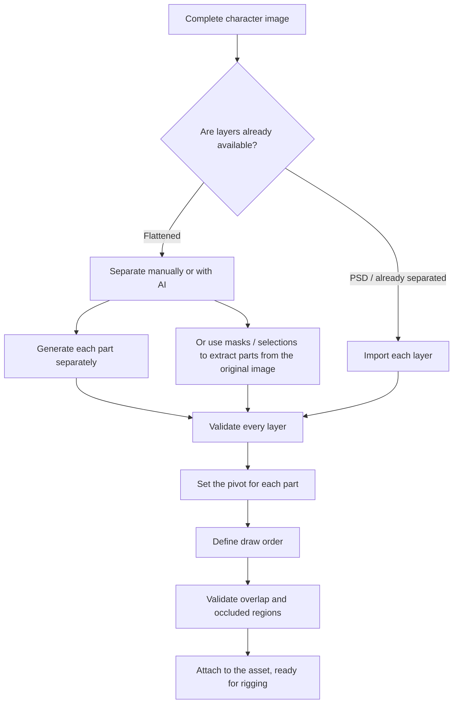

# Create Images with the AI Client and Import Assets through MCP

Status: the requirement is included in the plan; the connector has not yet been
implemented in the app.

## 1. Responsibilities

Codex/Antigravity uses the image-generation and image-editing tools available in
the working session. Parallax provides MCP tools to prepare a brief, read
references, receive results, manage layers and views, build meshes, and rig
assets. The default flow does not install a local image-generation model or
require an additional app-specific image API key.

The agent is the orchestrator. The MCP server cannot implicitly call an
internal client tool in the reverse direction. Each client needs an available
image-generation tool and artifact-transfer mechanism; do not hard-code the
name of one specific tool into the shared protocol.

The current Codex session has an image-generation tool in its tool catalog.
Antigravity documentation also describes an integrated image-generation tool;
actual availability still depends on the client and working session.
[Antigravity Models][anti-models].

## 2. Default workflow

1. The user asks in Codex/Antigravity, for example, to create a character and a
   4K/60 FPS film.
2. The agent reads the project, style, and references and obtains a brief from a
   Parallax MCP tool.
3. The agent calls the client's image-generation tool and then inspects the
   actual result.
4. The agent calls the Parallax image-import tool, receives an asset ID, and
   receives a validation report.
5. The agent adds views, layers, and materials, creates the mesh and rig,
   renders a test pose, and corrects it when necessary.
6. When the asset meets requirements, the agent places it in a shot and exports
   the film through MCP tools.

The image-generation button in the UI may prepare a request for the agent to
read. If no supported agent-launch connection exists, the UI must state that it
is waiting for the agent; it must not display a generating state.

## 3. Brief data

- Generation request ID, target asset ID, and project revision.
- Asset type, description, style, color palette, and readable references.
- Viewing angle, neutral pose, and body proportions to preserve between images.
- Image format, desired alpha, desired dimensions, and safe-padding region.
- Required layers or parts, plus bone names and semantics when a rig already
  exists.
- A distinction between artwork color/alpha and a scene normal map or shadow.
- A **Rig-Ready Template**, when present: skeleton type, standard pose
  (T-pose/A-pose), body proportions, and a `promptHint` that is automatically
  added to the AI prompt. When an image is generated from the template,
  auto-rig runs immediately after import. See [AUTO_RIG.md](AUTO_RIG.md)
  section 2.4 for the schema and default template set.

The brief requests flat lighting when later relighting is required and limits
pre-painted background shadows. Use an approved reference image as the basis
for later generations and edits. Repeating the same prompt does not by itself
guarantee that the character retains the same characteristics.

## 4. Tools and image transfer

The names below are proposed APIs, not a catalog of tools that is already
operational:

| Tool | Result |
| --- | --- |
| `asset.prepare_image_brief` | Brief and reference for the agent to generate or edit an image |
| `asset.import_image` | Asset ID, actual dimensions, alpha, and source hash |
| `asset.attach_view` | Attach a result to an asset's viewing angle |
| `asset.attach_layer` | Attach an image or mask to a named part |
| `asset.validate_artwork` | Report missing layers/views and image problems |
| `asset.get_preview` | Preview for visual inspection by the agent |

- On the same machine, import the file returned by the image tool from a path
  that both the agent and service can read.
- On different machines, or when the artifact exists only in the client,
  transfer it through a chunked upload with a hash. Do not assume that a cloud
  path exists on the user's computer.
- Do not treat a thumbnail URL or an image displayed in chat as an imported
  source.
- Send small metadata through JSON. Send large images through files or uploads
  rather than repeating base64 for the entire image set on every pose edit or
  command call.
- Import must be idempotent by request ID and source hash so that retries do not
  duplicate assets.

## 5. Output validation

- Read the actual dimensions, MIME type, and alpha; do not fully trust the file
  name or the agent's description.
- A checkerboard drawn into the image does not count as transparency.
- A flattened image does not automatically become separate layers. The app or
  agent must separate or generate each part and validate occluded regions,
  pivots, and overlap before rigging.
- Validate the angle set for consistent clothing, colors, proportions, viewing
  direction, and part names.
- An image for a character that fills the screen requires a different pixel
  budget from a small prop.
- If the tool produces only a small image, disclose the source dimensions; do
  not call an upscale a detailed 4K original. A 4K video output does not
  automatically increase texture detail.
- Record the source/reference and image version so that the texture can be
  replaced while retaining the rig.

## 6. Part Decomposition for Animation

A 2D character must be divided into separate layers for rigging and animation.
A flattened image, which has only one layer, cannot be rigged directly and must
be decomposed first.

### 6.1 Standard parts for a human character

```text
Level 1 — Main groups:
  ├── head          Head, including hair and ears
  ├── torso         Upper body
  ├── pelvis        Pelvis
  ├── left-arm      Left arm, shoulder to wrist
  ├── right-arm     Right arm
  ├── left-leg      Left leg, thigh to ankle
  └── right-leg     Right leg

Level 2 — Details, when required by the animation:
  head/
    ├── face        Face: skin and line work
    ├── eyes        Eyes, optionally separated into left and right
    ├── eyebrows    Eyebrows
    ├── mouth       Mouth
    ├── nose        Nose
    ├── hair-front  Hair in front of the face
    └── hair-back   Rear hair, drawn behind the head
  left-arm/
    ├── upper-arm   Upper arm
    ├── forearm     Forearm
    └── hand        Hand
  left-leg/
    ├── thigh       Thigh
    ├── shin        Shin
    └── foot        Foot
```

This list is a recommendation. A character may need other parts such as a tail,
wings, cape, or accessories. Part names must remain consistent across all views
of the same asset.

### 6.2 Part-decomposition workflow



### 6.3 Technical requirements for each part layer

| Requirement | Description |
| --- | --- |
| Transparent alpha | The background must be truly transparent (RGBA), not a solid background color |
| Clean edges | No halo or fringe from the old background around the part |
| Overlap | A part must extend a few pixels into a connection area, such as shoulder into torso or thigh into pelvis, to avoid a gap when the bone rotates |
| Canvas dimensions | Use the same canvas size as the original image so that parts align when stacked |
| File / layer name | Use the conventional part name, such as head, torso, or left-arm |
| Pivot | Place it at the natural rotation joint: shoulder, elbow, hip, knee, or neck |

### 6.4 Two decomposition methods

**Method 1 — Generate each part separately:**
The agent asks AI to create one part at a time while preserving the same style,
proportions, and reference. This method is suitable when detailed control is
required. Its challenge is consistency across separate generations.

**Method 2 — Extract parts from a full-body image:**
The agent asks AI to create a strong full-body image, then separates it with
masks or selections. AI may generate a mask for each region. This method is
suitable when the full-body image already meets requirements. Its challenge is
that occluded areas, such as the torso behind an arm, must be painted in.

**General rules:**
- A flattened image is not a layer set. It must be decomposed explicitly.
- Import every part as a separate layer through `asset.attach_layer`.
- Validate the composite: stacking all layers must reproduce the original
  image.
- Occluded regions require additional artwork behind the foreground part. For
  example, complete the torso behind an arm and the legs behind a garment. If
  these regions are not filled in, rotating a bone exposes empty space. The
  agent generates the missing artwork or uses the client's image-editing tool
  to complete it.

### 6.5 Draw order and overlap

```text
Typical draw order, back to front:

  0  hair-back            Rear hair
  1  right-arm (rear)     Right arm behind the torso
  2  right-leg (rear)     Right leg behind
  3  torso                Torso
  4  pelvis               Pelvis
  5  left-leg             Left leg in front
  6  left-arm             Left arm in front
  7  head                 Head
  8  hair-front           Hair in front of the face
  9  accessories          Accessories: hat, glasses, and so on
```

Draw order changes by view. At a quarter angle, the arm nearer the camera moves
forward and the farther arm moves behind. Each view defines its own draw order.
