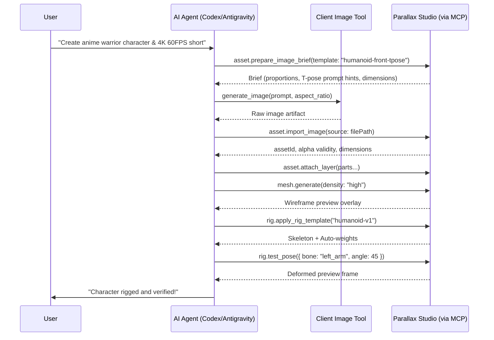
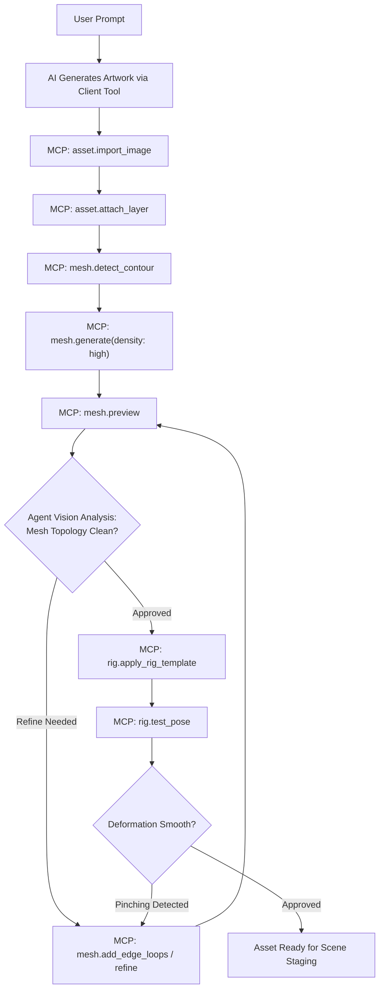

# Parallax Studio — AI Image Generation & Asset Ingestion Workflow

This document details the pipeline connecting AI client generation tools (Codex / Antigravity)
with Parallax Studio via the Model Context Protocol (MCP), covering character decomposition,
multi-view generation, and automated 2D mesh synthesis.

## 1. Architectural Responsibility

- The AI client (Codex or Antigravity) generates and refines images using its native capabilities.
- Parallax Studio provides MCP tools to supply briefs, inspect references, ingest PNG files,
  manage layers/views, construct meshes, and bind rigs.
- The desktop app does not bundle local image generation models (Stable Diffusion / ComfyUI)
  or manage external API keys in its default workflow.
- The AI agent acts as orchestrator. The MCP server does not invoke client-internal tools in reverse.

## 2. Default Production Lifecycle



## 3. Image Brief Specifications

Briefs provide structured metadata to maintain cross-image consistency:
- Target `assetId`, `generationRequestId`, and project `revision`.
- Character description, visual style, color palette, and reference hashes.
- Camera angle, neutral rest pose (T-pose or A-pose), and anatomical proportions.
- True RGBA alpha channel requirements and canvas safe padding.
- Required layer decomposition list and semantic bone labels.
- **Rig-Ready Template**: Embeds standardized proportions and prompt hints.
  Refer to [AUTO_RIG.md](AUTO_RIG.md) section 2 for schema details.

Briefs mandate flat directional lighting to allow dynamic scene re-lighting without conflicting baked-in shadows.

## 4. Ingestion Protocol & File Transfer

| MCP Tool | Functionality |
| --- | --- |
| `asset.prepare_image_brief` | Produces structured prompt hints and reference guidelines |
| `asset.import_image` | Validates file header, alpha channel, dimensions, and computes source hash |
| `asset.attach_view` | Associates artwork with a specific camera angle set |
| `asset.attach_layer` | Assigns an artwork element to a named anatomical layer |
| `asset.validate_artwork` | Asserts layer separation, true alpha, and joint overlap margins |
| `asset.get_preview` | Returns visual inspection frame for agent verification |

- Local workflows: Paths passed directly between client workspace and app service.
- Remote workflows: Chunked binary uploads with SHA-256 verification.
- Ingestion is idempotent: matching `requestId` or `sourceHash` prevents duplicate asset entries.

## 5. Artifact Validation Criteria

- **True Alpha Verification**: Validates uncompressed RGBA pixel data. Faux checkerboard patterns drawn into pixels fail validation.
- **Single-Layer Rejection**: Flattened images are flagged; character parts must be separated before skeletal binding.
- **Resolution Scaling**: Source resolution is recorded transparently; upscaling small generations does not fabricate 4K texture details.

## 6. Anatomical Part Decomposition

2D skeletal puppetry requires distinct physical layers to enable rotational joints without tearing artwork.

### 6.1 Standard Humanoid Decomposition Hierarchy

```text
Level 1 — Primary Groups:
  ├── head          Head (face, hair, ears)
  ├── torso         Upper chest and abdomen
  ├── pelvis        Hips and waist
  ├── left-arm      Left arm (shoulder to wrist)
  ├── right-arm     Right arm
  ├── left-leg      Left leg (thigh to ankle)
  └── right-leg     Right leg

Level 2 — Articulated Sub-parts:
  head/
    ├── face        Facial canvas
    ├── eyes        Eyes (optionally split left/right for blinking)
    ├── mouth       Mouth phonemes
    ├── hair-front  Forehead bangs
    └── hair-back   Rear hair (draw order behind torso)
  left-arm/
    ├── upper-arm   Deltoid to elbow
    ├── forearm     Elbow to wrist
    └── hand        Palm and fingers
  left-leg/
    ├── thigh       Hip to knee
    ├── shin        Knee to ankle
    └── foot        Foot and toes
```

### 6.2 Technical Layer Requirements

| Constraint | Specification | Rationale |
| --- | --- | --- |
| True Alpha | Clean RGBA masking | Prevents opaque bounding boxes |
| Clean Edges | Zero background halo fringes | Eliminates color contamination during blending |
| Joint Overlap | $\ge 10\%$ bone length overlap at joints | Prevents visible seam gaps during rotational bends |
| Canvas Bounds | Consistent canvas size across all layers | Maintains 1-to-1 stacking alignment |
| Pivot Placement | Positioned precisely at joint rotation centers | Prevents unnatural rotational offsets |

### 6.3 Occlusion Infilling (Under-drawing)

When a character's arm crosses the torso, the occluded torso region must be painted in.
If omitted, rotating the arm away reveals empty transparent holes. The agent uses the client's
in-painting tools or dedicated part prompts to complete occluded surfaces.

### 6.4 Standard Draw Order

```text
0  hair-back          Rear hair
1  right-arm-back     Rear arm (when occluded by torso)
2  right-leg-back     Rear leg
3  torso              Torso
4  pelvis             Pelvis
5  left-leg-front     Foreground leg
6  left-arm-front     Foreground arm
7  head               Head
8  hair-front         Front hair
9  accessories        Hats, glasses, handheld props
```

Each view set (front, quarter, side) defines its own draw order mapping.

## 7. Multi-View Set Generation

### 7.1 View Angle Standards

```text
         back
          ↑
  side-left ← front → side-right
          ↓
       (reserve)

Minimum Production Set:
  1. front           Direct front perspective
  2. quarter-left    Left three-quarter angle (~30°–45°)
  3. quarter-right   Right three-quarter angle (~30°–45°)

Full Set (Extended):
  4. side-left       Direct lateral profile (~90°)
  5. side-right      Direct lateral profile (~90°)
  6. back            Rear perspective (~180°)
```

### 7.2 Consistency Invariants

- Front view acts as the authoritative anchor reference. All subsequent angles must conform to it.
- **Costume Invariant**: Identical clothing patterns, buttons, seams, and accessories.
- **Proportion Invariant**: Shoulder width, limb length, and head-to-body ratios match within $\pm 5\%$.
- **Color Palette Invariant**: Skin, hair, and fabric tones remain identical across lighting passes.
- **Pivot Alignment Invariant**: Joint pivots correspond to identical relative anatomical coordinates.

## 8. AI-Driven Mesh Synthesis via MCP

Parallel to how AI agents control Blender via 3D MCP tools, agents in Parallax Studio control
2D mesh generation autonomously.



### 8.1 Automated Triangulation Pipeline

1. **Contour Extraction**: Marching Squares extracts vector boundary polygons from alpha channels.
2. **Contour Simplification**: Douglas-Peucker reduces boundary vertices while preserving silhouette fidelity.
3. **Interior Vertex Scattering**: Poisson disk sampling distributes interior vertices to maintain uniform triangle aspect ratios.
4. **Adaptive Density**:
   - *High Density*: Joint articulation regions (elbows, knees, shoulders, hips, neck, eyes, mouth).
   - *Medium Density*: Flexible limb segments (forearms, shins, torso).
   - *Low Density*: Rigid or static areas (helmet, armor plates, props).
5. **Earcut Triangulation**: Generates non-overlapping triangle index buffers.
6. **UV Mapping**: Normalizes vertex positions against texture bounds $[0, 1]^2$.

### 8.2 Edge Loops for 2D Joints

Edge loops are concentric vertex rings surrounding articulation pivots.
Similar to 3D sub-division modeling, edge loops prevent mesh pinching and volume collapse during acute limb bends.
The agent specifies joint coordinates; the app generates concentric rings around those centers.

## 9. Documentation References

- [PLAN.md](PLAN.md) sections 2, 5 — Product scope and AI handoff architecture
- [AUTO_RIG.md](AUTO_RIG.md) — Mixamo-style auto-rigging and Rig-Ready Templates
- [MCP_TOOLS.md](MCP_TOOLS.md) — Complete tool catalog and request schemas
- [PROJECT_FORMAT.md](PROJECT_FORMAT.md) — Disk serialization format
- [DEFORMATION_PIPELINE.md](DEFORMATION_PIPELINE.md) — Deformation transformation order
