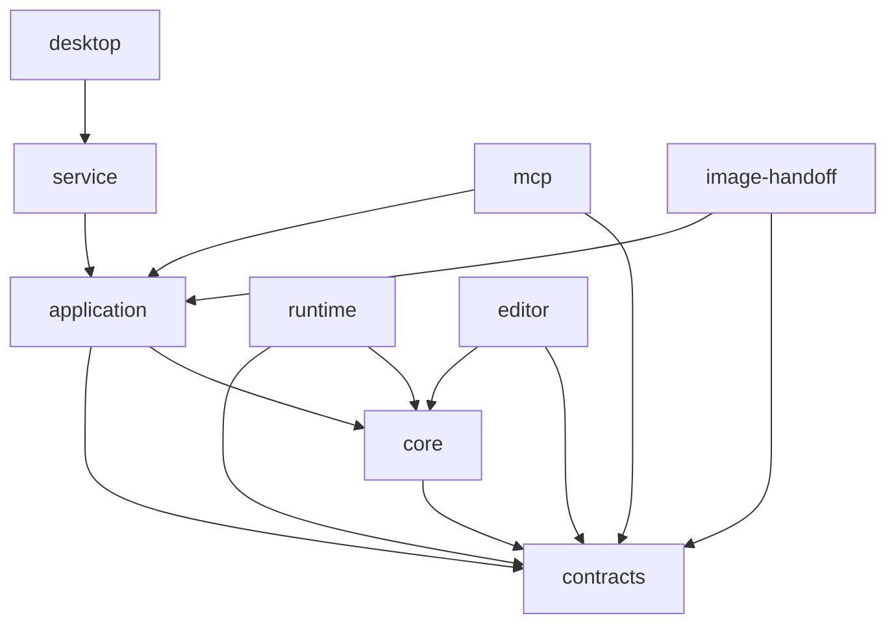

# Module map — proposed architecture

This is the target of the standardization milestone, not the complete current
structure. Create a module only when implementing a real responsibility; do not
scaffold large numbers of empty files.

## Directory structure

```text
apps/
  editor/src/
    app/                    Startup, layout, feature wiring
    features/
      assets/               Library, import, layer editor
      rig/                  Bone tree, pivot, weight brush, test pose
      views/                View sets and expressions
      stage/                Viewport and interaction
      timeline/             Tracks, clips, playhead UI
      director/             Script, shots, AI progress
      export/               Render settings and progress
    services/
      transport/            HTTP, error parsing, timeouts
      session/              Session client with explicit ownership
      project/              Adapter that calls the application service
    ui/                     Buttons, dialogs, fields, icon catalog (Lucide + custom SVG)
  service/src/
    http/                   Thin routes
    adapters/
      persistence/          Atomic writes, project repository, media store
      encoding/             FFmpeg process and progress
      renderer/             Renderer registration and job transport
    bootstrap.ts            Wire dependencies and start the service
  mcp/src/
    tools/                  Adapters by asset, rig, animation, scene, export
    resources/              Summaries, previews, and job status
    server.ts               Wire SDK and transport
  desktop/src-tauri/src/    Tauri shell and sidecar lifecycle
packages/
  contracts/src/
    asset/                  Layer, material, view schemas
    rig/                    Bone, binding, pose, landmark, rig-template schemas
    animation/              Track, clip, keyframe schemas
    scene/                  Instance, camera, light, shot schemas
    commands/               Command payloads and results
    jobs/                   Render job states
    images/                 ImageGenerationBrief and artifact handoff
    export/                 ExportProfile: resolution, FPS, codec, quality
    session/                SessionInfo and transport DTOs
  core/src/
    geometry/               Contour extraction, triangulation (Earcut), UV,
                            vertex density, edge loops, mesh preview, topology
    rig/                    Hierarchy, bind pose, weights, IK, landmarks, auto-skeleton
    deformation/            Warp grid, morph, pose composition
    views/                  View selection and view transitions
    animation/              Easing, keyframes, clips, sampling
    scene/                  Transform, layer/depth, camera sampling
    validation/             Cross-domain business invariants
  application/src/
    commands/               Handlers by domain, command registry
    history/                Undo/redo and transactions
    projects/               Revision, snapshots, orchestration
    jobs/                   Queue, lease, cancellation, retry
    images/                 Brief, source ingestion, view/layer orchestration
    ports/                  Storage, renderer, encoder, provider interfaces
  runtime/src/
    meshes/                 Render mesh and skeleton adapter
    materials/              Image, alpha, normal map
    shadows/                Shadow pass and receivers
    cameras/                Camera adapter
    resources/              Texture/geometry cache and disposal
    playback/               Frame loop using core sampling
    export/                 Frame rendering using the same runtime
  image-handoff/src/        References, files/uploads, and validation of AI-created artifacts
scripts/quality/            Small, independent, readable gates
docs_vi/                    Canonical Vietnamese specification reviewed by the user
docs/                       English translation of docs_vi for AI agents
```

## Ownership and dependencies

| Module | May depend on | Must not depend on |
| --- | --- | --- |
| contracts | Schema library | Core, runtime, UI, service |
| core | contracts, pure algorithms | React, Three.js, DOM, Node I/O, MCP, Tauri |
| application | core, contracts, ports | UI, Three.js, concrete storage |
| runtime | core, contracts, Three.js | UI, MCP, direct project writes |
| editor feature | services, pure core for preview, contracts, ui | HTTP in components, MCP, Node fs |
| service adapter | application ports, I/O libraries | Reimplemented business logic |
| MCP tool | contracts, application client | Direct project modification or separate rig algorithms |
| desktop shell | Lifecycle and native adapters | Copies of rig/timeline/scene reducers |

The local application service is authoritative for command processing. The UI uses
the same core for previews while dragging but commits through the service. MCP also
calls the service and does not create separate project state.

### Dependency graph



An arrow `A → B` means A may import from B. There are no reverse arrows.

## Shared-logic examples

### Sampling a pose at a frame

- `core/animation/sample-keyframes.ts`: keyframes and easing.
- `core/animation/sample-clip.ts`: the clip's time range.
- `core/deformation/compose-pose.ts`: combine the pose in the defined order.
- `runtime/playback/apply-pose.ts`: map the pose to GPU buffers/skeletons.
- The timeline UI and exporter do not have separate interpolation implementations.

### Rig and mesh

- `core/geometry/triangulate-contour.ts`: wrap Earcut and validate input/output.
- `core/rig/compute-weights.ts`: weight-generation algorithm.
- `core/rig/normalize-weights.ts`: normalize and validate the sum.
- `core/rig/validate-hierarchy.ts`: bone parents and cycles.
- `features/rig/`: display the rig and convert interactions into commands.

### Session

- `contracts/session/session-info.ts`: one DTO definition.
- `services/transport/http-client.ts`: request/response, timeout, errors.
- `services/session/session-client.ts`: a token owned by one client instance.
- Components do not parse responses, hold a global token, or create another HTTP
  helper.

### When a module becomes large

For example, when `core/rig/` grows, divide it into `hierarchy/`, `binding/`,
`weights/`, and `ik/`. Each branch has a small public API; do not move everything
into a new `rig-utils.ts`. Do not export every internal symbol through a barrel that
causes import cycles or makes tree-shaking difficult.

### Images created by an AI client

- `contracts/images/` owns briefs and image metadata without depending on a
  client-specific tool name.
- `application/images/` owns image-generation requests, result ingestion, and
  idempotency.
- `image-handoff/` handles file/metadata transfer through a port; it does not embed
  an image-generation model.
- MCP only passes commands; the image-generation tool runs in Codex/Antigravity.
- Details are in [IMAGE_WORKFLOW.md](IMAGE_WORKFLOW.md).

### 2K/4K export at 60/120 FPS

- `contracts/export/` is the single source for presets, FPS, and codec settings.
- `core/animation/` samples poses by time, independently of preview/output FPS.
- `runtime/export/` renders frames; `service/adapters/encoding/` handles
  NVENC/FFmpeg.
- Do not hard-code separate resolution/FPS lists in UI, MCP, and backend.
- Details are in [RENDER_PROFILES.md](RENDER_PROFILES.md).

## Mapping from the draft code

| Current | Direction after implementation is assigned |
| --- | --- |
| `src/App.tsx` | Separate layout, panels, keyboard bindings, and orchestration |
| `src/api.ts` | HTTP client, session, and domain APIs |
| `src/engine/Stage.ts` | Separate mesh, material, camera, shadow, picking, and lifecycle concerns |
| `shared/model.ts` | Domain contracts, with business validation moved to core |
| `shared/animation.ts` | Separate sampling, pose composition, and rig weights |
| `shared/templates.ts` | Registry and templates by asset type |
| `engine/src/main.rs` | Do not combine HTTP/import/render/boot; evaluate reusable shell parts |
| `engine/src/validation.rs` | Remove handwritten contracts duplicated from TypeScript during migration |
| `engine/src/store.rs` | Evaluate atomic persistence; do not retain commands duplicated from the TypeScript service |

Do not move, edit, or delete these files in a turn that only requests planning.

## Links

- [PLAN.md](PLAN.md) — product plan
- [CODING_RULES.md](CODING_RULES.md) — source-code rules
- [COMMAND_BUS.md](COMMAND_BUS.md) — command bus used by the application module
- [DEFORMATION_PIPELINE.md](DEFORMATION_PIPELINE.md) — pipeline used by core/runtime
- [MCP_TOOLS.md](MCP_TOOLS.md) — MCP tool mapping to application commands
- [PROJECT_FORMAT.md](PROJECT_FORMAT.md) — data schemas from contracts
- [UI_SPECIFICATION.md](UI_SPECIFICATION.md) — UI design and icon system
- [AUTO_RIG.md](AUTO_RIG.md) — auto-rig pipeline and landmark detection
- [IMAGE_WORKFLOW.md](IMAGE_WORKFLOW.md) — AI image-creation and layer-separation workflow
