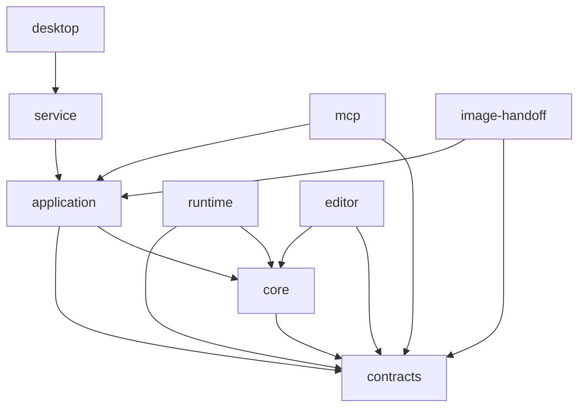

# Parallax Studio — Module Ownership & Architectural Boundaries

This document defines the canonical package ownership, directory layout, and dependency rules.
Modules are created only when backing concrete functional responsibilities; empty scaffolding is prohibited.

## Directory Structure

```text
apps/
  editor/src/
    app/                    Application startup, root layout, feature orchestration
    features/
      assets/               Asset browser, image ingestion, layer decomposition editor
      rig/                  Skeleton tree, joint pivots, weight painting brush, test posing
      views/                Multi-angle view switching and facial expressions
      stage/                Interactive Three.js viewport and gizmo manipulation
      timeline/             Track controls, clip arranging, playhead navigation, dopesheet
      director/             AI script breakdown, shot management, staging progress
      export/               Export configuration presets and render job progress
    services/
      transport/            HTTP client, network error parsing, request timeouts
      session/              Client session management with explicit instance ownership
      project/              Client adapter dispatching to Application Command Bus
    ui/                     Design system widgets, fields, modals, icon catalog (Lucide + SVG)
  service/src/
    http/                   Thin HTTP routing layer
    adapters/
      persistence/          Atomic project serialization, file storage, asset media store
      encoding/             FFmpeg subprocess streaming, NVENC probe, progress reporting
      renderer/             Headless renderer registration and job transport
    bootstrap.ts            Dependency injection and service lifecycle orchestration
  mcp/src/
    tools/                  Domain adapters (asset, rig, animation, scene, export)
    resources/              Project summaries, frame thumbnails, and job status resources
    server.ts               MCP SDK setup and stdio transport adapter
  desktop/src-tauri/src/    Tauri native desktop shell, window lifecycle, sidecar supervisor
packages/
  contracts/src/
    asset/                  Layer, material, view schemas
    rig/                    Bone, binding, pose, landmark, rig-template schemas
    animation/              Track, clip, keyframe, curve schemas
    scene/                  Instance, camera, light, shot schemas
    commands/               Command payloads and result contracts
    jobs/                   Render job states and progress DTOs
    images/                 ImageGenerationBrief and artifact handoff contracts
    export/                 ExportProfile contracts: resolutions, framerates, codecs
    session/                SessionInfo and transport DTOs
  core/src/
    geometry/               Contour extraction, Earcut triangulation, UV mapping, edge loops
    rig/                    Hierarchy, bind pose, distance weights, IK, landmarks, auto-skeleton
    deformation/            Warp grids, morph targets, canonical pose composition
    views/                  View selection, angle switching, topology compatibility check
    animation/              Easing curves, keyframe interpolation, clip sampling
    scene/                  Transform math, depth card ordering, camera projection sampling
    validation/             Cross-domain business invariant validation
  application/src/
    commands/               Domain command handlers and command bus registry
    history/                Undo/redo stacks and transactional rollbacks
    projects/               Revision tracking, snapshot generation, persistence orchestration
    jobs/                   Render job queue, lease management, cancellation
    images/                 Brief creation, ingestion verification, layer orchestration
    ports/                  Secondary ports (storage, renderer, encoder, AI provider)
  runtime/src/
    meshes/                 Three.js SkinnedMesh creation and skeleton binding
    materials/              Shader materials, transparency, normal maps, roughness
    shadows/                Silhouette shadow maps and planar shadow receivers
    cameras/                Orthographic and perspective camera adapters
    resources/              Texture and buffer disposal lifecycle
    playback/               Interactive viewport render loop using core sampling
    export/                 Offline frame rendering pipeline
  image-handoff/src/        Reference file verification and AI artifact ingestion
scripts/quality/            Independent, dependency-free quality and constraint verification gates
docs/                       Canonical English master plan, rules, and technical specifications
docs_vi/                    Vietnamese documentation reference for human inspection
```

## Module Ownership & Dependency Boundaries

| Module | Permitted Dependencies | Prohibited Dependencies |
| --- | --- | --- |
| `contracts` | External schema libraries (Zod) | `core`, `runtime`, `apps/*` |
| `core` | `contracts`, pure math algorithms | React, Three.js, DOM, Node I/O, MCP, Tauri |
| `application` | `core`, `contracts`, application ports | UI, Three.js, concrete file system / DB |
| `runtime` | `core`, `contracts`, Three.js | UI, MCP, direct project disk writes |
| `apps/editor` features | `apps/editor/services`, `core` (pure preview), `contracts`, `ui` | Node.js `fs`, direct MCP imports |
| `apps/service` adapters | `application` ports, concrete I/O libraries | Re-implementing core business math |
| `apps/mcp` tools | `contracts`, application service client | Direct disk mutations, custom rig logic |
| `desktop` shell | Tauri native APIs, service lifecycle | Duplicated animation/rig reducers |

The Application Service enforces state authority. The Editor UI uses `core` for responsive
in-memory preview but commits all state modifications through the Application Service.
MCP tools call the identical Application Service endpoints.

### Dependency Graph



Arrows denote allowed import directions (`A → B` means A may import B). Circular dependencies are prohibited.

## Concrete Shared Logic Examples

### Pose Sampling at Target Time

- `core/animation/sample-keyframes.ts`: Evaluates keyframe easing curves.
- `core/animation/sample-clip.ts`: Clamps time within clip bounds and loops.
- `core/deformation/compose-pose.ts`: Chains transformations in canonical order.
- `runtime/playback/apply-pose.ts`: Binds matrix calculations to Three.js bone buffers.
- Neither the timeline UI nor the offline exporter implements bespoke interpolation logic.

### Rigging & Mesh Generation

- `core/geometry/triangulate-contour.ts`: Wraps Earcut with strict topology and boundary checks.
- `core/rig/compute-weights.ts`: Proximity-based bone weight calculations with layer masking.
- `core/rig/normalize-weights.ts`: Enforces 4 influences per vertex summing strictly to 1.0.
- `core/rig/validate-hierarchy.ts`: Enforces acyclic graphs via topological sorting.
- `apps/editor/src/features/rig/`: Visualizes bones and maps user gestures into command payloads.

### Client Session Management

- `contracts/session/session-info.ts`: Single authoritative DTO definition.
- `apps/editor/src/services/transport/http-client.ts`: Handles requests, timeouts, and error parsing.
- `apps/editor/src/services/session/session-client.ts`: Encapsulates tokens per client instance.
- Components never parse raw network responses or access global token variables directly.

### Scaling Large Modules

When `core/rig/` expands, it subdivides into `hierarchy/`, `binding/`, `weights/`, `landmarks/`, `ik/`.
Each sub-folder maintains a minimal public API; dumping logic into a monolithic `rig-utils.ts` is prohibited.

### AI Image Generation & Handoff

- `contracts/images/` defines image briefs and metadata independently of AI client tooling.
- `application/images/` orchestrates generation briefs, artifact ingestion, and revision tagging.
- `image-handoff/` verifies PNG alpha integrity and file transport without bundling local AI models.
- MCP tools execute ingestion; image generation runs externally in the AI client.
  Refer to [IMAGE_WORKFLOW.md](IMAGE_WORKFLOW.md).

### High-Framerate Video Export

- `contracts/export/` provides standard presets (2K/4K, 60/120 FPS, H.264/HEVC).
- `core/animation/` samples poses at discrete timestamps independently of UI framerates.
- `runtime/export/` renders sampled frames; `service/adapters/encoding/` streams to NVENC/FFmpeg.
- Hardcoding custom resolution or framerate lists across UI or backend is prohibited.
  Refer to [RENDER_PROFILES.md](RENDER_PROFILES.md).

## Draft Code Migration Strategy

| Draft Location | Target Architecture Role |
| --- | --- |
| `src/App.tsx` | Decomposed into layout shell, dockable panels, keyboard shortcuts |
| `src/api.ts` | Refactored into domain HTTP clients and session services |
| `src/engine/Stage.ts` | Decomposed into runtime mesh, material, camera, and shadow passes |
| `shared/model.ts` | Decomposed into domain contracts with core validation logic |
| `shared/animation.ts` | Separated into pure core sampling, pose composition, and skinning math |
| `shared/templates.ts` | Moved to rig-template and animation-template registries |
| `engine/src/main.rs` | Stripped of duplicate web servers; retained for Tauri desktop shell |
| `engine/src/validation.rs` | Redundant manual Rust contracts replaced with shared TypeScript contracts |
| `engine/src/store.rs` | Evaluated for atomic persistence; command reducers unified in TypeScript |

Refactoring of draft files occurs during Milestone 0 upon user instruction.

## Documentation References

- [PLAN.md](PLAN.md) — Master product roadmap and milestone scope
- [CODING_RULES.md](CODING_RULES.md) — Coding standards and 800-line physical file limits
- [COMMAND_BUS.md](COMMAND_BUS.md) — Command bus architecture and undo/redo mechanics
- [DEFORMATION_PIPELINE.md](DEFORMATION_PIPELINE.md) — Canonical deformation transformation order
- [MCP_TOOLS.md](MCP_TOOLS.md) — MCP tool catalog and request/response schemas
- [PROJECT_FORMAT.md](PROJECT_FORMAT.md) — On-disk project structure and manifest schema
- [UI_SPECIFICATION.md](UI_SPECIFICATION.md) — Dual-mode editor UI layout and icon system
- [AUTO_RIG.md](AUTO_RIG.md) — Mixamo-style auto-rigging and mesh topology standards
- [IMAGE_WORKFLOW.md](IMAGE_WORKFLOW.md) — AI image generation, layer decomposition, and auto-mesh
