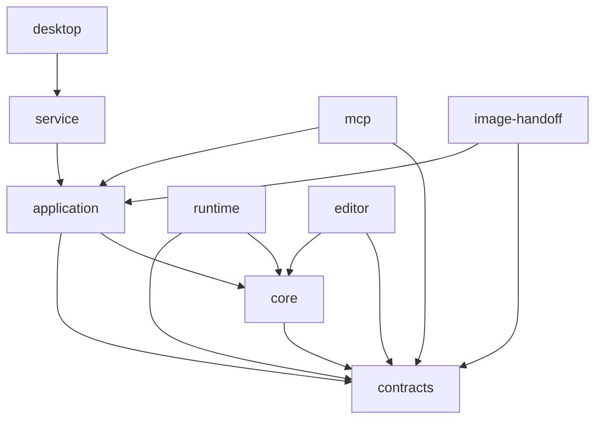

# Bản đồ module — kiến trúc đề xuất

Đây là đích của mốc chuẩn hóa, chưa phải toàn bộ cấu trúc hiện có. Chỉ tạo module
khi triển khai trách nhiệm có thật; không scaffold hàng loạt file rỗng.

## Sơ đồ thư mục

```text
apps/
  editor/src/
    app/                    Khởi động, layout, kết nối feature
    features/
      assets/               Library, import, layer editor
      rig/                  Bone tree, pivot, weight brush, test pose
      views/                Bộ góc nhìn và biểu cảm
      stage/                Viewport và tương tác
      timeline/             Track, clip, playhead UI
      director/             Kịch bản, shot, tiến độ AI
      export/               Cài đặt và tiến độ render
    services/
      transport/            HTTP, parse lỗi, timeout
      session/              Session client có ownership rõ
      project/              Adapter gọi application service
    ui/                     Button, dialog, field thuần dùng chung
  service/src/
    http/                   Route mỏng
    adapters/
      persistence/          Atomic write, project repository, media store
      encoding/             FFmpeg process và progress
      renderer/             Renderer registration và job transport
    bootstrap.ts            Lắp dependencies và khởi động
  mcp/src/
    tools/                  Adapter theo asset, rig, animation, scene, export
    resources/              Summary, preview và job status
    server.ts               Lắp SDK và transport
  desktop/src-tauri/src/    Tauri shell và lifecycle sidecar
packages/
  contracts/src/
    asset/                  Layer, material, view schema
    rig/                    Bone, binding, pose schema
    animation/              Track, clip, keyframe schema
    scene/                  Instance, camera, light, shot schema
    commands/               Command payload và result
    jobs/                   Render job state
    images/                 ImageGenerationBrief và artifact handoff
    export/                 ExportProfile: resolution, FPS, codec, quality
    session/                SessionInfo và transport DTO
  core/src/
    geometry/               Contour, triangulation adapter, UV, topology
    rig/                    Hierarchy, bind pose, weights, IK
    deformation/            Warp grid, morph, pose composition
    views/                  View selection và chuyển góc
    animation/              Easing, keyframes, clips, sampling
    scene/                  Transform, layer/depth, camera sampling
    validation/             Invariant nghiệp vụ liên miền
  application/src/
    commands/               Handler theo miền, command registry
    history/                Undo/redo và transaction
    projects/               Revision, snapshot, orchestration
    jobs/                   Queue, lease, cancellation, retry
    images/                 Brief, source ingestion, view/layer orchestration
    ports/                  Interface storage, renderer, encoder, provider
  runtime/src/
    meshes/                 Render mesh và skeleton adapter
    materials/              Image, alpha, normal map
    shadows/                Shadow pass và receiver
    cameras/                Camera adapter
    resources/              Texture/geometry cache và dispose
    playback/               Frame loop dùng core sampling
    export/                 Frame rendering dùng cùng runtime
  image-handoff/src/        Reference, file/upload và kiểm tra artifact AI đã tạo
scripts/quality/            Gate nhỏ, độc lập và đọc được
docs/                       Kế hoạch, quy tắc, quyết định kiến trúc
```

## Quyền sở hữu và phụ thuộc

| Module | Được phụ thuộc | Không được phụ thuộc |
| --- | --- | --- |
| contracts | Schema library | Core, runtime, UI, service |
| core | contracts, thuật toán thuần | React, Three.js, DOM, Node I/O, MCP, Tauri |
| application | core, contracts, ports | UI, Three.js, storage cụ thể |
| runtime | core, contracts, Three.js | UI, MCP, ghi project trực tiếp |
| editor feature | services, core thuần cho preview, contracts, ui | HTTP trong component, MCP, Node fs |
| service adapter | application ports, thư viện I/O | Nghiệp vụ được viết lại |
| MCP tool | contracts, application client | Tự sửa project hoặc thuật toán rig riêng |
| desktop shell | Lifecycle và native adapter | Bản sao rig/timeline/scene reducer |

Local application service xử lý command có thẩm quyền. UI dùng cùng core để preview
khi kéo nhưng commit qua service. MCP cũng gọi service, không tạo project state riêng.

### Sơ đồ phụ thuộc



Mũi tên `A → B` nghĩa là A được phép import từ B. Không có mũi tên ngược.

## Ví dụ logic chung

### Lấy pose tại một frame

- `core/animation/sample-keyframes.ts`: keyframe và easing.
- `core/animation/sample-clip.ts`: khoảng thời gian của clip.
- `core/deformation/compose-pose.ts`: kết hợp pose theo thứ tự đã định nghĩa.
- `runtime/playback/apply-pose.ts`: ánh xạ pose lên buffer/skeleton GPU.
- Timeline UI và exporter không có bản nội suy riêng.

### Rig và mesh

- `core/geometry/triangulate-contour.ts`: bọc Earcut, kiểm tra input/output.
- `core/rig/compute-weights.ts`: thuật toán tạo trọng số.
- `core/rig/normalize-weights.ts`: chuẩn hóa và kiểm tra tổng.
- `core/rig/validate-hierarchy.ts`: parent và chu kỳ xương.
- `features/rig/`: hiển thị và chuyển thao tác thành command.

### Session

- `contracts/session/session-info.ts`: một định nghĩa DTO.
- `services/transport/http-client.ts`: request/response, timeout, lỗi.
- `services/session/session-client.ts`: token theo một client instance.
- Component không parse response, giữ global token hay tạo HTTP helper khác.

### Khi module đã lớn

Ví dụ `core/rig/` phát triển thì chia `hierarchy/`, `binding/`, `weights/`, `ik/`.
Mỗi nhánh có public API nhỏ; không chuyển tất cả vào một `rig-utils.ts` mới.
Không xuất toàn bộ internal qua barrel gây vòng import hoặc khó tree-shake.

### Ảnh do AI client tạo

- `contracts/images/` sở hữu brief và metadata ảnh, không phụ thuộc tên tool riêng của client.
- `application/images/` sở hữu yêu cầu sinh ảnh, nhập kết quả và idempotency.
- `image-handoff/` xử lý truyền file/metadata theo port; không nhúng model sinh ảnh.
- MCP chỉ chuyển command; công cụ sinh ảnh chạy phía Codex/Antigravity.
- Chi tiết nằm trong [IMAGE_WORKFLOW.vi.md](IMAGE_WORKFLOW.vi.md).

### Export 2K/4K, 60/120 FPS

- `contracts/export/` là một nguồn cho preset, FPS và codec settings.
- `core/animation/` lấy pose theo thời gian, độc lập preview/output FPS.
- `runtime/export/` render frame; `service/adapters/encoding/` xử lý NVENC/FFmpeg.
- Không hard-code một danh sách resolution/FPS riêng trong UI, MCP và backend.
- Chi tiết nằm trong [RENDER_PROFILES.vi.md](RENDER_PROFILES.vi.md).

## Ánh xạ từ mã nháp

| Hiện tại | Hướng xử lý sau khi được giao triển khai |
| --- | --- |
| `src/App.tsx` | Layout, panel, keyboard binding, orchestration riêng |
| `src/api.ts` | HTTP client, session và API theo miền |
| `src/engine/Stage.ts` | Mesh, material, camera, shadow, picking, lifecycle riêng |
| `shared/model.ts` | Contracts theo miền, validation nghiệp vụ sang core |
| `shared/animation.ts` | Sampling, pose composition và rig weights riêng |
| `shared/templates.ts` | Registry và template theo loại asset |
| `engine/src/main.rs` | Không dồn HTTP/import/render/boot; đánh giá phần shell dùng lại |
| `engine/src/validation.rs` | Loại bỏ contract viết tay trùng TypeScript khi migrate |
| `engine/src/store.rs` | Đánh giá atomic persistence; không giữ command trùng service TS |

Không di chuyển, sửa hoặc xóa các file trên trong lượt chỉ yêu cầu lập kế hoạch.

## Liên kết

- [PLAN.vi.md](PLAN.vi.md) — kế hoạch sản phẩm
- [CODING_RULES.vi.md](CODING_RULES.vi.md) — quy tắc mã nguồn
- [COMMAND_BUS.vi.md](COMMAND_BUS.vi.md) — command bus sử dụng application module
- [DEFORMATION_PIPELINE.vi.md](DEFORMATION_PIPELINE.vi.md) — pipeline dùng core/runtime
- [MCP_TOOLS.vi.md](MCP_TOOLS.vi.md) — MCP tools mapping sang application commands
- [PROJECT_FORMAT.vi.md](PROJECT_FORMAT.vi.md) — schema dữ liệu từ contracts
