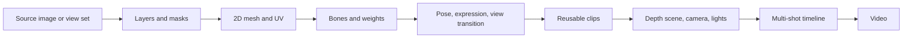
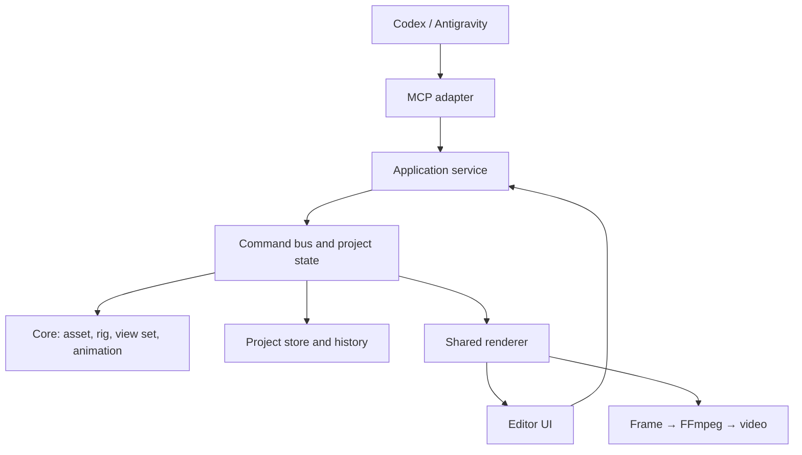

# Parallax Studio — 2D to 2.5D Plan

Updated: 11/09/2026. Status: proposed for user review.

This plan replaces the previous Blender/Python approach. The current turn only
updates documentation, rules, skills, and rule-checking tools; it does not continue
app feature development.

## 1. Direction

Create an application specialized in processing 2D images, skeletal rigging,
facial/body deformation, multi-angle view management, and 2.5D filmmaking. It does
not depend on Blender or Godot. 3D models/GLB are outside the scope of the first release.

Users work with images, layers, bones, poses, and clips. The engine uses flat meshes,
cameras, and depth coordinates to create parallax and shadows. Calculations in 3D
space do not require users to author or import complete 3D models.

Prioritize one renderer for both preview and export, one business-logic layer for
UI and MCP, and a project format that can be reopened and edited. Do not rebuild
capabilities that established libraries already provide well.

Additional accepted requirements: use the image-generation tools already available
in Codex/Antigravity and import their results through MCP; export films at 60/120 FPS
in 2K/4K. The user's target GPU is an NVIDIA RTX 3060 with 12 GB VRAM. Details are
separated into the [image-creation workflow](IMAGE_WORKFLOW.md) and
[render profiles](RENDER_PROFILES.md).

## 2. Multi-angle mechanism from images

| Mechanism | Purpose | Required data |
| --- | --- | --- |
| Bones and skinning | Bend arms/legs, neck, and tail | Bones, mesh, and weights |
| Warp and morph poses | Subtle face turns, blinking, mouth, squash/stretch | Control grid and sample poses |
| View set | Front, three-quarter, side, and back views when provided | Image/layers and corresponding bindings for each view |

Live2D documents mesh deformation and deformers for face turns and motion; Spine
documents weighted skinning. These are mechanism references, not required
dependencies. [Live2D deformers][live2d], [Spine weights][spine-weights].
The auto-rig mechanism (landmarks, auto-skeleton, and auto-weights) and mesh
topology are specified in detail in [AUTO_RIG.md](AUTO_RIG.md).

### View sets

- Start with a front view and two three-quarter views; add two side views when the
  asset requires them.
- Each view stores its own layers, pivots, draw order, and bindings; semantically
  equivalent bones keep the same names.
- The head and body may switch views independently when supported by the asset set.
- Interpolate meshes only when their topology and correspondence are compatible.
- If topology differs, switch views at a suitable marker or use a verified blend;
  do not blend non-corresponding vertices.
- A clip or parameter controls the view. Selection may follow direction relative to
  the camera, with stable thresholds to prevent flicker at view boundaries.
- When the back view is missing, report the missing view; do not pretend the front
  image is enough for a full 360-degree turn.

One image does not contain occluded regions or a rear view. AI can draw additional
views, but clothing, proportions, and details must be checked for consistency.
Generating a view set is a separate step from mesh generation and rigging, and the
user can adjust every result.

### 2D materials

Each layer has a color image, alpha/mask, and optional normal map, roughness, and
tint. Flat color is the default style; an additional lighting mode provides a sense
of volume. A normal map only changes the lighting response; it does not create
geometry or hidden angles. An advanced depth map is a later feature and does not
replace a view set.

## 3. Proposed libraries and languages

| Component | Choice | Scope |
| --- | --- | --- |
| UI | React + TypeScript + Lucide Icons | Asset editor, rig editor, timeline, and inspector ([UI details](UI_SPECIFICATION.md)) |
| Rendering | Three.js, WebGL2 first | Flat skinned meshes, cameras, materials, and shadows |
| Triangulation | Earcut | Triangulation of validated contours |
| PSD | ag-psd, optional | Layers within the library's supported scope; layered PNG is preferred |
| Schema | Zod + generated JSON Schema | One contract source for UI/service/MCP |
| MCP | Official TypeScript SDK | Adapter for Codex and Antigravity |
| Local service | Node.js + TypeScript | Project state, command bus, files, and jobs |
| Desktop | Tauri + Rust | Windows/Linux and process lifecycle |
| Film export | Shared renderer + native FFmpeg | Correctly timed frames, video, and audio |
| Image-generation source | Image-generation tool integrated into Codex/Antigravity | AI creates images and passes the results into the app through MCP |

Three.js provides skinning and materials with normal-map support. Earcut/ag-psd
reduce the amount of processing that must be implemented. The rig editor, warp,
view sets, and timeline still need to be built. Earcut only handles triangulation;
contour extraction, adding vertices around joints, and deformation topology require
separate logic. [Skinning][skinning], [material][material], [Earcut][earcut],
[ag-psd][psd].

TypeScript owns the main logic so UI, MCP, and renderer can share it directly. Rust
does not keep a second rig/timeline implementation. Move a hot path to Rust/WASM
only when measurements show a benefit; retain one implementation source and
compatibility tests. Do not add a local model, ComfyUI, a Python service, or a
separate image-generation API key to the default workflow.

The foundational libraries can be used free of charge: Three.js uses MIT and Earcut
uses ISC. Live2D/Spine runtimes are not included in the core because they have
separate terms. [Three.js license][three-license], [Earcut][earcut],
[Spine runtime license][spine-license].

Do not combine PixiJS and Three.js in the first release. Use one renderer to reduce
the cost of synchronizing poses, materials, picking, and shadows. Evaluate WebGPU
after WebGL2.

## 4. Camera and shadows for 2.5D

- Characters and environments are depth-separated layers; cameras may be
  orthographic or perspective.
- A mesh deforms according to the pose before taking part in the shadow pass.
- Shadows follow image alpha, the deformed silhouette, and light direction; they
  must not be rectangles.
- Shadow-receiving floors/walls are simple planes supplied by the app; the user does
  not need to create 3D models.
- Light-driven silhouette shadows and artistic soft shadows are two explicitly
  named modes.
- Switching views must switch the corresponding shadow and avoid accidentally
  producing two shadows.
- A flat card does not have complete volume, so shadows have limitations at edge-on
  and rear angles. A simple shadow proxy may be added after the film style has been
  validated.

## 5. AI/MCP and shared data

Domain tools cover reading projects/assets; importing layers; creating meshes;
creating/editing rigs; testing poses; adding views/expressions; adding clips/shots;
configuring cameras/lights; rendering previews; exporting films; and reading or
cancelling jobs. UI and MCP call the same application service.

AI changes assets/scenes through data; it does not edit the app's source code every
time it makes a film. Commands have schemas, revisions, IDs, and readable state.
Batches are atomic; retries do not duplicate assets/jobs; undo/redo use the same
command bus.

The default asset-creation workflow is:

1. The agent reads requirements/style/references and creates a standard brief from
   an app tool.
2. Codex/Antigravity invokes the client's own image-generation or image-editing tool.
3. The agent passes the real image into the app through an MCP asset-import tool;
   the app validates the data and stores the source.
4. Normalize layers/views, create the mesh and rig, test poses, and make corrections
   through the same command bus.

The MCP server cannot call every AI client's internal tools by itself. The agent
coordinates both tool groups within one task; when image generation is unavailable
or the file cannot be transferred, it reports the real state. The workflow begins
from a request in Codex/Antigravity; an image-generation button in the UI must not
pretend it has launched an external agent. Users do not need to configure another
image model/API inside the app.
[Workflow, file transfer, and acceptance details](IMAGE_WORKFLOW.md).

The project stores a versioned manifest, asset sources, views, rigs, materials, and
clips. Texture atlases/thumbnails are rebuildable caches; scene instances reference
asset IDs. Finalize the detailed schema in Milestone 0 to avoid locking the format
before experimentation.
[Detailed schema and project structure](PROJECT_FORMAT.md).
[Command bus and undo/redo architecture](COMMAND_BUS.md).
[MCP tool catalog](MCP_TOOLS.md).
[UI design and icon system](UI_SPECIFICATION.md).

## 6. Preview and export

- Use the same pose evaluator at `frameIndex / fps`.
- Timeline FPS, preview FPS, and exported video FPS are three separate settings.
  Export supports 24/30/60/120 FPS, including 2K DCI, QHD 1440p, 4K UHD, and
  4K DCI.
- Sample every exported frame at its target time; do not merely change metadata or
  duplicate 60 FPS frames and call the result a 120 FPS render.
- Contract order: select view → warp/morph in rest space → bone skinning → instance
  transform → camera/shadow/render. This order must be tested.
  [Deformation pipeline details](DEFORMATION_PIPELINE.md).
- The renderer sends frames through a bounded-buffer pipeline to FFmpeg; expose job
  progress, errors, and cancellation. Each job is tied to a revision snapshot.
- Prefer H.264/HEVC through NVENC when the driver and FFmpeg build support it. Probe
  the real encoder and provide an explicit CPU fallback; do not silently reduce
  resolution or FPS when encoding is slow.
- The first release requires the app to remain open so the renderer can receive
  jobs. MCP returns `waiting_renderer` when no renderer is available; it must not
  falsely report that rendering is running or complete.
- Headless operation while the app is closed is a later extension after the basic
  pipeline.
- The browser uses the same editor but must check environment codec/file support;
  do not promise native capabilities on the web when the local service is absent.

4K/120 FPS is an output-quality requirement; it does not mean every scene must
preview or render faster than real time. Offline frame-by-frame rendering still
preserves the exact FPS. Presets, memory budgets, and the acceptance matrix are in
[RENDER_PROFILES.md](RENDER_PROFILES.md).

## 7. Implementation milestones and acceptance

| Milestone | Content | Acceptance condition |
| --- | --- | --- |
| 0. Standardization | Format the draft, split modules, consolidate genuinely shared logic, enable gates | Modified source is readable, no file exceeds 800 lines, and work does not continue in files that accumulate business concerns |
| 1. Image → 2.5D pipeline | AI creates an image with a client tool → MCP imports it → mesh/rig → camera/shadow | A real image produces a 5–10 second clip with correct deformation and alpha/light shadows, and the project reopens |
| 2. Rig and multiple views | Bones/pivots/weights, rest pose, warp, expressions, view set | View changes stay within asset capabilities without pivot jumps or invalid topology blending |
| 3. Filmmaking app | Library, timeline, clip blending, shots, cameras/lights | Build a short film from reusable assets; save/open/undo work correctly |
| 4. AI director | Script → shots → assets/actions → preview → corrections → export | MCP builds a multi-shot film from existing assets and reports missing data |
| 5. Asset-set quality | Generate/edit multiple views with client tools, layers, expressions, and rig | The view set is consistent, has true alpha, and remains editable; no local model installation is required |
| 6. Packaging/optimization | Windows/Linux, NVENC, 2K/4K × 60/120 FPS, cache, and recovery | Correct dimensions/frame count/timestamps with verification video and measurements on each OS |

Benchmarks use the RTX 3060 12 GB as the target GPU. The preview target is 60 FPS,
with an optional 120 FPS mode for suitable scenes and displays; preview resolution
may be reduced independently from 4K output. Record CPU, RAM, driver, vertex/bone
counts, shadow budget, median/p95 frame time, export time, RAM/VRAM, and encoder.
Do not infer performance from VRAM alone or call offline 4K/120 FPS export a real-time
4K/120 FPS preview.

Critical tests cover normalized weights; acyclic bones; IK limits; interpolation;
view/topology transitions; masks/shadows following the pose; preview/export using
the same time; UI/MCP sharing state; atomic save and undo; imported images being
real tool output; and 60/120 FPS output having the correct frame count/timestamps
without silent quality reduction.
[Testing strategy](TESTING_STRATEGY.md).

## 8. Code and AI rules

Details: [CODING_RULES.md](CODING_RULES.md), [MODULE_MAP.md](MODULE_MAP.md).
The user-requested code rules apply independently of architecture approval.

- Maximum 800 physical lines per source file, including comments and blank lines.
- Around 400–500 lines is a signal to split responsibilities, not a target size.
- Do not compress code/JSX/types to evade the limit; present each business step
  clearly.
- Each business rule/algorithm has one owner; callers import it or use an adapter.
- Shared helpers are divided by domain, not collected in `utils.ts` or `shared.ts`.
- Names describe meaning; types are separated clearly; imports, public APIs, and
  helpers have a readable layout.
- AI guidance works together with formatter, lint, source limits, duplicate checks,
  and dependency-graph checks; documentation alone does not enforce compliance.

Codex reads `AGENTS.md`. Codex/Antigravity use
`.agents/skills/<name>/SKILL.md`; Antigravity has workspace rules in
`.agents/rules`. Client adapters point back to the shared rule source.
[Codex rules][codex-rules], [skills][codex-skills],
[Antigravity rules][anti-rules], [skills][anti-skills].

Large tasks may be divided among specialists with independent scopes. The Lead
finalizes contracts, assigns one write owner per file, integrates results, and runs
the final checks; it does not invoke every role for a small task. Details are in the
[AI team protocol](AI_TEAM_PROTOCOL.md).

## 9. Current scope

The first release excludes Blender/Godot, a GLB editor, 3D model authoring,
cloth/fluid simulation, advanced lip-sync, multi-user collaboration, and cloud
rendering. Basic audio multiplexing follows the video pipeline; voice generation
requires a provider or a user-supplied file.

The code in `src/`, `shared/`, and `engine/` is still an incomplete draft, has not
been built/tested, and contains compressed code. Do not use it as a quality example.
Milestone 0 will standardize the applicable parts when the user requests
implementation. This turn does not refactor the app or install dependencies.

[live2d]: https://docs.live2d.com/en/cubism-editor-manual/deformer/
[spine-weights]: https://esotericsoftware.com/spine-weights
[skinning]: https://threejs.org/docs/pages/SkinnedMesh.html
[material]: https://threejs.org/docs/pages/MeshStandardMaterial.html
[earcut]: https://github.com/mapbox/earcut
[psd]: https://github.com/Agamnentzar/ag-psd
[three-license]: https://github.com/mrdoob/three.js/blob/dev/LICENSE
[spine-license]: https://esotericsoftware.com/licenses/Spine-Runtimes-License-Agreement.pdf
[codex-rules]: https://learn.chatgpt.com/docs/agent-configuration/agents-md
[codex-skills]: https://learn.chatgpt.com/docs/build-skills
[anti-rules]: https://antigravity.google/docs/rules-workflows
[anti-skills]: https://antigravity.google/docs/skills
