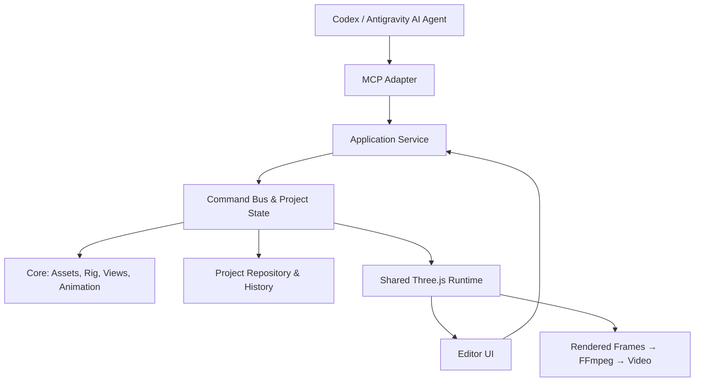

# Parallax Studio — 2D to 2.5D Technical Master Plan

Last Updated: September 11, 2026. Status: Proposed architectural plan for user approval.

This specification supersedes the prior Blender/Python backend approach. The current phase
focuses on architectural guidelines, coding standards, and verification tooling; application
feature implementation will commence upon explicit user request.

## 1. Vision & Architecture Orientation

Parallax Studio is a specialized desktop application engineered for image-based 2D character
processing, skeletal rigging, facial and organic deformation, multi-angle view management,
and 2.5D filmmaking. It operates independently of external 3D engines such as Blender or Godot.
Full 3D modeling and GLB meshes are strictly out of scope for the initial release.

Users interact with images, layers, bones, poses, and animation clips. The engine deploys
flat 2D meshes in 3D coordinate space with orthographic or perspective depth cameras to
achieve parallax effects, dynamic lighting, and drop shadows without demanding full 3D asset authoring.

Architectural priorities:
- A single Three.js WebGL2 renderer shared between interactive preview and headless video export.
- A single authoritative Application Command Bus consumed identically by UI and MCP tools.
- A standardized, versioned, reconstructible project format on disk.
- Zero redundant reimplementation of mature libraries.
- Asset creation via built-in AI client tools (Codex / Antigravity) ingested via MCP tools;
  video export at 2K/4K resolution up to 60/120 FPS targeting NVIDIA RTX 3060 hardware.
  Refer to [IMAGE_WORKFLOW.md](IMAGE_WORKFLOW.md) and [RENDER_PROFILES.md](RENDER_PROFILES.md).

## 2. Multi-View Mechanism for 2D Assets

| Mechanism | Purpose | Required Data Model |
| --- | --- | --- |
| Bone & Skinning | Limb bending, neck, tail deformation | Bone hierarchy, mesh vertices, linear blend weights |
| Warp & Morph Pose | Facial turns, eye blinking, mouth phonemes, squash/stretch | Control warp grids and target blend poses |
| View Set | Front, three-quarter, profile, back views | Dedicated layers, pivots, and bone bindings per angle |

Live2D informs deformer hierarchies and facial turns; Spine 2D informs weighted mesh skinning.
These serve as conceptual references rather than direct dependencies. [Live2D deformers][live2d],
[Spine weights][spine-weights]. Automatic rigging (landmarks, auto-skeleton, auto-weights)
and mesh topology standards are codified in [AUTO_RIG.md](AUTO_RIG.md).

### View Sets

- Initial setup supports front and two three-quarter views (left/right); lateral profiles added as assets require.
- Each angle stores dedicated layer bounds, pivots, draw order, and bone bindings; bone identifiers remain identical.
- Head and torso can switch angles independently when asset articulation permits.
- Mesh vertex morphing occurs strictly between compatible topologies with confirmed correspondence.
- If topologies diverge, view switching occurs at discrete boundary frames or verified cross-fades; never interpolate mismatched vertices.
- View changes are driven by parameters or relative camera angle with hysteresis thresholds to prevent flickering.
- A single 2D image cannot reveal occluded zones or rear angles. Missing views must be flagged explicitly.

### 2D Materials & Lighting

Each layer comprises color imagery, alpha masks, and optional normal maps, roughness, and tint.
By default, assets render flat; dynamic lighting adds volumetric perception. Normal maps modify
lighting response but do not fabricate occluded geometry.

## 3. Technology Stack & Dependencies

| Component | Technology Choice | Scope & Ownership |
| --- | --- | --- |
| UI | React + TypeScript + Lucide Icons | Asset editor, rig editor, timeline, inspector ([UI_SPECIFICATION.md](UI_SPECIFICATION.md)) |
| Renderer | Three.js (WebGL2 initially) | Flat textured skinned meshes, cameras, materials, shadow maps |
| Triangulation | Earcut | Robust 2D contour polygon triangulation |
| PSD Parsing | ag-psd (optional) | Layer extraction; multi-layer PNG preferred |
| Schema & Contracts | Zod + Generated JSON Schema | Single contract definition for UI, service, and MCP |
| MCP Adapter | Official TypeScript MCP SDK | Integration adapter for Codex and Antigravity |
| Application Service | Node.js + TypeScript | Project state, command bus, atomic disk writes, job queues |
| Desktop Shell | Tauri + Rust | Windows & Linux packaging, process and sidecar lifecycle |
| Video Export | Shared Runtime + Native FFmpeg | Timestamp-accurate frame rendering, video and audio multiplexing |
| Image Generation | Codex / Antigravity client tools | AI asset generation ingested via MCP; no local model required |

Three.js provides native SkinnedMesh and MeshStandardMaterial with normal mapping. Earcut handles
triangulation; contour extraction, edge loops, and deformation topology require custom core logic.
TypeScript owns all primary business logic so UI, MCP, and renderer share code directly without
FFI serialization bridges. Rust is reserved strictly for Tauri lifecycle and measured hot paths.

Dependencies utilize permissive open-source licenses: Three.js (MIT), Earcut (ISC).
No Live2D or Spine proprietary runtimes are bundled. [Three.js license][three-license],
[Earcut][earcut], [Spine license][spine-license].

PixiJS and Three.js are not mixed: a single renderer eliminates pose synchronization, depth sorting,
picking, and shadow pass overhead.

## 4. Camera, Depth & Shadows for 2.5D

- Characters and background elements are positioned as discrete planar depth cards.
- Meshes deform according to skeletal and warp poses before entering the shadow pass.
- Shadows conform to the deformed alpha silhouette and directional light vectors, never simple rectangles.
- Ground and backdrops receive shadows on lightweight receiver planes provided by the engine.
- Silhouette directional shadows and artistic soft contact shadows are distinct named modes.
- Switching views updates the corresponding shadow casting silhouette seamlessly.

## 5. Unified Command Bus & MCP Architecture

Domain tools: asset inspection/import, mesh generation, skeletal auto-rigging, test pose, view addition,
clip authoring, camera/light configuration, preview rendering, export job dispatch.
UI and MCP dispatch identically into the Application Service Command Bus.

AI modifies projects strictly via structured data mutations, never by modifying source code files.
Commands feature schema validation, monotonic revision tracking, idempotency IDs, and atomic rollbacks.

Default Asset Lifecycle:
1. Agent inspects project style and generates a standard brief via app tools.
2. AI client invokes its internal image generation tool.
3. Agent ingests generated PNG into the app via MCP `asset.import_image`.
4. App validates alpha, normalizes layers, generates meshes with edge loops, rigs skeleton, and tests pose.

Reference documentation:
- [IMAGE_WORKFLOW.md](IMAGE_WORKFLOW.md) — Image generation & part decomposition.
- [PROJECT_FORMAT.md](PROJECT_FORMAT.md) — Project disk schema and manifest.
- [COMMAND_BUS.md](COMMAND_BUS.md) — Command dispatch, transactions, undo/redo.
- [MCP_TOOLS.md](MCP_TOOLS.md) — MCP tool catalog and schemas.
- [UI_SPECIFICATION.md](UI_SPECIFICATION.md) — Dual-mode UI and icon system.

## 6. Preview and Export Pipeline

- Interactive preview and video export share identical pose evaluation at `frameIndex / fps`.
- Timeline FPS, preview FPS, and export FPS are three decoupled settings.
  Export supports 24, 30, 60, and 120 FPS across 2K DCI, QHD 1440p, 4K UHD, and 4K DCI.
- Export renders discrete sampled frames; it never duplicates 60 FPS frames to fabricate 120 FPS.
- Canonical transformation order:
  `View Selection → Warp/Morph (Rest Space) → Bone Skinning → Instance Transform → Camera / Shadow / Render`.
  Refer to [DEFORMATION_PIPELINE.md](DEFORMATION_PIPELINE.md).
- Frames are streamed to an FFmpeg subprocess using bounded buffer pipes.
- NVIDIA NVENC hardware acceleration (H.264/HEVC) is prioritized with deterministic CPU fallback.
- Export profiles and GPU budgets are codified in [RENDER_PROFILES.md](RENDER_PROFILES.md).

## 7. Milestones and Acceptance Criteria

| Milestone | Scope | Definition of Done |
| --- | --- | --- |
| 0. Foundation & Standardization | Codebase cleanup, module boundaries, quality gates | No files exceed 800 lines; zero duplicate logic; strict checks pass |
| 1. Image to 2.5D Pipeline | AI image creation → MCP import → mesh/rig → lighting/shadows | Validated asset renders 5–10s clip with correct deformation and alpha shadows |
| 2. Rigging & Multi-Angle | Bones, pivots, weights, rest pose, facial warp, view sets | Stable angle transitions without pivot jumps or topology mismatches |
| 3. Filmmaking Editor | Library, timeline, clip blending, multi-shot, cameras/lights | Short film constructed from reusable assets; atomic undo/redo functional |
| 4. AI Director Automation | Script → shot breakdown → asset staging → preview → export | MCP constructs multi-shot scenes autonomously; reports missing assets |
| 5. Asset Library Quality | Multi-view generation via client tools, transparent layers, auto-rig | Cohesive character angles with clean true alpha; editable rigs |
| 6. Packaging & Optimization | Windows/Linux packaging, NVENC 2K/4K 60/120 FPS, recovery | Timestamp-accurate high-framerate video exports verified on RTX 3060 |

Testing requirements: normalized weights, acyclic skeletons, bounded IK, deformation order contracts,
preview/export equivalence, and atomic transaction recovery. Refer to [TESTING_STRATEGY.md](TESTING_STRATEGY.md).

## 8. Code Quality & Agent Rules

Full specifications: [CODING_RULES.md](CODING_RULES.md), [MODULE_MAP.md](MODULE_MAP.md).
- Maximum 800 physical lines per source file. Proactive modularization at 400–500 lines.
- No code compression to bypass line limits.
- Existing code first: `REUSE → EXTEND → REFACTOR → CREATE NEW`.
- Single authoritative owner per domain algorithm.
- AI agents operate with 6 internal cognitive lenses (Architect, Product Designer, Graphics Engineer,
  Desktop Engineer, QA Engineer, Code Reviewer). No subagent creation unless explicitly instructed.

## 9. Current Scope Boundaries

Initial releases exclude full 3D authoring, 3D mesh modeling, cloth/fluid simulations, advanced
automated lip-sync, and cloud collaborative editing. Audio multiplexing follows video pipeline stabilization.

[live2d]: https://docs.live2d.com/en/cubism-editor-manual/deformer/
[spine-weights]: https://esotericsoftware.com/spine-weights
[skinning]: https://threejs.org/docs/pages/SkinnedMesh.html
[material]: https://threejs.org/docs/pages/MeshStandardMaterial.html
[earcut]: https://github.com/mapbox/earcut
[psd]: https://github.com/Agamnentzar/ag-psd
[three-license]: https://github.com/mrdoob/three.js/blob/dev/LICENSE
[spine-license]: https://esotericsoftware.com/licenses/Spine-Runtimes-License-Agreement.pdf
