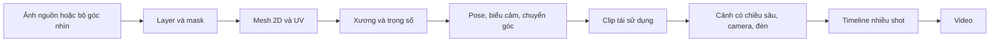
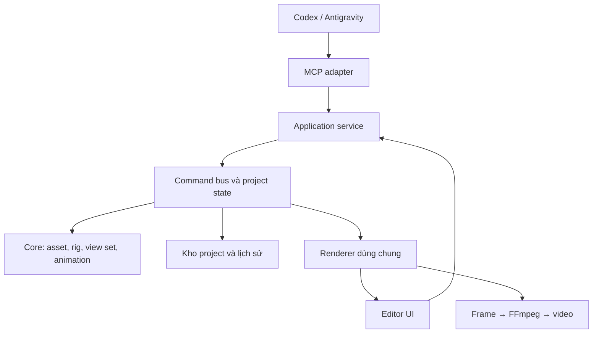

# Parallax Studio — Kế hoạch 2D → 2.5D

Ngày cập nhật: 11/09/2026. Trạng thái: đề xuất để người dùng duyệt.

Kế hoạch này thay thế phương án Blender/Python trước đó. Trong lượt hiện tại chỉ
cập nhật tài liệu, rule, skill và công cụ kiểm tra quy tắc; chưa làm tiếp tính năng app.

## 1. Định hướng

Tạo ứng dụng chuyên xử lý ảnh 2D, rig xương, biến dạng khuôn mặt/cơ thể, quản lý
nhiều góc nhìn và dựng phim 2.5D. Không phụ thuộc Blender hoặc Godot. Model 3D/GLB
không nằm trong phạm vi bản đầu.

Người dùng làm việc với ảnh, layer, xương, pose và clip. Engine dùng mesh phẳng,
camera và tọa độ có chiều sâu để tạo parallax và bóng. Việc tính toán trong không
gian 3D không yêu cầu người dùng dựng hay nhập model 3D hoàn chỉnh.

Ưu tiên một renderer cho cả preview/export, một bộ nghiệp vụ cho UI/MCP, cùng
định dạng project có thể mở lại và sửa. Không tự xây lại các phần thư viện đã làm tốt.

Yêu cầu bổ sung đã nhận: dùng công cụ tạo ảnh sẵn có của Codex/Antigravity rồi
nhập kết quả qua MCP; xuất phim 60/120 FPS ở 2K/4K. GPU mục tiêu người dùng cung cấp
là NVIDIA RTX 3060 12 GB VRAM. Chi tiết được tách thành [luồng tạo ảnh](IMAGE_WORKFLOW.vi.md)
và [profile render](RENDER_PROFILES.vi.md).

## 2. Cơ chế nhiều góc nhìn từ ảnh

| Cơ chế | Công dụng | Dữ liệu cần có |
| --- | --- | --- |
| Bone và skinning | Uốn tay/chân, cổ, đuôi | Xương, mesh và trọng số |
| Warp và morph pose | Quay mặt nhẹ, chớp mắt, miệng, squash/stretch | Lưới điều khiển và pose mẫu |
| View set | Góc trước, nghiêng, bên, sau nếu được cung cấp | Ảnh/layer và binding tương ứng từng góc |

Live2D mô tả mesh deformation và deformer cho quay mặt/cử động; Spine mô tả
skinning theo trọng số. Đây là nguồn tham khảo cơ chế, không phải dependency
bắt buộc. [Live2D deformers][live2d], [Spine weights][spine-weights].

### Bộ góc nhìn

- Khởi đầu với chính diện và hai góc nghiêng; thêm hai góc bên khi asset cần.
- Mỗi góc lưu layer, pivot, draw order và bindings riêng; tên xương cùng ý nghĩa.
- Đầu/cơ thể có thể chuyển góc độc lập nếu bộ asset hỗ trợ.
- Chỉ nội suy mesh khi topology và correspondence tương thích.
- Nếu topology khác, đổi view tại mốc phù hợp hoặc blend được kiểm chứng;
  không trộn vertex không tương ứng.
- Góc được clip/tham số điều khiển; có thể chọn theo hướng tương đối với camera,
  có ngưỡng ổn định để tránh nhấp nháy ở ranh giới view.
- Thiếu góc sau thì báo thiếu view, không giả lập rằng ảnh trước đủ để quay 360 độ.

Một ảnh không cung cấp vùng bị che hoặc góc sau. AI có thể vẽ thêm, nhưng phải
kiểm tra độ nhất quán trang phục, tỷ lệ và chi tiết. Sinh bộ góc là bước riêng
với dựng mesh và rig; người dùng có thể chỉnh từng kết quả.

### Vật liệu 2D

Mỗi layer có ảnh màu, alpha/mask và tùy chọn normal map, roughness, tint. Mặc định
có phong cách màu phẳng; chế độ ánh sáng bổ sung cảm giác nổi khối. Normal map
chỉ thay đổi phản ứng ánh sáng, không sinh hình khối/góc khuất. Depth map nâng cao
là tính năng sau, không thay thế bộ góc nhìn.

## 3. Thư viện và ngôn ngữ đề xuất

| Thành phần | Lựa chọn | Phạm vi |
| --- | --- | --- |
| UI | React + TypeScript | Asset editor, rig editor, timeline và inspector |
| Render | Three.js, WebGL2 trước | Mesh phẳng có xương, camera, material và bóng |
| Tam giác hóa | Earcut | Tam giác hóa contour đã kiểm tra |
| PSD | ag-psd, tùy chọn | Layer trong phạm vi thư viện hỗ trợ; PNG chia lớp được ưu tiên |
| Schema | Zod + JSON Schema được sinh | Một nguồn contract cho UI/service/MCP |
| MCP | SDK TypeScript chính thức | Adapter cho Codex và Antigravity |
| Local service | Node.js + TypeScript | Project state, command bus, tệp và job |
| Desktop | Tauri + Rust | Windows/Linux, lifecycle các tiến trình |
| Xuất phim | Renderer dùng chung + FFmpeg native | Frame đúng thời gian, video và âm thanh |
| Nguồn sinh ảnh | Công cụ tạo ảnh tích hợp trong Codex/Antigravity | AI tạo ảnh rồi chuyển kết quả vào app qua MCP |

Three.js có skinning và material hỗ trợ normal map. Earcut/ag-psd giảm phần xử lý
phải tự viết. Editor rig, warp, view set và timeline vẫn cần xây dựng. Earcut chỉ
xử lý triangulation; contour extraction, thêm đỉnh quanh khớp và topology cho
biến dạng cần logic riêng. [Skinning][skinning], [material][material],
[Earcut][earcut], [ag-psd][psd].

TypeScript sở hữu logic chính để UI, MCP và renderer dùng chung trực tiếp. Rust
không giữ một bản rig/timeline thứ hai. Chỉ chuyển hot path sang Rust/WASM nếu đo
được lợi ích; duy trì một nguồn triển khai và bộ test tương thích. Không thêm
model local, ComfyUI, Python service hoặc API key sinh ảnh riêng vào luồng mặc định.

Các thư viện nền có thể dùng miễn phí: Three.js dùng MIT, Earcut dùng ISC. Chưa
đưa Live2D/Spine runtime vào lõi vì có điều khoản riêng. [Three.js license][three-license],
[Earcut][earcut], [Spine runtime license][spine-license].

Không ghép PixiJS và Three.js trong bản đầu: dùng một renderer để giảm chi phí
đồng bộ pose, material, picking và shadow. WebGPU được đánh giá sau WebGL2.

## 4. Camera và bóng cho 2.5D

- Nhân vật/bối cảnh là các lớp có chiều sâu; camera orthographic hoặc perspective.
- Mesh deform theo pose rồi tham gia shadow pass.
- Bóng theo alpha ảnh, silhouette sau deform và hướng đèn; không thành hình chữ nhật.
- Sàn/tường nhận bóng là plane đơn giản app cung cấp; không cần người dùng làm model 3D.
- Bóng silhouette theo đèn và bóng mềm mỹ thuật là hai chế độ có tên rõ ràng.
- Đổi view phải đổi shadow tương ứng, tránh tạo hai bóng ngoài ý muốn.
- Card phẳng không có thể tích đầy đủ: bóng ở góc cạnh/góc sau có giới hạn.
  Shadow proxy đơn giản có thể bổ sung sau khi đã kiểm chứng phong cách phim.

## 5. AI/MCP và dữ liệu chung

Tool theo miền: đọc project/asset; nhập layer; tạo mesh; tạo/sửa rig; test pose;
thêm view/biểu cảm; thêm clip/shot; đặt camera/light; render preview; xuất phim;
đọc/hủy job. UI và MCP gọi cùng application service.

AI thay đổi asset/scene qua dữ liệu, không sửa source code app mỗi lần làm phim.
Command có schema, revision, ID và state đọc lại. Batch nguyên tử; retry không
tạo asset/job lặp; undo/redo dùng cùng command bus.

Luồng tạo asset mặc định:

1. Agent đọc yêu cầu/style/reference và tạo brief chuẩn từ tool của app.
2. Codex/Antigravity gọi công cụ sinh hoặc sửa ảnh đang có của chính client.
3. Agent đưa ảnh thật vào app qua tool MCP nhập asset; app kiểm tra dữ liệu và lưu source.
4. Chuẩn hóa layer/view, tạo mesh, rig, test pose và sửa qua cùng command bus.

MCP server không tự gọi được công cụ nội bộ của mọi AI client. Agent điều phối
hai nhóm công cụ trong một tác vụ; nếu thiếu công cụ tạo ảnh hoặc không chuyển
được file thì báo đúng trạng thái. Luồng chạy từ yêu cầu trong Codex/Antigravity;
nút tạo ảnh trong UI không được giả lập rằng đã khởi chạy một agent bên ngoài.
Không cần người dùng cấu hình thêm model/API sinh ảnh trong app.
[Chi tiết luồng, truyền file và nghiệm thu](IMAGE_WORKFLOW.vi.md).

Project lưu manifest có phiên bản, asset source, các view, rig, material và clips.
Texture atlas/thumbnail là cache tạo lại được; scene instance tham chiếu asset ID.
Chốt schema chi tiết ở mốc 0 để tránh khóa cứng định dạng trước thử nghiệm.
[Chi tiết schema và cấu trúc project](PROJECT_FORMAT.vi.md).
[Kiến trúc command bus và undo/redo](COMMAND_BUS.vi.md).
[Catalog MCP tools](MCP_TOOLS.vi.md).

## 6. Preview và export

- Cùng pose evaluator tại thời điểm `frameIndex / fps`.
- FPS của timeline, preview và video xuất là ba thiết lập riêng. Export hỗ trợ
  24/30/60/120 FPS, gồm 2K DCI, QHD 1440p, 4K UHD và 4K DCI.
- Mỗi frame xuất được lấy mẫu tại thời gian đích; không chỉ đổi metadata hoặc
  nhân đôi frame 60 FPS để gọi là render 120 FPS.
- Thứ tự contract: chọn view → warp/morph ở rest space → bone skinning →
  instance transform → camera/shadow/render; thứ tự này phải có test.
  [Chi tiết pipeline biến dạng](DEFORMATION_PIPELINE.vi.md).
- Renderer gửi frame theo pipeline có bộ đệm giới hạn sang FFmpeg; hiển thị progress,
  lỗi và hủy job. Mỗi job gắn với snapshot revision.
- Ưu tiên H.264/HEVC qua NVENC khi driver và bản FFmpeg hỗ trợ. Probe encoder thực tế
  và có fallback CPU rõ ràng; không tự hạ độ phân giải hoặc FPS khi encode chậm.
- Bản đầu cần app đang mở để renderer nhận job. MCP trả `waiting_renderer` khi
  chưa có renderer; không báo đang render hoặc đã xong sai thực tế.
- Headless khi app đóng là mở rộng sau pipeline cơ bản.
- Browser dùng cùng editor nhưng cần kiểm tra codec/tệp của môi trường; không hứa
  web có đủ khả năng native nếu thiếu local service.

4K/120 FPS là yêu cầu chất lượng đầu ra; không đồng nghĩa mọi cảnh phải preview
hoặc render nhanh hơn thời gian thực. Dựng offline theo frame vẫn giữ đúng FPS.
Preset, memory budget và ma trận nghiệm thu nằm trong [RENDER_PROFILES.vi.md](RENDER_PROFILES.vi.md).

## 7. Mốc triển khai và nghiệm thu

| Mốc | Nội dung | Điều kiện đạt |
| --- | --- | --- |
| 0. Chuẩn hóa | Format mã nháp, chia module, gom đúng logic chung, bật gate | Source sửa xong dễ đọc, không file vượt 800 dòng; không tiếp tục trên file dồn nghiệp vụ |
| 1. Pipeline ảnh → 2.5D | AI tạo ảnh bằng tool của client → MCP nhập ảnh → mesh/rig → camera/bóng | Có ảnh thật, clip 5–10 giây, deform đúng, bóng theo alpha/đèn, mở lại project được |
| 2. Rig và nhiều góc | Bone/pivot/weight, rest pose, warp, biểu cảm, view set | Chuyển góc trong phạm vi asset, không nhảy pivot hoặc trộn topology sai |
| 3. App dựng phim | Library, timeline, clip blending, shot, camera/light | Dựng phim ngắn từ asset dùng lại; lưu/mở/undo đúng |
| 4. Đạo diễn AI | Kịch bản → shot → asset/action → preview → sửa → export | MCP dựng được phim nhiều shot từ asset sẵn có, báo dữ liệu thiếu |
| 5. Chất lượng bộ asset | Sinh/sửa nhiều góc bằng tool của client, layer, biểu cảm và rig | Bộ góc nhất quán, alpha thật, kết quả có thể sửa; không bắt cài model local |
| 6. Đóng gói/tối ưu | Windows/Linux, NVENC, 2K/4K × 60/120 FPS, cache và recovery | Đúng kích thước/frame count/timestamp, có video kiểm chứng và số đo trên từng OS |

Benchmark dùng RTX 3060 12 GB làm cấu hình GPU mục tiêu. Preview mục tiêu 60 FPS,
có tùy chọn 120 FPS cho cảnh và màn hình phù hợp; cho phép giảm resolution preview
độc lập với output 4K. Ghi CPU, RAM, driver, vertex/bone, shadow budget, frame time
trung vị/p95, thời gian xuất, RAM/VRAM và encoder đã dùng. Không suy hiệu năng từ
VRAM đơn thuần hoặc gọi phép xuất 4K/120 FPS offline là preview 4K/120 thời gian thực.

Test quan trọng: weights chuẩn hóa; xương không chu kỳ; giới hạn IK; interpolation;
chuyển view/topology; mask/shadow theo pose; preview/export cùng thời gian;
UI/MCP cùng state; lưu và undo nguyên tử; ảnh nhập là kết quả thật của tool;
output 60/120 FPS đúng frame count/timestamp, không giảm chất lượng âm thầm.
[Chiến lược kiểm thử](TESTING_STRATEGY.vi.md).

## 8. Quy tắc code và AI

Chi tiết: [CODING_RULES.vi.md](CODING_RULES.vi.md), [MODULE_MAP.vi.md](MODULE_MAP.vi.md).
Quy tắc code người dùng đã yêu cầu có hiệu lực độc lập với duyệt kiến trúc.

- Tối đa 800 dòng vật lý mỗi file source, gồm comment và dòng trống.
- Khoảng 400–500 dòng là tín hiệu tách trách nhiệm, không phải chỉ tiêu phải đạt.
- Không nén code/JSX/type để lách giới hạn; mỗi bước nghiệp vụ trình bày rõ.
- Một nghiệp vụ/thuật toán có một nơi sở hữu; caller import hoặc gọi adapter.
- Helper chung chia theo miền, không dồn tất cả vào `utils.ts` hoặc `shared.ts`.
- Tên mô tả ý nghĩa, type tách rõ, import/public API/helper có bố cục.
- Rule hướng dẫn AI đi cùng formatter, lint, giới hạn source, kiểm tra duplicate
  và dependency graph; tài liệu đơn thuần không tự bảo đảm tuân thủ.

Codex đọc `AGENTS.md`. Codex/Antigravity dùng `.agents/skills/<name>/SKILL.md`;
Antigravity có workspace rule trong `.agents/rules`. Adapter client dẫn về nguồn
quy tắc chung. [Codex rules][codex-rules], [skills][codex-skills],
[Antigravity rules][anti-rules], [skills][anti-skills].

## 9. Phạm vi hiện tại

Bản đầu không gồm Blender/Godot, GLB editor, dựng model 3D, cloth/fluid, lip-sync
nâng cao, cộng tác nhiều người hoặc render cloud. Ghép audio cơ bản theo sau video
pipeline; sinh giọng nói cần provider hoặc tệp người dùng cung cấp.

Mã trong `src/`, `shared/`, `engine/` còn là bản nháp thiếu thành phần, chưa build/
kiểm thử và có code nén. Không dùng nó làm mẫu chất lượng. Mốc 0 sẽ chuẩn hóa phần
phù hợp khi người dùng yêu cầu triển khai. Lượt này không refactor app hoặc cài dependency.

[live2d]: https://docs.live2d.com/en/cubism-editor-manual/deformer/
[spine-weights]: https://esotericsoftware.com/spine-weights
[skinning]: https://threejs.org/docs/pages/SkinnedMesh.html
[material]: https://threejs.org/docs/pages/MeshStandardMaterial.html
[earcut]: https://github.com/mapbox/earcut
[psd]: https://github.com/Agamnentzar/ag-psd
[three-license]: https://github.com/mrdoob/three.js/blob/dev/LICENSE
[spine-license]: https://esotericsoftware.com/licenses/Spine-Runtimes-License-Agreement.pdf
[codex-rules]: https://learn.chatgpt.com/docs/agent-configuration/agents-md
[codex-skills]: https://learn.chatgpt.com/docs/build-skills
[anti-rules]: https://antigravity.google/docs/rules-workflows
[anti-skills]: https://antigravity.google/docs/skills
