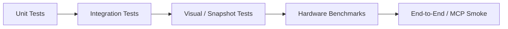

# Parallax Studio — Comprehensive Testing Strategy

This document defines testing categories, automated CI quality gates, module invariant matrices,
and hardware benchmark protocols.

## 1. Test Categorization



| Category | Scope | Primary Tooling | Execution Target |
| --- | --- | --- | --- |
| Unit | Pure functions and classes, zero disk/network I/O | Vitest | < 1s per file |
| Integration | Multi-module interactions with mock I/O | Vitest + Memory Storage | < 5s per suite |
| Visual Snapshot | Frame buffer pixel comparisons | Vitest + Canvas Snapshots | < 10s per case |
| Benchmark | Frame times, VRAM footprint, throughput | Dedicated benchmark runner | Nightly / Release gates |
| End-to-End | Full desktop shell + MCP client invocation | Native test scripts | Release candidate gates |

## 2. Test Invariants by Domain Module

### 2.1 Core — Skeletal Rigging

| Test Case | Scope | Asserted Invariant |
| --- | --- | --- |
| Valid Hierarchy | Unit | Topological sort succeeds for acyclic skeletal graphs |
| Cyclic Detection | Unit | Rejects cyclic parent-child bone dependencies |
| Weight Normalization | Unit | $\sum_{i=1}^{4} w_i = 1.0 \pm 0.001$ across all vertices |
| Maximum Influences | Unit | Rejects $> 4$ bone influences per vertex |
| Inverse Kinematics | Unit | Two-bone IK solver converges smoothly within angular limits |
| Bind / Unbind | Integration | Adding/removing bone bindings recalculates buffers cleanly |

### 2.2 Core — Animation Sampling

| Test Case | Scope | Asserted Invariant |
| --- | --- | --- |
| Keyframe Interpolation | Unit | Evaluates linear, ease-in, ease-out, and cubic bezier curves |
| Clip Boundaries | Unit | Accurately clamps or loops out-of-bounds evaluation timestamps |
| Time-to-Frame Mapping | Unit | $\text{frameIndex} = \text{time} \times \text{fps}$ across all standard framerates |
| 120 FPS Sampling | Unit | 1.0s video yields exactly 120 uniquely sampled timestamps |
| Hold Keyframe | Unit | Constant values maintained between identical keyframes |

### 2.3 Core — Deformation Pipeline

| Test Case | Scope | Asserted Invariant |
| --- | --- | --- |
| Canonical Order | Integration | View $\to$ Warp/Morph $\to$ Skinning $\to$ Transform evaluates strictly in order |
| Rest-Space Lattice Identity | Unit | Zero-offset control lattice leaves vertices unmutated |
| Morph Topology Guard | Unit | Rejects morph blending between diverging vertex counts or indices |
| Additive Blendshapes | Unit | Multiple simultaneous morph targets sum displacements additively |
| Preview / Export Parity | Integration | Viewport and offline export evaluate identical vertex positions |

### 2.4 Core — View Sets & Angles

| Test Case | Scope | Asserted Invariant |
| --- | --- | --- |
| Angle Quantization | Unit | Camera azimuth maps deterministically to correct view ID |
| Hysteresis Threshold | Unit | Micro-oscillations within $\pm 5^\circ$ boundary do not flip views |
| Missing View Fallback | Unit | Logs diagnostic warning and retains current view; never distorts |
| Atomic View Switch | Integration | Switching views updates mesh, texture, bindings, and shadow maps |

### 2.5 Application — Command Bus & History

| Test Case | Scope | Asserted Invariant |
| --- | --- | --- |
| Dispatch Mutation | Unit | Handler transforms state immutably; original state untouched |
| Undo / Redo | Integration | Executing inverse command restores exact prior state |
| Batch Atomicity | Integration | Failure at step $N$ cleanly rolls back steps $1 \dots N-1$ |
| Monotonic Revision | Unit | Every committed command increments revision counter by 1 |
| Conflict Detection | Unit | Outdated `baseRevision` on structural commands triggers rejection |
| Idempotency Cache | Unit | Duplicate `commandId` returns cached result without re-execution |

### 2.6 Runtime — Rendering & GPU

| Test Case | Scope | Asserted Invariant |
| --- | --- | --- |
| Buffer Dimensions | Visual | Off-screen render targets match exact profile resolutions |
| Dynamic Shadow Map | Visual | Shadow geometry updates synchronously with skeletal deformation |
| Alpha Silhouette | Visual | Shadows conform to texture alpha transparency, not quad bounding box |
| Normal Map Perturbation | Visual | Normal map channels alter specular and diffuse shading vectors |

### 2.7 Export Subsystem

| Test Case | Scope | Asserted Invariant |
| --- | --- | --- |
| Discrete Frame Total | Integration | Duration $D \times \text{FPS} = \text{Exact frame count}$ |
| Timestamp Accuracy | Integration | Exported frame timestamps progress monotonically without drift |
| NVENC Detection & Fallback | Integration | Probes hardware encoder; falls back to CPU without crashing |
| Job Cancellation | Integration | Cancelling aborts FFmpeg subprocess and purges ring buffers |

### 2.8 MCP Integration

| Test Case | Scope | Asserted Invariant |
| --- | --- | --- |
| Tool-to-Command Mapping | Integration | MCP tool dispatches to correct Application Command |
| Input Validation | Unit | Schema violations return structured error responses |
| UI/MCP State Equivalence | Integration | Identical command from UI and MCP yields identical state |

### 2.9 Auto-Rigging & Mesh Generation

| Test Case | Scope | Asserted Invariant |
| --- | --- | --- |
| Contour Extraction | Unit | Alpha boundary extraction matches silhouette cleanly |
| Triangulation Quality | Unit | Zero degenerate (area $\le 0$) or overlapping triangles |
| Edge Loop Insertion | Integration | Joint zones contain $\ge 1–2$ concentric loops; bends smoothly |
| Landmark Calibration | Unit | Landmark coordinates map to proportional skeleton joints |
| Proximity Weights | Unit | Vertex weights decay with distance; zero orphan vertices |

## 3. Core Test Contract: Preview = Export Equivalence

The most critical visual invariant of Parallax Studio:

1. Staged scene containing rigged characters, keyframed animation, camera, and dynamic lighting.
2. Render frame at timestamp $t$ via the interactive Three.js preview pipeline.
3. Render frame at timestamp $t$ via the offline headless export pipeline.
4. Byte-level canvas comparison:
   - Vertex positions: 100% identical.
   - Surface colors: Identical within anti-aliasing edge tolerances ($\le 2\text{ px}$).
   - Projected shadows: Identical silhouette shapes and placement.

Asserted across at least 3 temporal milestones (beginning, midpoint, end of clip).

## 4. Hardware Benchmark Protocol

- **Target Hardware**: NVIDIA GeForce RTX 3060 (12 GB VRAM).
- **Reference Scene**:
  - 10 rigged characters (each $\approx 50$ bones, $\approx 20$ morph targets).
  - 20 layered prop cards with alpha masks.
  - 1 directional shadow-casting light.
  - Orthographic depth camera.
- **Measured Metrics**:
  - Viewport frame time (median p50 and 95th percentile p95).
  - Offline rendering throughput (FPS).
  - Peak system RAM and GPU VRAM consumption.
  - Active encoder saturation (NVENC vs. software).

## 5. Automated CI Quality Gates

### Mandatory Blocking Gates

1. **Source Code Limits Gate**:
   ```sh
   node scripts/quality/check-source-limits.mjs
   node --test scripts/quality/source-limits.test.mjs
   ```
   No file exceeds 800 physical lines; no source line exceeds 120 characters.
2. **TypeScript Strict Typecheck**: `tsc -b --noEmit`.
3. **Automated Unit & Integration Test Suite**: `vitest run`.
4. **Code Formatting Check**: `prettier --check .`.

### Advisory Inspection Gates

5. **Dependency Boundary Graph**: Enforces directional imports per `MODULE_MAP.md`.
6. **Code Duplication Check**: Detects semantic and structural code duplication.
7. **Performance Regression Check**: Flags frame time increases $> 10\%$ against baseline.

## 6. Test Directory Structure

```text
tests/
  unit/
    rig/
    animation/
    deformation/
    geometry/
    views/
  integration/
    command-bus/
    preview-export-parity/
    mcp-tools/
    export-pipeline/
  visual/
    shadow-accuracy/
    render-output/
  benchmark/
    viewport-frametime.bench.ts
    export-throughput.bench.ts
```

All test files adhere to the strict 800-line physical limit.

## 7. Documentation References

- [PLAN.md](PLAN.md) section 7 — Project milestones and acceptance criteria
- [RENDER_PROFILES.md](RENDER_PROFILES.md) section 6 — Render verification protocol
- [CODING_RULES.md](CODING_RULES.md) section 6 — Automated gates and limits
- [DEFORMATION_PIPELINE.md](DEFORMATION_PIPELINE.md) section 7 — Deformation test contracts
- [COMMAND_BUS.md](COMMAND_BUS.md) — Transactional rollback and undo tests
