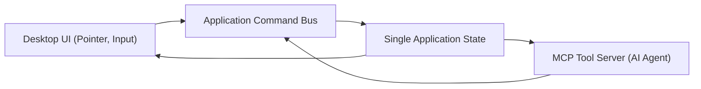

# Parallax Studio UI Specification

Status: Architectural specification. Describes the user interface architecture
and interaction model derived from professional desktop animation software:
Spine 2D, Live2D Cubism, Rive, and Moho.

## 1. Professional Animation App Reference

### 1.1 Comparative Analysis

Industry-standard 2D/2.5D animation suites adhere to a consistent spatial layout:

| Component | Spine 2D | Live2D Cubism | Rive | Moho |
| --- | --- | --- | --- | --- |
| Central Viewport | Yes | Yes | Yes | Yes |
| Left Hierarchy / Tree | Hierarchy | Parts Palette | Hierarchy | Layers |
| Right Properties / Inspector | Inspector | Inspector | Inspector | Style / Properties |
| Bottom Timeline | Dopesheet / Graph | Timeline | Timeline | Timeline |
| Primary Toolbar | Bottom / Left | Top | Top Strip | Left Strip |
| Core Dual Modes | Setup / Animate | Modeling / Animation | Design / Animate | Frame 0 / Animate |
| Panel Management | Split resize | Floating windows | Stackable tabs | Docking / Undocking |

### 1.2 Architectural Takeaways

1. **Explicit Mode Separation**: Setup (rigging/modeling) vs. Animate. Each mode
   presents distinct toolbars, gizmos, and inspector controls without clutter.
2. **Central Viewport Primacy**: Dominates screen real estate; hosts canvas plus
   toggleable vector overlays (wireframe, skeleton bones, heatmaps, landmarks, pivots).
3. **Left-to-Right Mental Model**: Select target in Left Hierarchy -> Manipulate in
   Viewport -> Inspect/Fine-tune numeric parameters in Right Inspector.
4. **Context-Sensitive Properties**: Inspector content mutates dynamically based on
   selection type (Layer, Bone, Vertex, Keyframe, or Viewport).
5. **Timeline at Bottom**: Accommodates multi-track dopesheet and spline graph editor.
6. **Stackable Panel System**: Rive-style docking allows users to stack tabs, split
   containers, and persist layout presets across workflow stages.

## 2. Overall Parallax Studio Layout

```text
┌────────────────────────────────────────────────────────────────┐
│  Menu Bar   │  Mode: [Setup ▼] [Animate]  │  [Preview] [Export]│
├─────────┬──────────────────────────────────────┬───────────────┤
│         │                                      │               │
│  LEFT   │           CENTRAL VIEWPORT           │    RIGHT      │
│ PANELS  │                                      │   PANELS      │
│         │      (Canvas + Overlays)             │               │
│ ┌─────┐ │                                      │ ┌───────────┐ │
│ │Hier-│ │   ┌──────────────────────────┐       │ │Properties │ │
│ │archy│ │   │                          │       │ │           │ │
│ │Asset│ │   │    Character Viewport    │       │ │ Transform │ │
│ │Bone │ │   │    Overlays:             │       │ │ Rig       │ │
│ │Layer│ │   │    • Mesh wireframe      │       │ │ Mesh      │ │
│ └─────┘ │   │    • Bone skeleton       │       │ │ Material  │ │
│ ┌─────┐ │   │    • Weight heatmap      │       │ │ Animation │ │
│ │Views│ │   │    • Landmarks & pivots  │       │ └───────────┘ │
│ │     │ │   └──────────────────────────┘       │ ┌───────────┐ │
│ └─────┘ │                                      │ │Tool       │ │
│         │         [Toolbar Strip]              │ │Options    │ │
│         │                                      │ └───────────┘ │
├─────────┴──────────────────────────────────────┴───────────────┤
│  TIMELINE PANEL                                                │
│  ┌──────────────────────────────────────────────────────────┐  │
│  │ Track │ ♦──────♦────♦──────────♦────♦                    │  │
│  │ Bone  │    ♦────────♦──────♦                              │  │
│  │ Layer │ ♦──────────────────♦                              │  │
│  └──────────────────────────────────────────────────────────┘  │
│  [Dopesheet] [Graph Editor] [▶ Play] [⏹ Stop]  00:00 / 05:00  │
├────────────────────────────────────────────────────────────────┤
│  Status Bar: "Ready" │ FPS: 60 │ Frame: 0/300 │ GPU: 3060 OK   │
└────────────────────────────────────────────────────────────────┘
```

## 3. Two Primary Operating Modes

### 3.1 Setup Mode (Rigging & Preparation)

Dedicated to character asset construction: importing artwork, segmenting layers,
generating Earcut meshes, placing landmarks, auto-rigging, and painting weights.
Equivalent to Frame 0 in Moho or Setup Mode in Spine.

**Setup Mode Toolbar:**

```text
┌─────────────────────────────────────────────────────────────┐
│ [Select] [Move] [Rotate] [Scale] │ [Mesh Edit] [Weight     │
│                                   │  Paint] [Bone Tool]     │
│ [Landmark] [Pivot] [Draw Order]   │ [Auto-Rig] [Template]   │
└─────────────────────────────────────────────────────────────┘
```

| Tool | Function | Target Command Bus Action |
| --- | --- | --- |
| Select | Select bone, layer, or vertex | `editor.select` |
| Move | Translate active element | `transform.move` |
| Rotate | Rotate active element | `transform.rotate` |
| Scale | Scale active element | `transform.scale` |
| Mesh Edit | Insert/remove/translate vertices & edges | `mesh.refine` |
| Weight Paint | Brush vertex skinning weights | `rig.set_weights` |
| Bone Tool | Create/parent/re-order bones | `rig.add_bone` |
| Landmark | Place/drag anatomical landmark markers | `rig.set_landmarks` |
| Pivot | Set local layer pivot origin | `asset.set_pivot` |
| Draw Order | Adjust 2D layer stacking order | `asset.set_draw_order` |
| Auto-Rig | Execute Rig-Ready automatic skeleton fit | `rig.apply_rig_template` |
| Template | Browse skeleton & landmark templates | `rig.list_rig_templates` |

### 3.2 Animate Mode (Performance & Keyframing)

Dedicated to kinematic performance: manipulating bones, placing keyframes,
fine-tuning easing splines, previewing playback, and baking animation tracks.

**Animate Mode Toolbar:**

```text
┌─────────────────────────────────────────────────────────────┐
│ [Select] [Move] [Rotate] │ [Key ♦] [Auto-Key] [Templates]  │
│                           │                                  │
│ [Onion Skin] [Preview]    │ [Graph] [Dopesheet]              │
└─────────────────────────────────────────────────────────────┘
```

| Tool | Function | Target Command Bus Action |
| --- | --- | --- |
| Select | Select bones or keyframes | `editor.select` |
| Move | Translate bone pose | `animation.set_keyframe` |
| Rotate | Rotate bone pose | `animation.set_keyframe` |
| Key ♦ | Explicitly insert keyframe at playhead | `animation.set_keyframe` |
| Auto-Key | Automatically key modified transforms | `animation.set_keyframe` |
| Templates | Apply motion cycle presets (walk, idle) | `animation.apply_template` |
| Onion Skin | Toggle ghost preview of adjacent frames | `editor.toggle_onion_skin` |
| Preview | Trigger real-time viewport playback | `animation.preview_frame` |
| Graph | Switch to bezier curve spline editor | `editor.switch_view_mode` |
| Dopesheet | Switch to keyframe dopesheet view | `editor.switch_view_mode` |

## 4. Panel Layout Specifications

### 4.1 Hierarchy Panel (Left)

Displays a tree representation of the active scene graph, viewports, and assets:

```text
┌─ Hierarchy ─────────────────┐
│ 🔍 Search hierarchy...      │
│                             │
│ ▼ 📁 Project: "Ronin Duel"  │
│   ▼ 👤 Character: "Ninja"   │
│     ▼ 🖼 Views              │
│       📷 front [Active]     │
│       📷 quarter-left       │
│     ▼ 📄 Layers (front)     │
│       🔲 head         [z:7] │
│       🔲 torso        [z:3] │
│       🔲 left-arm     [z:6] │
│       🔲 right-arm    [z:1] │
│       🔲 left-leg     [z:5] │
│       🔲 right-leg    [z:2] │
│       🔲 pelvis       [z:4] │
│     ▼ 🦴 Skeleton           │
│       🦴 root               │
│         🦴 spine            │
│           🦴 head           │
│           🦴 left_clavicle  │
│             🦴 left_arm     │
│     ▼ 🎬 Animations         │
│       🎬 idle-breath        │
│       🎬 sprint-cycle       │
└─────────────────────────────┘
```

### 4.2 Properties Panel (Right Inspector)

Context-sensitive panel displaying properties for selected entities:

**When Layer is Selected:**
```text
┌─ Properties: head ──────────┐
│ Name: [head            ]    │
│ Visible: [✓]  Locked: [ ]   │
│ Draw Order: [7        ]     │
│ Opacity: [100%     ] ░░░░█  │
│                             │
│ ── Mesh Geometry ──         │
│ Vertices: 245               │
│ Triangles: 438              │
│ [Edit Mesh] [Auto-Generate] │
│                             │
│ ── Pivot Offset ──          │
│ X: [512.0]  Y: [280.0]      │
│ [Reset to Bounding Center]  │
│                             │
│ ── Texture Source ──        │
│ Size: 1024 × 1024 px        │
│ Alpha Integrity: Clean ✅   │
│ [Replace Asset Image]       │
└─────────────────────────────┘
```

**When Bone is Selected:**
```text
┌─ Properties: left_arm ──────┐
│ Name: [left_arm        ]    │
│ Parent Bone: left_clavicle  │
│ Length: [85.0 px]           │
│ Local Rotation: [0.0°]      │
│                             │
│ ── Skin Weights ──          │
│ Bound Layer: left-arm       │
│ Influence Radius: [40.0 px] │
│ Falloff: [Gaussian ▼]       │
│ [Paint Weights]             │
│                             │
│ ── Kinematics ──            │
│ Constraint: [2-Bone IK ▼]   │
│ IK Target: bone_left_wrist  │
│ Pole Target: (none)         │
│                             │
│ ── Anatomical Landmarks ──  │
│ Joint Head: (420, 320)      │
│ Joint Tail: (380, 480)      │
│ [Snap to Landmark Point]    │
└─────────────────────────────┘
```

**When Keyframe is Selected:**
```text
┌─ Properties: Keyframe ──────┐
│ Time: [0.250 s] (Frame 15)  │
│ Target: left_arm.rotation   │
│                             │
│ ── Transform Value ──       │
│ Angle: [-30.0°]             │
│                             │
│ ── Interpolation Spline ──  │
│ Easing: [Cubic Bezier ▼]    │
│ Preset: [Ease In-Out]       │
│ In-Tangent:  [-0.15, 0.0]   │
│ Out-Tangent: [ 0.15, 0.0]   │
└─────────────────────────────┘
```

### 4.3 Tool Options Panel (Bottom-Right)

Controls active tool parameters:

**Weight Paint Mode Active:**
```text
┌─ Weight Paint Options ──────┐
│ Brush Size: [20 px]         │
│ Strength:   [0.50]   ░░█░░  │
│ Falloff:    [Smooth ▼]      │
│ Mode: [Paint ▼]             │
│   • Paint (Additive)        │
│   • Erase (Subtractive)     │
│   • Smooth (Laplacian)      │
│   • Blur (Gaussian kernel)  │
│                             │
│ Active Bone: left_arm       │
│ Heatmap Overlay: [✓] Active │
│ [Auto-Weights] [Normalize]  │
└─────────────────────────────┘
```

**Mesh Edit Mode Active:**
```text
┌─ Mesh Edit Options ─────────┐
│ Edit Target: [Vertex ▼]     │
│   • Vertex (Translate/Add)  │
│   • Edge (Split/Collapse)   │
│   • Face (Subdivide)        │
│                             │
│ Operations:                 │
│ [Add Vertex] [Delete Vert]  │
│ [Add Edge Loop] [Subdivide] │
│ Target Density: [Medium ▼]  │
│ [Triangulate (Earcut)]      │
│ Mesh Stats: 245V / 438T     │
└─────────────────────────────┘
```

### 4.4 Timeline Panel (Bottom)

Multi-track scrubber with keyframe dopesheet and spline editor toggles:

```text
┌─ Timeline ──────────────────────────────────────────────────┐
│ Clip: [run-cycle ▼]  Duration: 1.00s  FPS: 60  Loop: [✓]   │
├──────────┬──────────────────────────────────────────────────┤
│ Track    │ 0.0   0.25   0.5   0.75   1.0                   │
│          │ |      |      |      |      |                    │
│ ▼ root   │ ♦──────♦──────♦──────♦──────♦                    │
│   rot    │ 0°     2°     0°    -2°     0°                   │
│   pos.y  │ 0      5      0      5      0                    │
│ ▼ l_arm  │ ♦─────────────♦─────────────♦                    │
│   rot    │ -45°          35°          -45°                  │
│ ▼ r_arm  │ ♦─────────────♦─────────────♦                    │
│   rot    │ 35°          -45°           35°                  │
├──────────┴──────────────────────────────────────────────────┤
│ [⏮] [◀◀] [▶ Play] [⏹] [▶▶] [⏭] │ 🔑 Auto-Key: [ON] │ 00:15/01:00│
└─────────────────────────────────────────────────────────────┘
```

### 4.5 Perspective Views Panel (Bottom-Left)

Manages multi-angle character reference textures for 2.5D visual continuity:

```text
┌─ Views Panel ───────────────┐
│ Active View: front          │
│                             │
│ ┌─────┐ ┌─────┐ ┌─────┐    │
│ │front│ │qtr-L│ │qtr-R│    │
│ │ [✓] │ │ [✓] │ │ [ ] │    │
│ └─────┘ └─────┘ └─────┘    │
│ ┌─────┐ ┌─────┐ ┌─────┐    │
│ │sideL│ │back │ │sideR│    │
│ │ [ ] │ │ [ ] │ │ [ ] │    │
│ └─────┘ └─────┘ └─────┘    │
│                             │
│ [Add Perspective] [Check]   │
└─────────────────────────────┘
```

## 5. Viewport Vector Overlays

Viewport overlays provide visual debugging and editing handles directly above
the rendered Three.js canvas. Overlays are toggled via hotkey or overlay toolbar:

```text
┌─ Viewport Overlays ───────────────────────┐
│ [✓] Mesh Wireframe    (Ctrl+M)            │
│ [✓] Bone Skeleton     (Ctrl+B)            │
│ [ ] Weight Heatmap    (Ctrl+W)            │
│ [ ] Landmarks         (Ctrl+L)            │
│ [✓] Pivot Points      (Ctrl+P)            │
│ [ ] Onion Skin        (Ctrl+O)            │
│ [ ] Safe Area Bounds  (Ctrl+A)            │
│ [ ] Alignment Grid    (Ctrl+G)            │
└───────────────────────────────────────────┘
```

**Weight Heatmap Representation:**
- **Red (`#FF3B30`)**: Weight = 1.0 (Full influence by active bone).
- **Yellow (`#FFCC00`)**: Weight = 0.5 (Shared influence between adjacent bones).
- **Blue (`#007AFF`)**: Weight = 0.0 (Zero influence).

## 6. MCP Integration: AI Understanding and UI Synchronization

### 6.1 Architectural Principle: Unified Command Bus



All interactions—whether triggered by a user click or an AI agent calling an MCP
tool—execute via the exact same Command Bus handlers. When an AI agent executes
`rig.set_landmarks`, the state updates and the viewport immediately renders the
updated marker pins.

### 6.2 Semantic UI Element IDs

To allow AI agents and automation scripts to interact deterministically with the
user interface, interactive elements implement standardized semantic IDs:

| UI Element | Semantic Element ID | Underlying Command |
| --- | --- | --- |
| Auto-Rig Action Button | `btn-auto-rig` | `rig.apply_rig_template` |
| Mesh Edit Mode Toggle | `tool-mesh-edit` | `mesh.refine` |
| Weight Paint Tool Toggle | `tool-weight-paint` | `rig.set_weights` |
| Landmark Marker Handle | `landmark-{name}` | `rig.set_landmarks` |
| Hierarchy Bone Item | `bone-{bone_id}` | `rig.get_hierarchy` |
| Keyframe Scrubber Node | `kf-{track}-{timestamp}` | `animation.set_keyframe` |
| Viewport Playhead Toggle | `btn-play` | `animation.preview_frame` |
| Export Video Action | `btn-export` | `export.start_job` |
| Rig Template Selector | `select-rig-template` | `rig.list_rig_templates` |
| View Angle Thumbnail | `view-{view_id}` | `asset.attach_view` |

### 6.3 Bidirectional State Flow

| User / Agent Action | UI Reaction | MCP / Agent State Reaction |
| --- | --- | --- |
| User drags landmark pin | Viewport updates handle, skeleton adapts | State update emitted, agent observes new coords |
| Agent invokes `mesh.generate` | Viewport paints wireframe mesh overlay | State updated, agent receives vertex stats |
| User paints skin weight brush | Heatmap reflects real-time gradient | State updated, normalized weights recorded |
| Agent invokes `animation.apply_template` | Timeline generates keyframe track | State updated, playback immediately available |
| User clicks Auto-Rig | Viewport renders landmarks + skeleton | Same command sequence runs as MCP invocation |
| Agent invokes `export.start_job` | Modal shows render progress bar | Job progress reported via MCP polling |

## 7. Workflow-Specific Interaction Sequences

### 7.1 Import to Auto-Rig Sequence (Setup Mode)

```text
Step 1: Ingestion                 Step 2: Template Selection
┌──────────────────────┐          ┌──────────────────────┐
│ [Import Image]       │          │ Select Rig Template: │
│                      │    →     │                      │
│  📁 Select PNG...    │          │ ◉ Humanoid T-Pose    │
│  or Drag & Drop      │          │ ○ Humanoid A-Pose    │
│                      │          │ ○ Chibi Character    │
│  [AI Generate ✨]    │          │ ○ Quadruped Animal   │
│  Prompt: [........]  │          │ [Apply Template]     │
└──────────────────────┘          └──────────────────────┘
           ↓                                 ↓
Step 3: Layer Separation          Step 4: Auto-Rig Evaluation
┌──────────────────────┐          ┌──────────────────────┐
│ Segmenting Layers... │          │ ✅ Landmarks Placed  │
│                      │    →     │ ✅ 15 Bones Bound    │
│  ✅ head             │          │ ✅ Initial Weights   │
│  ✅ torso            │          │                      │
│  ✅ left_arm         │          │ ⚠ Left elbow offset  │
│  ✅ right_arm        │          │   by 4px detected    │
│  ✅ left_leg         │          │                      │
│  ✅ right_leg        │          │ [Fine-Tune Pins]     │
│  [Confirm Layers]    │          │ [Accept Rig]         │
└──────────────────────┘          └──────────────────────┘
```

### 7.2 Mesh Editing Sequence

- Hover vertex: Highlights with amber halo (`#F5A623`).
- Click vertex: Selects vertex with cyan ring (`#50E3C2`).
- Drag vertex: Translates position with real-time UV texture warping.
- `Ctrl + Click`: Multi-selects vertices for group translation.
- `Del` key: Removes selected vertex and re-triangulates via Earcut.

### 7.3 Weight Painting Sequence

- `Left-Click + Drag`: Paints positive weight influence for the active bone.
- `Right-Click + Drag`: Erases (subtracts) weight influence.
- `Shift + Click`: Smooths weight boundary via Laplacian neighbor averaging.
- `Mouse Wheel`: Adjusts brush radius interactively.

### 7.4 Animation & Curve Editing

- Scrubber drag: Updates Three.js deformation pipeline to target timestamp.
- Click bone gizmo + drag: Rotates bone and generates keyframe if Auto-Key is active.
- Graph Editor handles: Manipulates cubic bezier tangents for velocity easing.

## 8. Keyboard Shortcuts

| Shortcut | Action | Scope |
| --- | --- | --- |
| `Tab` | Toggle Setup Mode ↔ Animate Mode | Global |
| `V` | Pointer Selection Tool | Viewport |
| `G` | Translate / Grab Active Element | Viewport |
| `R` | Rotate Active Element | Viewport |
| `S` | Scale Active Element | Viewport |
| `E` | Mesh Editing Mode | Setup Mode |
| `W` | Weight Painting Mode | Setup Mode |
| `B` | Bone Tool | Setup Mode |
| `L` | Landmark Placement Tool | Setup Mode |
| `K` | Insert Keyframe at Playhead | Animate Mode |
| `Space` | Play / Pause Playhead | Animate Mode |
| `Ctrl + Z` | Undo Command | Global |
| `Ctrl + Shift + Z` | Redo Command | Global |
| `Ctrl + M` | Toggle Mesh Wireframe Overlay | Viewport |
| `Ctrl + B` | Toggle Skeleton Bone Overlay | Viewport |
| `Ctrl + W` | Toggle Weight Heatmap Overlay | Viewport |
| `Ctrl + K` | Quick Command Palette Search | Global |

## 9. Responsive Layout Presets

Panels can be dragged, nested as stacked tabs, collapsed, or resized.

| Workspace Preset | Primary Visible Panels | Target Workflow |
| --- | --- | --- |
| `Default` | Hierarchy (L), Properties (R), Timeline (B) | General editing |
| `Rigging` | Hierarchy + Views (L), Properties + Weight Tools (R) | Auto-rig & skinning |
| `Animation` | Compact Hierarchy (L), Timeline + Graph Editor (B) | Keyframe choreography |
| `Preview` | Viewport maximized, panels hidden | Cinematic review |
| `Export` | Viewport + Encoding Profiles + Render Queue | Video output |

## 10. Component to Command Mapping

| UI Component | User Action | Command Bus Handler | Associated MCP Tool |
| --- | --- | --- | --- |
| Import Button | Click -> File Dialog | `asset.import_image` | `asset.import_image` |
| AI Generate Button | Click -> Prompt Modal | `asset.prepare_image_brief` | `asset.prepare_image_brief` |
| Hierarchy Layer Item | Click | `editor.select` | (Internal selection) |
| Layer Reorder Drag | Drag up/down | `asset.set_draw_order` | `asset.set_draw_order` |
| Mesh Vertex Drag | Drag in viewport | `mesh.refine` | `mesh.refine` |
| Auto-Generate Mesh | Click | `mesh.generate` | `mesh.generate` |
| Landmark Marker Drag | Drag pin handle | `rig.adjust_landmark` | `rig.adjust_landmark` |
| Auto-Rig Execute | Click | `rig.apply_rig_template` | `rig.apply_rig_template` |
| Viewport Bone Rotate | Drag rotate handle | `rig.test_pose` | `rig.test_pose` |
| Weight Brush Stroke | Paint on mesh | `rig.set_weights` | `rig.set_weights` |
| Keyframe Diamond Drag | Drag on timeline track | `animation.set_keyframe` | `animation.set_keyframe` |
| Motion Template Pick | Select preset | `animation.apply_template` | `animation.apply_template` |
| Playback Button | Click ▶ | `animation.preview_frame` | `animation.preview_frame` |
| Export Job Button | Click | `export.start_job` | `export.start_job` |
| Perspective View Click | Select thumbnail | `editor.switch_view` | `asset.attach_view` |

## 11. Iconography System

### 11.1 Anti-AI-Slop & Consistency Principles

- **No OS-Native Icons**: Prohibit Segoe MDL2 (Windows) and SF Symbols (macOS)
  because they diverge across platforms and create inconsistent visual weights.
- **Strictly No Emojis**: Emojis are OS-dependent and unprofessional in desktop software.
- **Icon Resolution Priority**:
  1. Primary: Use curated open-source icon library (Lucide Icons).
  2. Fallback: Generate bespoke inline SVG adhering to the exact Lucide specification.

### 11.2 Recommended Library: Lucide Icons

- **License**: ISC (Permissive, open commercial use).
- **Style**: Vector outline, 24×24 viewBox, 2px stroke width, rounded caps and joins.
- **Customization**: Adapts dynamically via `currentColor` and CSS size variables.
- **Tree-Shaking**: Imports only referenced icons.

### 11.3 Icon Catalog

#### Setup Mode Toolbar
| Tool | Lucide Icon | Outline Description | Custom SVG Fallback |
| --- | --- | --- | --- |
| Select | `MousePointer2` | Standard directional cursor | — |
| Move | `Move` | 4-way translation arrows | — |
| Rotate | `RotateCcw` | Circular rotation arrow | — |
| Scale | `Maximize2` | Opposing corner expanders | — |
| Mesh Edit | `Pentagon` | Closed geometric polygon | Triangle mesh wireframe |
| Weight Paint | `Paintbrush` | Angled bristled brush | — |
| Bone Tool | `Bone` | Anatomical bone outline | — |
| Landmark | `MapPin` | Pinpoint marker | — |
| Pivot Origin | `Crosshair` | Centered reticle | — |
| Draw Order | `Layers` | Stacked planar layers | — |
| Auto-Rig | `Wand2` | Magic wand with star | Skeleton + sparkle glyph |
| Rig Template | `LayoutTemplate` | Structured wireframe layout | — |

#### Animate Mode Toolbar
| Tool | Lucide Icon | Outline Description | Custom SVG Fallback |
| --- | --- | --- | --- |
| Keyframe | `Diamond` | Rhombus keyframe marker | — |
| Auto-Key | `KeyRound` | Circular head key glyph | Diamond + "A" subscript |
| Motion Library | `Library` | Standing book shelf | — |
| Onion Skin | `GalleryVertical` | Stacked translucent frames | Overlapping ghost frames |
| Playback | `Play` | Directional playback triangle | — |
| Graph Editor | `LineChart` | Multi-node bezier spline | — |
| Dopesheet | `BarChart3` | Horizontal timing bars | — |

#### General Header, Status, and Controls
| Control | Lucide Icon | Function |
| --- | --- | --- |
| Undo / Redo | `Undo2` / `Redo2` | History traversal |
| Save Project | `Save` | Disk serialization |
| Export Video | `Download` | Render queue initiation |
| Import Asset | `Upload` | Image asset ingestion |
| AI Generation | `Sparkles` | Generative image prompt modal |
| Settings | `Settings` | System preferences |
| Search Filter | `Search` | Hierarchy & command search |
| Visibility | `Eye` / `EyeOff` | Layer/bone visibility toggle |
| Lock State | `Lock` / `Unlock` | Edit protection lock |

### 11.4 Bespoke Inline SVG Guidelines

When specialized animation operations lack a corresponding Lucide glyph, code
inline SVGs conforming to the following template:

```xml
<svg xmlns="http://www.w3.org/2000/svg"
     width="24" height="24"
     viewBox="0 0 24 24"
     fill="none"
     stroke="currentColor"
     stroke-width="2"
     stroke-linecap="round"
     stroke-linejoin="round">
  <!-- Geometry paths only. No embedded text or raster images. -->
</svg>
```

**Bespoke Example: Auto-Rig Glyph (Skeleton with Generative Sparkle)**
```xml
<svg xmlns="http://www.w3.org/2000/svg" width="24" height="24" viewBox="0 0 24 24"
     fill="none" stroke="currentColor" stroke-width="2" stroke-linecap="round" stroke-linejoin="round">
  <circle cx="12" cy="4" r="2"/>
  <line x1="12" y1="6" x2="12" y2="14"/>
  <line x1="12" y1="8" x2="8" y2="12"/>
  <line x1="12" y1="8" x2="16" y2="12"/>
  <line x1="12" y1="14" x2="9" y2="20"/>
  <line x1="12" y1="14" x2="15" y2="20"/>
  <line x1="19" y1="2" x2="19" y2="6"/>
  <line x1="17" y1="4" x2="21" y2="4"/>
</svg>
```

### 11.5 CSS Design Tokens for Icons

```css
:root {
  --icon-sm: 16px;
  --icon-md: 20px;
  --icon-lg: 24px;
  --icon-xl: 32px;
  --icon-stroke-width: 2px;
  --icon-stroke-width-thin: 1.5px;
  --icon-color-default: currentColor;
  --icon-color-active: var(--accent);
  --icon-color-muted: var(--muted);
  --icon-color-danger: var(--destructive);
}
```

## 12. Cross-References

- [PLAN.md](PLAN.md) — Product roadmap and development milestones
- [COMMAND_BUS.md](COMMAND_BUS.md) — Command dispatch, undo/redo, and transactions
- [MCP_TOOLS.md](MCP_TOOLS.md) — MCP tools corresponding to UI actions
- [MODULE_MAP.md](MODULE_MAP.md) — `apps/editor/` package architecture
- [AUTO_RIG.md](AUTO_RIG.md) — Mixamo-style auto-rig specifications
- [IMAGE_WORKFLOW.md](IMAGE_WORKFLOW.md) — AI image creation and part decomposition
- [DEFORMATION_PIPELINE.md](DEFORMATION_PIPELINE.md) — Viewport Three.js render pipeline
