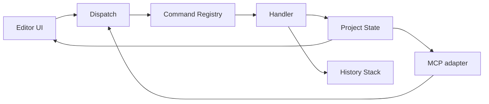
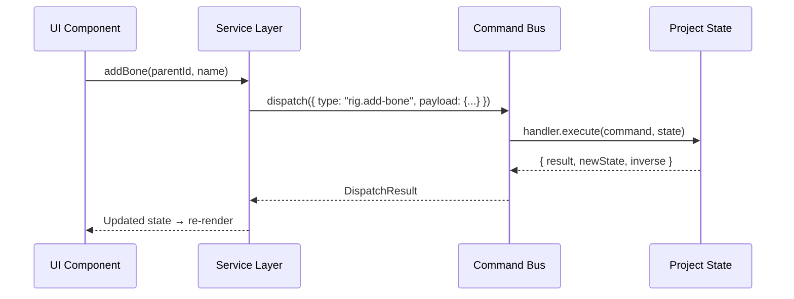

# Command bus, undo/redo và transaction

Trạng thái: đề xuất thiết kế. Chưa triển khai trong source; tài liệu này đặt ra
kiến trúc và ràng buộc cho mốc 0–1.

## 1. Vai trò

Command bus là lớp điều phối duy nhất cho mọi thay đổi project state. Cả UI lẫn MCP
đều đi qua command bus thay vì sửa state trực tiếp. Điều này đảm bảo:

- Một nguồn sự thật cho trạng thái project.
- Undo/redo nhất quán bất kể thay đổi đến từ UI hay MCP.
- Mọi thay đổi có revision, audit trail và khả năng phát lại.



## 2. Cấu trúc command

Mỗi command là một object bất biến mô tả **ý định thay đổi**, không phải cách thay đổi.

```ts
interface Command<TPayload = unknown, TResult = unknown> {
  /** Loại command, dùng để tìm handler. Ví dụ: "rig.add-bone" */
  readonly type: string;

  /** Dữ liệu đầu vào cho command */
  readonly payload: TPayload;

  /** ID duy nhất cho lần dispatch này (UUID v4) */
  readonly commandId: string;

  /** Revision của project tại thời điểm tạo command */
  readonly baseRevision: number;
}
```

### Quy ước đặt tên type

```text
<domain>.<action>

Ví dụ:
  asset.create
  asset.import-image
  asset.attach-view
  rig.add-bone
  rig.set-weights
  animation.set-keyframe
  animation.delete-clip
  scene.add-instance
  scene.set-camera
  export.start-job
  export.cancel-job
  project.save
```

Domain khớp với thư mục trong `packages/application/src/commands/`.

## 3. Handler

Mỗi command type có đúng một handler. Handler nhận command và state hiện tại, trả
về kết quả và thông tin undo.

```ts
interface CommandHandler<TPayload, TResult> {
  readonly type: string;

  /** Validate payload và state trước khi thực hiện */
  validate(command: Command<TPayload>, state: ProjectState): ValidationResult;

  /** Thực hiện command, trả về kết quả và inverse command để undo */
  execute(
    command: Command<TPayload>,
    state: ProjectState,
  ): CommandResult<TResult>;
}

interface CommandResult<TResult> {
  /** Kết quả trả về cho caller */
  result: TResult;

  /** State mới sau khi áp dụng command */
  newState: ProjectState;

  /** Command ngược lại để undo. null nếu không thể undo */
  inverse: Command | null;

  /** Revision mới */
  newRevision: number;
}
```

### Quy tắc handler

- Handler không import React, DOM, Three.js hoặc I/O trực tiếp.
- Handler chỉ đọc và tạo state mới; không mutation in-place trên state cũ.
- Validation tách riêng khỏi execution — caller có thể dry-run để kiểm tra.
- Lỗi validation trả về message đọc được, không throw exception không kiểm soát.

## 4. Registry và dispatch

```ts
class CommandBus {
  private handlers = new Map<string, CommandHandler>();
  private history: HistoryStack;

  /** Đăng ký handler cho một command type */
  register(handler: CommandHandler): void;

  /** Dispatch và thực hiện command */
  dispatch<TPayload, TResult>(
    command: Command<TPayload>,
  ): DispatchResult<TResult>;

  /** Dispatch nhiều command như một transaction */
  dispatchBatch(commands: Command[]): BatchResult;
}
```

### Conflict detection

- `baseRevision` trong command được so sánh với revision hiện tại.
- Nếu revision không khớp: handler quyết định có thể tiếp tục hay cần reject.
- Mặc định: command tạo/xóa entity reject khi conflict; command sửa property
  có thể merge nếu property không trùng.

## 5. Transaction (batch)

Khi nhiều command cần thực hiện nguyên tử:

```ts
interface BatchResult {
  /** Thành công: tất cả command đã commit */
  success: boolean;

  /** Nếu thất bại: state được rollback về trước batch */
  error?: string;

  /** Danh sách kết quả từng command (nếu thành công) */
  results: CommandResult[];

  /** Một inverse duy nhất để undo toàn bộ batch */
  batchInverse: Command[];
}
```

### Quy tắc batch

- Tất cả hoặc không gì: nếu command thứ N thất bại, rollback command 1..N-1.
- Batch tạo một entry duy nhất trong history stack, không phải N entry riêng.
- MCP thường dùng batch cho các thao tác phức hợp (ví dụ: tạo asset + import
  ảnh + tạo mesh + tạo rig trong một lần).
- Batch có giới hạn số lượng command (mặc định 50) để tránh transaction quá lớn.

## 6. Undo/redo

### Chiến lược: command-based inverse

Mỗi command khi execute trả về một inverse command. Undo = dispatch inverse command.

```text
User action:    rig.add-bone { name: "arm", parentId: "spine" }
State:          bone "arm" được thêm, revision 43
Inverse:        rig.delete-bone { boneId: "arm-uuid" }

Undo:           dispatch inverse → bone "arm" bị xóa, revision 44
Redo:           dispatch lại command gốc → bone "arm" được thêm lại, revision 45
```

### History stack

```ts
interface HistoryStack {
  /** Thêm entry mới, xóa redo stack phía sau */
  push(entry: HistoryEntry): void;

  /** Undo: dispatch inverse, di chuyển sang redo stack */
  undo(): UndoResult;

  /** Redo: dispatch command gốc, di chuyển về undo stack */
  redo(): RedoResult;

  /** Giới hạn số entry (mặc định 100) */
  readonly maxEntries: number;

  /** Xóa history khi chuyển project hoặc theo yêu cầu */
  clear(): void;
}

interface HistoryEntry {
  /** Command gốc đã thực hiện */
  command: Command;

  /** Inverse command để undo */
  inverse: Command;

  /** Timestamp */
  timestamp: number;

  /** Mô tả ngắn cho hiển thị trong UI */
  description: string;
}
```

### Giới hạn và edge case

- History stack có giới hạn cố định (100 entry mặc định, có thể cấu hình).
- Entry cũ nhất bị loại bỏ khi stack đầy — không thể undo vô hạn.
- Sau khi dispatch command mới, redo stack bị xóa (standard behavior).
- Batch command tạo một entry duy nhất; undo batch = dispatch tất cả inverse
  theo thứ tự ngược.
- Command không có inverse (ví dụ: export video) không thêm vào history stack.

## 7. Revision và persistence

- Mỗi command commit thành công tăng `revision` trong manifest lên 1.
- Save project ghi revision hiện tại vào manifest.
- Load project khôi phục revision từ manifest; history stack bắt đầu rỗng.
- Export job lưu `snapshotRevision` — revision tại thời điểm bắt đầu job.

### Quan hệ với autosave

- Autosave ghi toàn bộ state hiện tại kèm revision.
- History stack **không** được persist qua autosave/load trong bản đầu.
  Mở rộng persist history là tính năng sau, cần serialize inverse commands.

## 8. UI integration



- UI component không tạo Command trực tiếp; gọi qua service layer.
- Service layer tạo command với đúng type, payload và baseRevision.
- State thay đổi → UI re-render qua React state/context subscription.
- Ctrl+Z / Ctrl+Y → service gọi `history.undo()` / `history.redo()`.

## 9. MCP integration

- MCP tool handler gọi cùng service layer như UI.
- Batch command đặc biệt hữu ích cho MCP: agent thường thực hiện nhiều bước
  liên tiếp (tạo asset, import, mesh, rig) và cần atomicity.
- MCP trả về `commandId` và `revision` cho agent theo dõi.
- Retry: cùng `commandId` không tạo entity trùng (idempotent check).

## 10. Error handling

| Loại lỗi | Xử lý |
| --- | --- |
| Validation failure | Trả lỗi với message đọc được; state không đổi |
| Conflict revision | Reject hoặc merge tùy command type |
| Handler exception | Catch, log, state không đổi, trả lỗi internal |
| Batch partial failure | Rollback tất cả command trong batch |
| Inverse execution failure | Log lỗi, state có thể inconsistent — cần recovery |

Inverse execution failure là trường hợp nghiêm trọng nhất. Cần:
- Log đầy đủ command gốc và inverse đã thất bại.
- Cơ chế recovery: reload project từ last save.
- Không âm thầm bỏ qua; UI phải thông báo.

## 11. Liên kết

- [PLAN.md](PLAN.md) mục 5 — command bus là trung tâm
- [PROJECT_FORMAT.md](PROJECT_FORMAT.md) — revision trong manifest
- [MODULE_MAP.md](MODULE_MAP.md) — `packages/application/src/commands/`,
  `packages/application/src/history/`
- [CODING_RULES.md](CODING_RULES.md) mục 5 — ranh giới module
