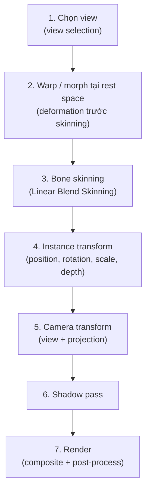

# Pipeline biến dạng và thứ tự xử lý

Trạng thái: đề xuất thiết kế. Đây là contract kỹ thuật cốt lõi — preview và export
phải cho kết quả giống nhau tại cùng thời điểm khi dùng cùng pipeline này.

## 1. Thứ tự deformation chính thức



Thứ tự này là bất biến. Mọi code path (preview loop, export frame, MCP test pose)
phải gọi các bước theo đúng thứ tự trên. Không được bỏ bước, đảo thứ tự hoặc thêm
bước riêng cho một code path cụ thể.

## 2. Chi tiết từng bước

### Bước 1 — Chọn view (View Selection)

**Đầu vào:** Asset instance, hướng nhìn tương đối với camera, tham số điều khiển
(nếu dùng clip/parameter thay vì tự động).

**Xử lý:**
- Xác định góc nhìn phù hợp từ view set của asset.
- So sánh hướng nhìn với bộ góc đã có (front, quarter-left, quarter-right, side...).
- Áp dụng hysteresis threshold để tránh nhấp nháy ở ranh giới giữa hai view.
  Mặc định ±5° (có thể cấu hình per asset).
- Nếu asset không có view phù hợp: giữ view hiện tại, log cảnh báo — không giả lập
  góc bằng cách biến dạng view trước thành view sau.

**Đầu ra:** View ID đã chọn → quyết định mesh, texture, pivot và bindings nào được dùng.

**Không gian tọa độ:** Chưa áp dụng — bước này chỉ chọn dữ liệu, không biến đổi
vertex.

### Bước 2 — Warp và morph tại rest space

**Đầu vào:** Mesh của view đã chọn, warp grid parameters, morph target weights.

**Xử lý:**
- Áp dụng warp grid deformation lên vertex positions tại rest space.
- Áp dụng morph targets (nếu có) theo blend weights.
- Thứ tự nội bộ: warp trước, morph sau (vì morph thường tinh chỉnh trên
  kết quả warp đã sơ bộ đúng hướng).

**Ràng buộc:**
- Morph chỉ hoạt động giữa các mesh có topology tương thích (cùng số vertex,
  cùng triangle indices). Nếu topology khác: chuyển view rời rạc tại mốc thời gian
  phù hợp, không nội suy vertex.
- Warp grid resolution mặc định 4×4 điểm điều khiển; có thể tăng lên 8×8 cho
  biến dạng phức tạp hơn. Grid vượt quá 16×16 cần lý do và review hiệu năng.

**Không gian tọa độ:** Rest space — tọa độ gốc của texture, trước khi bone skinning
di chuyển vertex theo skeleton.

### Bước 3 — Bone skinning (Linear Blend Skinning)

**Đầu vào:** Vertex positions sau warp/morph (từ bước 2), bone transforms tại frame
hiện tại, bind pose (rest pose matrices), weights.

**Xử lý:**

```text
v' = Σ (weight_i × BoneMatrix_i × InverseBindMatrix_i × v)
```

Trong đó:
- `v` = vertex position sau warp/morph
- `BoneMatrix_i` = world transform của bone i tại frame hiện tại
- `InverseBindMatrix_i` = inverse của bind pose matrix của bone i
- `weight_i` = skin weight của vertex cho bone i (tổng = 1.0)
- `v'` = vertex position trong asset local space

**Ràng buộc:**
- Tối đa 4 bone influence per vertex. GPU skinning phổ biến hỗ trợ 4;
  tăng lên cần kiểm tra shader và hiệu năng.
- Weights phải chuẩn hóa: tổng weight per vertex = 1.0 ± 0.001.
- Bone hierarchy phải acyclic. Validate khi load rig.
- Transform propagation: parent → child, theo topological order.

**Không gian tọa độ:** Kết quả ở asset local space.

### Bước 4 — Instance transform

**Đầu vào:** Vertex positions trong asset local space (từ bước 3), instance
transform (position, rotation, scale, depth).

**Xử lý:**
- Áp dụng scale → rotation → translation theo thứ tự chuẩn.
- `depth` (z) xác định thứ tự vẽ và khoảng cách từ camera cho parallax.

**Không gian tọa độ:** World space — tọa độ chung của scene.

### Bước 5 — Camera transform

**Đầu vào:** Vertex positions trong world space (từ bước 4), camera parameters.

**Xử lý:**
- View matrix: đặt camera vào vị trí và hướng trong world.
- Projection matrix: orthographic hoặc perspective.
- Orthographic: parallax thông qua scale theo depth và offset theo camera pan.
- Perspective: parallax tự nhiên theo z-distance.

**Không gian tọa độ:** Clip space → screen space sau viewport transform.

### Bước 6 — Shadow pass

**Đầu vào:** Mesh đã deform (sau bước 3–4), light parameters, shadow receivers.

**Xử lý:**
- Render mesh từ góc nhìn của light source vào shadow map.
- Dùng alpha của texture sau deform — bóng theo silhouette, không phải hình chữ nhật.
- Shadow receivers (sàn, tường) là plane đơn giản do app cung cấp.

**Hai chế độ shadow:**

| Chế độ | Mô tả | Use case |
| --- | --- | --- |
| Silhouette shadow | Bóng đổ theo hướng đèn, alpha chính xác | Phong cách hiện thực |
| Artistic shadow | Bóng mềm, có thể tùy chỉnh hình dáng | Phong cách mỹ thuật |

**Ràng buộc:**
- Đổi view phải cập nhật shadow tương ứng; không tạo hai bóng từ hai view.
- Card phẳng không có thể tích: bóng ở góc cạnh/sau có giới hạn tự nhiên.
- Shadow map resolution cân bằng giữa chất lượng và hiệu năng; mặc định 1024×1024.

### Bước 7 — Render (composite)

**Đầu vào:** Mesh trong screen space, textures, shadow map, material properties.

**Xử lý:**
- Draw layer theo draw order, áp dụng material (color, alpha, tint).
- Normal map + light direction → tạo cảm giác nổi khối.
- Composite shadow lên shadow receivers.
- Post-process: anti-aliasing, color correction (nếu có).

## 3. Hệ tọa độ quy ước

| Không gian | Gốc | Hướng | Đơn vị |
| --- | --- | --- | --- |
| Texture / UV | Góc trái-trên ảnh | X→, Y↓ | Pixel (ảnh gốc) |
| Rest space | Pivot của asset | X→, Y↑ | Pixel (artwork) |
| Asset local space | Pivot sau skinning | X→, Y↑ | Pixel |
| World space | Gốc scene | X→, Y↑, Z+ ra ngoài | Pixel (scene units) |
| Clip space | Tâm viewport | X[-1,1], Y[-1,1], Z[-1,1] | NDC |
| Screen space | Góc trái-trên canvas | X→, Y↓ | Pixel (viewport) |

> **Lưu ý:** UV space có Y↓ (theo quy ước ảnh), rest/world space có Y↑ (theo
> quy ước toán học). Chuyển đổi phải tường minh — không giả định Y cùng chiều.

## 4. Lấy mẫu pose theo thời gian

```text
time = frameIndex / outputFps

poseAtTime(time):
  1. Cho mỗi track trong timeline:
     - Tìm clip chứa time này
     - Nội suy keyframes theo easing function
  2. Kết hợp kết quả: bone transforms, warp params, morph weights, view params
  3. Trả về PoseSnapshot
```

- Bộ lấy mẫu dùng chung cho preview và export; không có thuật toán nội suy riêng.
- Export lấy đủ mọi frame: `frameIndex = 0, 1, 2, ..., totalFrames - 1`.
- Preview có thể bỏ frame khi viewport chậm; export không bỏ.
- `outputFps` là FPS của file xuất (24/30/60/120); `previewFps` là target cho
  viewport; hai giá trị độc lập.

## 5. Warp grid chi tiết

```text
Lưới điều khiển n×m:

  (0,0)───(1,0)───(2,0)───(3,0)
    │       │       │       │
  (0,1)───(1,1)───(2,1)───(3,1)
    │       │       │       │
  (0,2)───(1,2)───(2,2)───(3,2)
    │       │       │       │
  (0,3)───(1,3)───(2,3)───(3,3)
```

- Mỗi control point có offset (dx, dy) so với vị trí mặc định (uniform grid).
- Vertex trong mesh được ánh xạ vào cell nào của grid → nội suy bilinear
  từ 4 góc cell → displacement cho vertex đó.
- Rest state: tất cả offset = (0, 0).
- Animation: keyframe các offset theo thời gian.

## 6. Morph targets

```ts
interface MorphTarget {
  /** Tên mô tả: "smile", "blink-left", "surprised" */
  name: string;

  /** Delta positions cho mỗi vertex: positions[i] += delta[i] × weight */
  deltas: Array<{ dx: number; dy: number }>;

  /** Weight range: 0.0 (không áp dụng) đến 1.0 (áp dụng hoàn toàn) */
  minWeight: 0;
  maxWeight: 1;
}
```

- Nhiều morph targets có thể hoạt động đồng thời (additive blending).
- Thứ tự áp dụng: cộng dồn tất cả `delta × weight`, rồi áp lên vertex.
  Thứ tự cộng dồn không ảnh hưởng kết quả (phép cộng giao hoán).
- Topology phải giống mesh gốc: cùng số vertex, cùng indices.

## 7. Test contract

Các invariant phải được kiểm tra:

1. **Consistency preview/export:** Render cùng scene tại cùng time với cùng pipeline
   → pixel output giống nhau (cho phép sai khác do anti-aliasing nhưng không khác về
   vị trí mesh/pose).

2. **Thứ tự deformation:** Đảo bước 2 và 3 phải cho kết quả khác rõ rệt →
   test phải verify đúng thứ tự.

3. **Weight normalization:** Tổng weight per vertex = 1.0 ± 0.001.

4. **Acyclic hierarchy:** Load rig → topological sort thành công.

5. **View switch:** Đổi view phải cập nhật mesh, texture, bindings và shadow.

6. **Topology guard:** Morph giữa mesh có topology khác → reject hoặc discrete switch.

7. **Frame completeness:** Export N giây ở F FPS → đúng N×F frame, timestamp đúng.

## 8. Giới hạn đã biết

- Card phẳng 2D không có thể tích thực: xoay mạnh sẽ lộ độ mỏng.
- Self-shadowing của card phẳng bị giới hạn; shadow proxy phức tạp hơn là mở rộng sau.
- Linear Blend Skinning có candy-wrapper artifact khi xoay bone >180°.
  Giải pháp (dual quaternion) là mở rộng, không nằm trong bản đầu.
- Morph additive blending có thể tạo vertex vượt boundary khi tổng weight > 1.
  Clamp hoặc cảnh báo tùy nghiệp vụ.

## 9. Liên kết

- [PLAN.md](PLAN.md) mục 2, 4, 6 — cơ chế deformation và yêu cầu
- [MODULE_MAP.md](MODULE_MAP.md) — `core/deformation/`, `core/rig/`,
  `core/geometry/`, `runtime/meshes/`
- [RENDER_PROFILES.md](RENDER_PROFILES.md) — FPS lấy mẫu và chất lượng
- [COMMAND_BUS.md](COMMAND_BUS.md) — command điều khiển pose/rig
