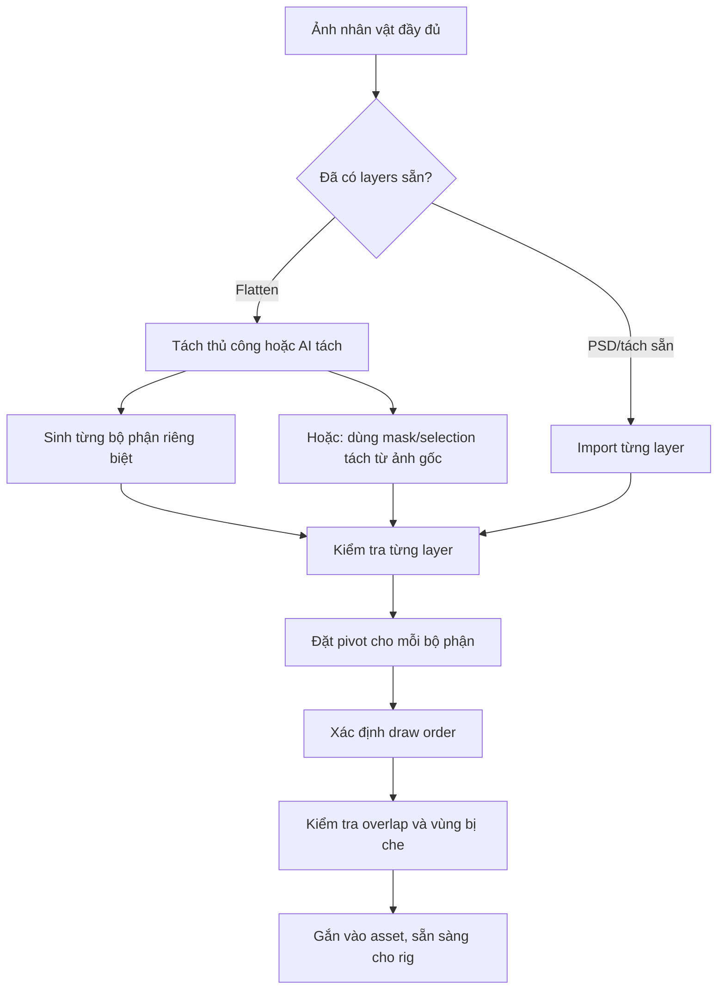
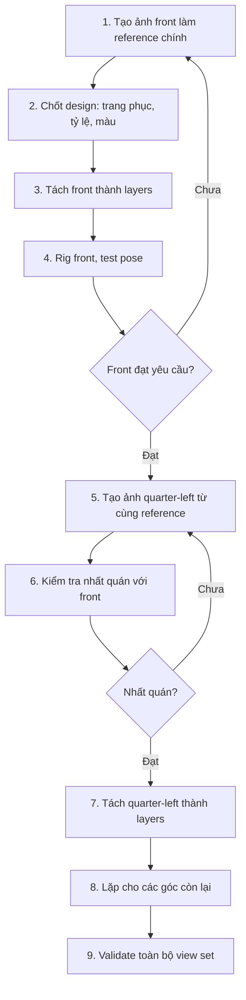
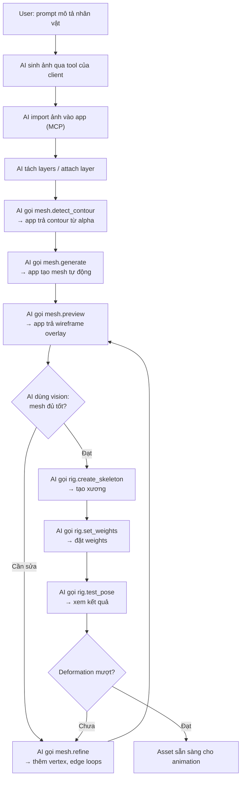
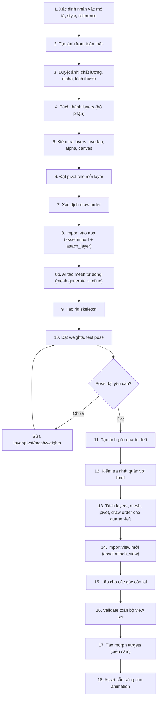

# Tạo ảnh bằng AI client, đưa asset vào app qua MCP

Trạng thái: yêu cầu đã được đưa vào kế hoạch; chưa triển khai connector trong app.

## 1. Trách nhiệm

Codex/Antigravity dùng công cụ sinh và sửa ảnh đã có trong phiên làm việc.
Parallax cung cấp MCP tool để chuẩn bị brief, đọc reference, nhận kết quả,
quản lý layer/view, dựng mesh và rig. Không cài một model sinh ảnh local hoặc
yêu cầu thêm API key sinh ảnh của app trong luồng mặc định.

Agent là bên điều phối. MCP server không mặc nhiên được gọi công cụ nội bộ của
client theo chiều ngược lại. Mỗi client cần có công cụ tạo ảnh và cách chuyển
artifact khả dụng; không hard-code tên một tool riêng thành giao thức chung.

Phiên Codex hiện tại có công cụ tạo ảnh được cung cấp trong tool catalog.
Tài liệu Antigravity cũng mô tả công cụ sinh ảnh tích hợp; khả năng thực tế vẫn
phụ thuộc client/phiên làm việc. [Antigravity Models][anti-models].

## 2. Chu trình mặc định

1. Người dùng yêu cầu trong Codex/Antigravity, ví dụ: tạo nhân vật và phim 4K/60 FPS.
2. Agent đọc project/style/reference và lấy brief từ tool MCP của Parallax.
3. Agent gọi công cụ tạo ảnh của client, sau đó xem kết quả thật.
4. Agent gọi tool nhập ảnh của Parallax, nhận asset ID và báo cáo kiểm tra.
5. Agent thêm view/layer/material, tạo mesh/rig, render test pose rồi sửa nếu cần.
6. Khi asset đạt yêu cầu, agent đưa vào shot và xuất phim bằng tool MCP.

Nút tạo ảnh trong UI có thể chuẩn bị yêu cầu để agent đọc. Nếu chưa có kết nối
khởi chạy agent được hỗ trợ, UI phải ghi đang chờ agent; không hiển thị đang sinh ảnh.

## 3. Dữ liệu brief

- Generation request ID và asset ID đích, revision của project.
- Loại asset, mô tả, style, bảng màu và reference có thể đọc được.
- Góc nhìn, pose trung tính và tỷ lệ cơ thể cần giữ giữa các ảnh.
- Định dạng ảnh, alpha mong muốn, kích thước mong muốn và vùng safe padding.
- Danh sách layer hoặc bộ phận cần có, tên xương/ngữ nghĩa nếu đã có rig.
- Phân biệt màu/alpha của artwork với normal map hoặc shadow của scene.
- **Rig-Ready Template** (nếu có): skeleton type, pose chuẩn (T-pose/A-pose),
  tỷ lệ cơ thể, promptHint tự động bổ sung vào prompt AI. Khi tạo ảnh theo
  template, auto-rig áp ngay sau import. Xem [AUTO_RIG.md](AUTO_RIG.md)
  mục 2.4 cho schema và bộ templates mặc định.

Brief yêu cầu ánh sáng phẳng khi cần relight về sau; hạn chế bóng nền đã vẽ sẵn.
Chọn ảnh reference đã chốt làm cơ sở cho các lần sinh/sửa tiếp theo. Sinh cùng
một prompt nhiều lần không tự bảo đảm nhân vật giữ nguyên đặc điểm.

## 4. Tool và truyền ảnh

Tên dưới đây là API đề xuất, chưa phải catalog tool đã hoạt động:

| Tool | Kết quả |
| --- | --- |
| `asset.prepare_image_brief` | Brief và reference cho agent sinh/sửa ảnh |
| `asset.import_image` | Asset ID, kích thước thật, alpha và source hash |
| `asset.attach_view` | Gắn kết quả vào góc nhìn của asset |
| `asset.attach_layer` | Gắn ảnh/mask vào bộ phận có tên |
| `asset.validate_artwork` | Báo layer/view thiếu và vấn đề ảnh |
| `asset.get_preview` | Preview để agent kiểm tra bằng thị giác |

- Cùng máy: nhập file do công cụ ảnh trả về ở đường dẫn agent và service đọc được.
- Khác máy hoặc artifact chỉ ở client: truyền file theo upload có chunk và hash;
  không giả định một đường dẫn trong cloud tồn tại trên máy người dùng.
- Không biến một URL thumbnail hoặc hình hiển thị trong chat thành source đã nhập.
- Metadata nhỏ truyền qua JSON; ảnh lớn đi qua file/upload, không lặp base64 của
  cả bộ ảnh trong mỗi lần sửa pose hoặc gọi command.
- Import phải idempotent theo request ID/source hash để retry không nhân đôi asset.

## 5. Kiểm tra đầu ra

- Đọc kích thước/MIME/alpha thật; không tin hoàn toàn tên file hoặc lời mô tả của agent.
- Nền caro được vẽ trong ảnh không được tính là alpha trong suốt.
- Ảnh flatten chưa tự trở thành các layer riêng. App/agent phải tách hoặc sinh
  từng phần và kiểm tra vùng bị che, pivot, overlap trước khi gắn xương.
- Kiểm tra bộ góc: trang phục, màu, tỷ lệ, hướng nhìn và tên bộ phận nhất quán.
- Ảnh cho một nhân vật chiếm toàn màn hình cần pixel budget khác một đạo cụ nhỏ.
- Nếu công cụ chỉ sinh ảnh nhỏ, công khai kích thước nguồn; không gọi upscale
  thành ảnh gốc có chi tiết 4K. Output video 4K không tự tăng chi tiết texture.
- Ghi nhận source/reference và phiên bản ảnh để có thể thay texture mà giữ rig.

## 6. Tách thành phần cho animation (Part Decomposition)

Nhân vật 2D cần được chia thành các layer riêng biệt để gắn xương và animation.
Ảnh flatten (một layer duy nhất) không thể rig trực tiếp — phải tách trước.

### 6.1 Bộ phận chuẩn cho nhân vật người

```text
Cấp 1 — Nhóm chính:
  ├── head          Đầu (bao gồm tóc, tai)
  ├── torso         Thân trên
  ├── pelvis        Hông
  ├── left-arm      Tay trái (vai đến cổ tay)
  ├── right-arm     Tay phải
  ├── left-leg      Chân trái (đùi đến mắt cá)
  └── right-leg     Chân phải

Cấp 2 — Chi tiết (khi animation cần):
  head/
    ├── face        Mặt (da, đường nét)
    ├── eyes        Mắt (có thể tách trái/phải)
    ├── eyebrows    Lông mày
    ├── mouth       Miệng
    ├── nose        Mũi
    ├── hair-front  Tóc trước mặt
    └── hair-back   Tóc sau (draw order phía sau đầu)
  left-arm/
    ├── upper-arm   Cánh tay trên
    ├── forearm     Cánh tay dưới
    └── hand        Bàn tay
  left-leg/
    ├── thigh       Đùi
    ├── shin        Ống chân
    └── foot        Bàn chân
```

Danh sách trên là gợi ý — mỗi nhân vật có thể cần bộ phận khác (đuôi, cánh, áo
choàng, phụ kiện). Tên bộ phận phải nhất quán giữa các view của cùng asset.

### 6.2 Luồng tách thành phần



### 6.3 Yêu cầu kỹ thuật cho mỗi layer bộ phận

| Yêu cầu | Mô tả |
| --- | --- |
| Alpha trong suốt | Nền phải trong suốt thật (RGBA), không phải màu nền đặc |
| Viền sạch | Không có halo/fringe từ nền cũ quanh mép bộ phận |
| Vùng phủ (overlap) | Bộ phận cần thừa vài pixel ở vùng nối (vai vào thân, đùi vào hông) để tránh khe hở khi xoay xương |
| Kích thước canvas | Cùng canvas size với ảnh gốc để bộ phận khớp vị trí khi xếp chồng |
| Tên file / layer | Đặt đúng tên bộ phận theo quy ước (head, torso, left-arm...) |
| Pivot | Đặt tại khớp xoay tự nhiên (vai, khuỷu, hông, đầu gối, cổ) |

### 6.4 Hai cách tách

**Cách 1 — Sinh riêng từng bộ phận:**
Agent yêu cầu AI tạo ảnh từng bộ phận một, với cùng style, tỷ lệ và reference.
Phù hợp khi cần kiểm soát chi tiết. Thách thức: giữ nhất quán giữa các lần sinh.

**Cách 2 — Tách từ ảnh toàn thân:**
Agent yêu cầu AI tạo ảnh toàn thân đẹp, rồi tách bằng mask/selection. Có thể
dùng AI để tạo mask cho từng vùng. Phù hợp khi ảnh toàn thân đã đạt yêu cầu.
Thách thức: vùng bị che (tay che thân) cần vẽ bù phần bị khuất.

**Quy tắc chung:**
- Ảnh flatten chưa phải tập các layer. Phải tách rõ ràng.
- Mỗi bộ phận được import là một layer riêng qua `asset.attach_layer`.
- Kiểm tra xếp chồng: tất cả layer ghép lại phải khớp ảnh gốc.
- Vùng bị che (occluded): cần vẽ thêm phần khuất sau bộ phận phía trước.
  Ví dụ: thân sau tay, chân sau áo. Nếu không vẽ bù, khi xoay xương sẽ lộ khoảng
  trống. Agent sinh ảnh bù hoặc dùng tool sửa ảnh của client cho phần này.

### 6.5 Draw order và vùng phủ

```text
Draw order thông thường (từ sau ra trước):

  0  hair-back          Tóc phía sau
  1  right-arm (phía sau) Tay phải phía sau thân
  2  right-leg (phía sau) Chân phải phía sau
  3  torso              Thân
  4  pelvis             Hông
  5  left-leg           Chân trái phía trước
  6  left-arm           Tay trái phía trước
  7  head               Đầu
  8  hair-front         Tóc trước mặt
  9  accessories        Phụ kiện (mũ, kính...)
```

Draw order thay đổi theo view: ở góc nghiêng, tay gần camera lên trước,
tay xa camera xuống sau. Mỗi view định nghĩa draw order riêng.

## 7. Tạo bộ nhiều góc nhìn (Multi-View Creation)

### 7.1 Bộ góc tiêu chuẩn

```text
         back
          ↑
  side-left ← front → side-right
          ↓
        (reserve)

Bắt buộc tối thiểu:
  1. front           Chính diện
  2. quarter-left    Nghiêng trái ~30-45°
  3. quarter-right   Nghiêng phải ~30-45°

Mở rộng khi cần:
  4. side-left       Bên trái ~90°
  5. side-right      Bên phải ~90°
  6. back            Phía sau ~180°
```

### 7.2 Luồng tạo bộ góc



**Quy tắc quan trọng:** Front luôn là reference chính. Tất cả góc khác tham chiếu
front để giữ nhất quán. Không tạo nhiều góc song song rồi mới kiểm tra — sẽ khó
sửa nếu style lệch nhau.

### 7.3 Tiêu chí nhất quán giữa các góc

| Tiêu chí | Kiểm tra | Mức độ |
| --- | --- | --- |
| **Trang phục** | Cùng quần áo, phụ kiện, hoa văn, nút áo | Bắt buộc |
| **Tỷ lệ cơ thể** | Chiều cao, chiều rộng vai, tay, chân tương đương | Bắt buộc |
| **Bảng màu** | Da, tóc, quần áo cùng tông màu (cho phép sai khác do chiếu sáng) | Bắt buộc |
| **Chi tiết mặt** | Mắt, mũi, miệng cùng phong cách vẽ | Bắt buộc |
| **Tên bộ phận** | Cùng tên layer/bộ phận giữa các view | Bắt buộc |
| **Hướng nhìn** | Đúng góc yêu cầu (front thẳng, quarter ~30-45°) | Bắt buộc |
| **Chiều cao pixel** | Nhân vật cùng chiều cao pixel (cho phép ±5%) | Khuyến nghị |
| **Vị trí pivot** | Pivot cùng ý nghĩa (cổ, vai, hông) khớp nhau giữa views | Bắt buộc |
| **Alpha** | Viền sạch, không halo, cùng chất lượng mask | Bắt buộc |

### 7.4 Khó khăn thực tế và giải pháp

**Vấn đề 1: AI sinh ảnh không nhất quán giữa các lần.**
- Giải pháp: dùng ảnh front làm reference mạnh; gửi kèm reference trong brief.
  Kiểm tra kết quả và yêu cầu sửa nếu không khớp. Không bỏ qua sai khác.

**Vấn đề 2: Bộ phận bị che ở góc khác (tay che một phần thân ở góc nghiêng).**
- Giải pháp: sinh thêm phần bị che ở mỗi góc. Mỗi view có bộ layers riêng với
  vùng phủ phù hợp cho góc đó.

**Vấn đề 3: Tóc/phụ kiện trông khác ở các góc.**
- Giải pháp: yêu cầu cụ thể trong brief. Ví dụ: "mái tóc phủ trán nhìn từ trước,
  kẹp phía sau nhìn từ side". Kiểm tra visual consistency.

**Vấn đề 4: Topology không tương thích giữa views.**
- Xem [DEFORMATION_PIPELINE.md](DEFORMATION_PIPELINE.md) mục 2 bước 2:
  morph chỉ hoạt động khi topology tương thích. Nếu khác topology → chuyển view
  rời rạc tại mốc thời gian phù hợp, không nội suy vertex.

### 7.5 Pivot đặt tại khớp tự nhiên

```text
Pivot map (ví dụ cho góc front):

         ●  head pivot = cổ (neck joint)
         │
    ●────┼────●  arm pivot = vai (shoulder joint)
    │    │    │
    ●    │    ●  elbow pivot = khuỷu tay
    │    │    │
    ●    ●    ●  hand pivot = cổ tay (wrist)
         │
    ●────┼────●  leg pivot = hông (hip joint)
    │         │
    ●         ●  knee pivot = đầu gối
    │         │
    ●         ●  foot pivot = mắt cá (ankle)
```

**Quy tắc pivot:**
- Pivot đặt tại khớp xoay tự nhiên, không phải tâm bounding box.
- Pivot của cùng bộ phận ở các view khác nhau phải ở cùng vị trí tương đối
  so với cơ thể (không nhảy vị trí khi chuyển view).
- Đơn vị: pixel trong tọa độ texture, gốc góc trái-trên.
- Head pivot ở cổ, không ở đỉnh đầu — để xoay đầu quanh cổ.

## 8. AI tự động tạo mesh cho animation (AI-Driven Mesh Generation)

Tương tự cách ChatGPT điều khiển Blender qua MCP để tạo model 3D, AI agent của
Codex/Antigravity có thể tự động tạo mesh 2D cho animation từ ảnh đã import —
không cần người dùng thao tác thủ công.

### 8.1 Luồng tự động



### 8.2 Vai trò của AI agent trong tạo mesh

AI agent không đoán mù — nó dùng **vision** để phân tích ảnh và quyết định:

| Bước | AI phân tích gì | AI quyết định gì |
| --- | --- | --- |
| Trước mesh | Nhận diện bộ phận, vị trí khớp, contour | Khu vực nào cần nhiều vertex |
| Sau mesh.generate | Xem wireframe overlay trên texture | Vùng nào cần refine |
| Sau mesh.preview | So sánh wireframe với hình dáng bộ phận | Thêm edge loops ở đâu |
| Sau rig.test_pose | Xem deformation khi xoay khớp | Mesh có vùng méo/rách không |

### 8.3 Mesh tự động từ contour (App thực hiện)

Khi agent gọi `mesh.generate`, app chạy pipeline nội bộ:

```text
1. Đọc alpha channel → Marching Squares hoặc threshold → contour polygon
2. Đơn giản hóa contour: Douglas-Peucker giảm vertex nhưng giữ hình dáng
3. Thêm vertex nội bộ: Poisson disk sampling hoặc grid scatter
4. Đặt mật độ vertex:
   - Cao ở vùng khớp (vai, khuỷu, hông, đầu gối, cổ, mắt, miệng)
   - Trung bình ở vùng chuyển động vừa (thân, đùi, cánh tay)
   - Thấp ở vùng ít chuyển động (bụng, lưng, trán)
5. Earcut triangulation → tam giác
6. UV mapping: vertex position / texture size → UV coords
7. Trả mesh + wireframe preview
```

### 8.4 Chế độ mật độ mesh

| Chế độ | Vertex/layer | Phù hợp cho |
| --- | --- | --- |
| `low` | ~50–100 | Đạo cụ, bối cảnh ít chuyển động |
| `medium` | ~150–300 | Nhân vật phụ, tay chân đơn giản |
| `high` | ~300–600 | Nhân vật chính, mặt có biểu cảm |
| `custom` | Agent chỉ định | Vùng đặc biệt cần kiểm soát |

Agent chọn chế độ dựa trên vai trò asset. Mật độ cao quanh mắt/miệng cho phép
morph target biểu cảm mượt. Mật độ thấp ở đạo cụ giảm GPU workload.

### 8.5 Edge loops tự động

Edge loops là vòng vertex quanh khớp xoay — giúp deformation mượt khi bone xoay:

```text
Không có edge loop:          Có edge loop:
    ╱╲                           ╱╲
   ╱  ╲     ← méo khi        ╱──╲──╲
  ╱    ╲       xoay          ╱  ○  ╲  ╲    ← mượt khi
 ╱──────╲                   ╱──╱──╲──╲      xoay
╱        ╲                 ╱──╱    ╲──╲
                          ╱──╱      ╲──╲
```

App đặt edge loops tại vị trí mà agent chỉ định (thường là các khớp trong
bone hierarchy). Khi agent gọi `mesh.add_edge_loops`, truyền danh sách vị trí
khớp → app tạo vòng vertex quanh từng vị trí đó.

### 8.6 So sánh với ChatGPT + Blender

| Khía cạnh | ChatGPT + Blender (3D) | Parallax + AI agent (2D) |
| --- | --- | --- |
| Input | Prompt → 3D model | Prompt → 2D image |
| Giao thức | MCP tools cho Blender | MCP tools cho Parallax |
| Mesh | Polygon mesh 3D | Flat triangle mesh 2D |
| Rig | Armature + skinning | Bone hierarchy + weights |
| Vision | AI xem 3D viewport | AI xem wireframe overlay |
| Iteration | AI sửa model → xem lại | AI refine mesh → xem lại |
| Output | 3D animation | 2D/2.5D animation video |

Cơ chế tương đương: AI agent điều khiển app chuyên biệt qua MCP, dùng vision
để kiểm tra kết quả, tự lặp cho đến khi đạt chất lượng. Khác biệt chính là
Parallax hoạt động trên 2D flat mesh thay vì 3D polygons.

### 8.7 Ví dụ luồng hoàn chỉnh từ prompt

```text
User: "Tạo nhân vật ninja nữ, anime style, 4K/60 FPS, 5 giây clip"

Agent thực hiện:
 1. asset.prepare_image_brief → brief: anime ninja, flat lighting, front view
 2. [Gọi tool sinh ảnh] → ảnh ninja front view, alpha trong suốt
 3. asset.import_image → asset ID, kiểm tra: 2048×2048, alpha OK
 4. [Gọi tool sinh ảnh] → tách layers: head, torso, arms, legs
 5. asset.attach_layer × 7 → gắn từng bộ phận
 6. asset.validate_artwork → OK, đủ overlap, tên đúng
 7. mesh.detect_contour → contour cho từng layer
 8. mesh.generate(density: "high") → mesh 300 vertex/layer
 9. mesh.add_edge_loops → vòng vertex ở cổ, vai, khuỷu, hông, gối
10. mesh.preview → agent xem wireframe: "mắt cần thêm vertex"
11. mesh.refine(region: "eyes", add_vertices: 20) → mesh updated
12. mesh.validate → OK, không degenerate triangles
13. rig.create_skeleton(template: "humanoid") → 15 bones
14. rig.set_weights → auto weights từ bone proximity
15. rig.test_pose(rotate: {bone: "left-arm", angle: 45}) → preview
16. Agent xem: deformation mượt ✓
17. [Lặp bước 2–16 cho quarter-left, quarter-right]
18. animation.create_clip → clip 5 giây
19. animation.set_keyframe × N → pose tại các mốc
20. export.start_job(profile: "4k-uhd-60") → job bắt đầu
21. export.get_result → video 4K/60 FPS
```

### 8.8 Giới hạn

- AI phân tích ảnh bằng vision, không phải thuật toán chuyên dụng cho mọi trường hợp.
  Kết quả phụ thuộc chất lượng ảnh và khả năng nhận diện của model AI.
- Mesh tự động cần refine cho nhân vật phức tạp; không phải mọi ảnh đều cho mesh
  hoàn hảo ngay lần đầu.
- Edge loops tự động dựa trên vị trí agent chỉ định; app không tự nhận diện
  khớp — agent phải phân tích và quyết định.
- Contour detection từ alpha chỉ tốt khi alpha sạch; nền caro/fringe gây lỗi contour.
- Agent cần nhiều lần gọi tool (10–20 calls per asset) — latency tổng cộng
  phụ thuộc tốc độ MCP transport và sinh ảnh.

## 9. Quy trình tổng hợp từ tạo ảnh đến animation-ready



Mỗi bước có kiểm tra; không nhảy từ ảnh flatten đến rig mà bỏ qua tách layer.
Agent báo trạng thái từng bước và dừng nếu bước trước chưa đạt.

## 10. Nghiệm thu

Thử chu trình riêng trên Codex và Antigravity bằng công cụ thật của từng client.
Một nhân vật có góc trước và nghiêng phải được tạo, nhập, kiểm tra, rig và xuất clip.
Các trạng thái thiếu công cụ, chưa có file, lỗi alpha hoặc thiếu layer phải xuất hiện
đúng; không có asset giả được dùng để báo bước sinh ảnh đã hoàn thành.

Luồng này dùng quyền và hạn mức sinh ảnh của tài khoản AI đang hoạt động.
Không yêu cầu thêm API key từ app không có nghĩa mọi lượt sinh ảnh đều không có hạn mức.

[anti-models]: https://www.antigravity.google/docs/models/
