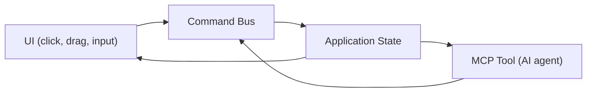

# Thiết kế UI cho Parallax Studio

Trạng thái: đề xuất thiết kế. Chưa triển khai; tài liệu mô tả kiến trúc UI
dựa trên phân tích các app chuyên nghiệp: Spine, Live2D Cubism, Rive, Moho.

## 1. Tham khảo từ app chuyên nghiệp

### 1.1 Mô hình chung

Tất cả app 2D animation chuyên nghiệp đều dùng cùng mô hình UI:

| Thành phần | Spine | Live2D | Rive | Moho |
| --- | --- | --- | --- | --- |
| Viewport trung tâm | ✅ | ✅ | ✅ | ✅ |
| Hierarchy/Tree trái | ✅ | Parts Palette | Hierarchy | Layers |
| Properties/Inspector phải | ✅ (dưới tree) | Inspector | Inspector | Style |
| Timeline dưới | ✅ | ✅ | ✅ | ✅ |
| Toolbar trên/trái | ✅ (dưới viewport) | ✅ | ✅ (trên) | ✅ (trái) |
| 2 chế độ chính | Setup / Animate | Modeling / Animation | Design / Animate | Frame 0 / Animate |
| Panel tùy chỉnh | Resize | Drag, save workspace | Stackable panels | Undock |

### 1.2 Bài học rút ra

1. **Hai chế độ rõ ràng** — Setup (rigging) vs Animate. Mỗi chế độ hiển thị
   toolbar và panel khác nhau. Không trộn lẫn công cụ setup vào animate mode.
2. **Viewport là trung tâm** — chiếm phần lớn diện tích, có overlay cho
   mesh wireframe, bone, weight heatmap, pivot, landmarks.
3. **Hierarchy bên trái** — cây phân cấp của project: assets, layers, bones.
   Click chọn → properties hiện bên phải.
4. **Properties bên phải** — context-sensitive: thay đổi theo thứ đang chọn.
5. **Timeline ở dưới** — keyframe dopesheet + graph editor (curves).
6. **Stackable panels** (Rive) — cho phép kéo thả, xếp chồng panel. Linh hoạt
   hơn layout cố định.

## 2. Layout tổng thể Parallax Studio

```text
┌────────────────────────────────────────────────────────────────┐
│  Menu Bar   │  Mode: [Setup ▼] [Animate]  │  [Preview] [Export]│
├─────────┬──────────────────────────────────────┬───────────────┤
│         │                                      │               │
│  LEFT   │           VIEWPORT                   │    RIGHT      │
│ PANELS  │                                      │   PANELS      │
│         │      (Canvas + Overlays)              │               │
│ ┌─────┐ │                                      │ ┌───────────┐ │
│ │Hier-│ │   ┌──────────────────────────┐       │ │Properties │ │
│ │archy│ │   │                          │       │ │           │ │
│ │     │ │   │    Character viewport    │       │ │ Transform │ │
│ │Asset│ │   │    with overlays:        │       │ │ Rig       │ │
│ │Bone │ │   │    • Mesh wireframe      │       │ │ Mesh      │ │
│ │Layer│ │   │    • Bone skeleton       │       │ │ Material  │ │
│ │     │ │   │    • Weight heatmap      │       │ │ Animation │ │
│ │     │ │   │    • Landmarks           │       │ │           │ │
│ │     │ │   │    • Pivot points        │       │ │           │ │
│ └─────┘ │   └──────────────────────────┘       │ └───────────┘ │
│ ┌─────┐ │                                      │ ┌───────────┐ │
│ │Views│ │                                      │ │Tool       │ │
│ │     │ │         [Toolbar Strip]               │ │Options    │ │
│ └─────┘ │                                      │ └───────────┘ │
├─────────┴──────────────────────────────────────┴───────────────┤
│  TIMELINE                                                      │
│  ┌──────────────────────────────────────────────────────────┐  │
│  │ Track │ ♦──────♦────♦──────────♦────♦                    │  │
│  │ Bone  │    ♦────────♦──────♦                              │  │
│  │ Layer │ ♦──────────────────♦                              │  │
│  └──────────────────────────────────────────────────────────┘  │
│  [Dopesheet] [Graph Editor] [▶ Play] [⏹ Stop]  00:00 / 05:00  │
├────────────────────────────────────────────────────────────────┤
│  Status Bar: "Ready" │ FPS: 60 │ Frame: 0/300 │ GPU: OK       │
└────────────────────────────────────────────────────────────────┘
```

## 3. Hai chế độ chính

### 3.1 Setup Mode (Rigging)

Chế độ xây dựng nhân vật: import ảnh, tách layers, tạo mesh, đặt landmarks,
auto-rig, sửa weights. **Tương đương Frame 0 trong Moho, Setup trong Spine.**

**Toolbar Setup Mode:**

```text
┌─────────────────────────────────────────────────────────────┐
│ [Select] [Move] [Rotate] [Scale] │ [Mesh Edit] [Weight     │
│                                   │  Paint] [Bone Tool]     │
│ [Landmark] [Pivot] [Draw Order]   │ [Auto-Rig] [Template]   │
└─────────────────────────────────────────────────────────────┘
```

| Tool | Chức năng | Command bus |
| --- | --- | --- |
| Select | Chọn bone/layer/vertex | — |
| Move | Di chuyển đối tượng | `transform.move` |
| Rotate | Xoay đối tượng | `transform.rotate` |
| Scale | Scale đối tượng | `transform.scale` |
| Mesh Edit | Thêm/xóa/kéo vertex, edge | `mesh.refine` |
| Weight Paint | Brush vẽ weights lên mesh | `rig.set_weights` |
| Bone Tool | Tạo/sửa/xóa bone | `rig.add_bone` |
| Landmark | Đặt/kéo landmark points | `rig.set_landmarks` |
| Pivot | Đặt pivot cho layer | `asset.set_pivot` |
| Draw Order | Kéo thứ tự draw | `asset.set_draw_order` |
| Auto-Rig | Áp Rig-Ready Template | `rig.apply_rig_template` |
| Template | Chọn skeleton template | `rig.list_rig_templates` |

### 3.2 Animate Mode

Chế độ tạo animation: đặt keyframe, kéo bone, xem preview, áp template.
**Tương đương Animate mode trong Spine/Rive.**

**Toolbar Animate Mode:**

```text
┌─────────────────────────────────────────────────────────────┐
│ [Select] [Move] [Rotate] │ [Key ♦] [Auto-Key] [Templates]  │
│                           │                                  │
│ [Onion Skin] [Preview]    │ [Graph] [Dopesheet]              │
└─────────────────────────────────────────────────────────────┘
```

| Tool | Chức năng | Command bus |
| --- | --- | --- |
| Select | Chọn bone để pose | — |
| Move | Kéo bone | `animation.set_keyframe` |
| Rotate | Xoay bone | `animation.set_keyframe` |
| Key ♦ | Đặt keyframe thủ công | `animation.set_keyframe` |
| Auto-Key | Tự đặt keyframe khi thay đổi | `animation.set_keyframe` |
| Templates | Áp animation template | `animation.apply_template` |
| Onion Skin | Hiện ghost frame trước/sau | `editor.toggle_onion_skin` |
| Preview | Phát animation preview | `animation.preview_frame` |
| Graph | Mở graph editor (curves) | — |
| Dopesheet | Mở dopesheet view | — |

## 4. Panel chi tiết

### 4.1 Hierarchy Panel (trái)

```text
┌─ Hierarchy ─────────────────┐
│ 🔍 Search...                │
│                              │
│ ▼ 📁 Project: "My Film"     │
│   ▼ 👤 Character: "Ninja"   │
│     ▼ 🖼 Views               │
│       📷 front ✅             │
│       📷 quarter-left         │
│     ▼ 📄 Layers (front)      │
│       🔲 head         [z:7]  │
│       🔲 torso        [z:3]  │
│       🔲 left-arm     [z:6]  │
│       🔲 right-arm    [z:1]  │
│       🔲 left-leg     [z:5]  │
│       🔲 right-leg    [z:2]  │
│       🔲 pelvis       [z:4]  │
│     ▼ 🦴 Skeleton            │
│       🦴 spine (root)        │
│         🦴 head              │
│         🦴 left_clavicle     │
│           🦴 left_upper_arm  │
│             🦴 left_forearm  │
│         🦴 right_clavicle    │
│         🦴 left_hip_bone     │
│           🦴 left_thigh     │
│     ▼ 🎬 Animations          │
│       🎬 idle-breathe        │
│       🎬 walk-cycle          │
│   ▼ 🎥 Scenes                │
│     🎥 Scene 01              │
│     🎥 Scene 02              │
└──────────────────────────────┘
```

Click chọn item → Properties panel bên phải cập nhật theo context.

### 4.2 Properties Panel (phải)

Context-sensitive — thay đổi theo thứ đang chọn:

**Khi chọn Layer:**
```text
┌─ Properties: head ──────────┐
│ Name: [head            ]    │
│ Visible: [✓]  Locked: [ ]   │
│ Draw Order: [7        ]     │
│ Opacity: [100%     ] ░░░░█  │
│                              │
│ ── Mesh ──                   │
│ Vertices: 245                │
│ Triangles: 438               │
│ [Edit Mesh] [Auto-Generate]  │
│                              │
│ ── Pivot ──                  │
│ X: [512]  Y: [280]          │
│ [Reset to Center]            │
│                              │
│ ── Texture ──                │
│ Size: 1024 × 1024            │
│ Alpha: Valid ✅               │
│ [Replace Image]              │
└──────────────────────────────┘
```

**Khi chọn Bone:**
```text
┌─ Properties: left_upper_arm ┐
│ Name: [left_upper_arm  ]    │
│ Parent: left_clavicle        │
│ Length: [85 px]              │
│ Rotation: [0°     ]         │
│                              │
│ ── Weights ──                │
│ Bound layers: left-arm       │
│ Influence radius: [40 px]    │
│ [Paint Weights]              │
│                              │
│ ── Constraints ──            │
│ IK Target: (none)            │
│ [Add IK]                     │
│                              │
│ ── Landmarks ──              │
│ Shoulder: (420, 320)         │
│ Elbow: (380, 480)            │
│ [Adjust Landmarks]           │
└──────────────────────────────┘
```

**Khi chọn Keyframe:**
```text
┌─ Properties: Keyframe ──────┐
│ Time: [0.250 s]             │
│ Bone: left_thigh             │
│                              │
│ ── Transform ──              │
│ Rotation: [-30°   ]         │
│ Translate X: [0    ]         │
│ Translate Y: [0    ]         │
│ Scale: [1.0    ]             │
│                              │
│ ── Easing ──                 │
│ Curve: [Ease In-Out ▼]      │
│ [Linear] [Ease In] [Ease Out]│
│ [Cubic Bezier]               │
│                              │
│ ── Graph ──                  │
│   ·    ╱──·                  │
│  ·  ╱      ·                 │
│ ·╱          ·                │
└──────────────────────────────┘
```

### 4.3 Tool Options Panel (phải dưới)

Thay đổi theo tool đang dùng:

**Khi dùng Weight Paint:**
```text
┌─ Weight Paint Options ──────┐
│ Brush: [●] Size: [20 px]    │
│ Strength: [0.5    ] ░░█░░   │
│ Mode: [Paint ▼]             │
│   • Paint (thêm weight)      │
│   • Erase (xóa weight)      │
│   • Smooth (làm mượt)       │
│   • Blur (trộn boundary)    │
│                              │
│ Target Bone: left_upper_arm  │
│ Show: [✓] Heatmap overlay   │
│                              │
│ [Auto-Weights] [Normalize]   │
└──────────────────────────────┘
```

**Khi dùng Mesh Edit:**
```text
┌─ Mesh Edit Options ─────────┐
│ Mode: [Vertex ▼]            │
│   • Vertex (chọn/kéo vertex) │
│   • Edge (chọn/chia edge)    │
│   • Triangle (chọn triangle) │
│                              │
│ Actions:                     │
│ [Add Vertex] [Delete]        │
│ [Add Edge Loop] [Subdivide]  │
│                              │
│ Density: [Medium ▼]         │
│ [Auto-Generate Mesh]         │
│ [Validate Mesh]              │
│                              │
│ Info: 245 verts, 438 tris    │
└──────────────────────────────┘
```

### 4.4 Timeline Panel (dưới)

```text
┌─ Timeline ──────────────────────────────────────────────────┐
│ Clip: [walk-cycle ▼]  Duration: 1.00s  FPS: 60  Loop: [✓]  │
├──────────┬──────────────────────────────────────────────────┤
│ Track    │ 0.0   0.25   0.5   0.75   1.0                   │
│          │ |      |      |      |      |                    │
│ ▼ spine  │ ♦──────♦──────♦──────♦──────♦                    │
│   rot    │ 0°     2°     0°    -2°     0°                   │
│   pos.y  │ 0      5      0      5      0                    │
│ ▼ l_thigh│ ♦─────────────♦─────────────♦                    │
│   rot    │ -30°          30°          -30°                   │
│ ▼ r_thigh│ ♦─────────────♦─────────────♦                    │
│   rot    │ 30°          -30°           30°                   │
│ ▼ head   │ ♦                            ♦                    │
│   rot    │ 0°                           0°                   │
├──────────┴──────────────────────────────────────────────────┤
│ [◀◀] [▶ Play] [⏹] [▶▶] │ 🔑 Auto-Key: [ON]  │ 00:15/01:00 │
└─────────────────────────────────────────────────────────────┘
```

### 4.5 Views Panel (trái dưới)

```text
┌─ Views ─────────────────────┐
│ Active: front                │
│                              │
│ ┌─────┐ ┌─────┐ ┌─────┐    │
│ │front│ │qtr-L│ │qtr-R│    │
│ │ ✅  │ │ ✅  │ │ ⬜  │    │
│ └─────┘ └─────┘ └─────┘    │
│ ┌─────┐ ┌─────┐ ┌─────┐    │
│ │sideL│ │back │ │sideR│    │
│ │ ⬜  │ │ ⬜  │ │ ⬜  │    │
│ └─────┘ └─────┘ └─────┘    │
│                              │
│ [Add View] [Validate Set]    │
└──────────────────────────────┘
```

## 5. Viewport Overlays

Toggle từng overlay qua toolbar hoặc phím tắt:

```text
┌─ Overlay Controls ───────────────────────┐
│ [✓] Mesh Wireframe    (Ctrl+M)           │
│ [✓] Bone Skeleton     (Ctrl+B)           │
│ [ ] Weight Heatmap    (Ctrl+W)           │
│ [ ] Landmarks         (Ctrl+L)           │
│ [✓] Pivot Points      (Ctrl+P)           │
│ [ ] Onion Skin        (Ctrl+O)           │
│ [ ] Safe Area         (Ctrl+A)           │
│ [ ] Grid              (Ctrl+G)           │
└──────────────────────────────────────────┘
```

**Weight Heatmap overlay:**
```text
Hiển thị ảnh hưởng của bone đang chọn lên mesh:

  🔴 = weight 1.0 (hoàn toàn thuộc bone này)
  🟡 = weight 0.5 (chia sẻ với bone khác)
  🔵 = weight 0.0 (không bị ảnh hưởng)

  Giúp user thấy rõ vùng ảnh hưởng và sửa bằng Weight Paint.
```

## 6. UI phục vụ MCP — AI hiểu và điều khiển

### 6.1 Nguyên tắc: UI và MCP dùng chung command bus



Mọi thao tác UI đều tạo command giống MCP tool gọi. Khi AI gọi
`rig.set_landmarks`, state cập nhật → UI hiển thị landmarks ngay.
Khi user kéo landmark trên viewport, UI gọi cùng command → MCP
đọc state thấy landmark mới.

### 6.2 UI elements có semantic ID cho MCP

Mỗi panel, tool, button có ID nhất quán để MCP tools tham chiếu:

```text
UI Element             → Semantic ID          → MCP Command
─────────────────────────────────────────────────────────────
Auto-Rig button        → btn-auto-rig         → rig.apply_rig_template
Mesh Edit toggle       → tool-mesh-edit       → mesh.refine
Weight Paint brush     → tool-weight-paint    → rig.set_weights
Landmark point ①       → landmark-neck        → rig.set_landmarks
Bone in hierarchy      → bone-left-upper-arm  → rig.get_hierarchy
Keyframe diamond       → kf-spine-0.25        → animation.set_keyframe
Play button            → btn-play             → animation.preview_frame
Export button          → btn-export           → export.start_job
Template selector      → select-template      → rig.list_rig_templates
View thumbnail (front) → view-front           → asset.attach_view
```

### 6.3 State đồng bộ hai chiều

| Thao tác | UI phản ứng | MCP phản ứng |
| --- | --- | --- |
| User kéo landmark | Viewport cập nhật, skeleton preview | State update, agent đọc được |
| AI gọi `mesh.generate` | Viewport hiện wireframe overlay | State update, agent nhận mesh info |
| User vẽ weight brush | Heatmap cập nhật real-time | State update, agent đọc weights |
| AI gọi `animation.apply_template` | Timeline hiện keyframes mới | State update, preview tự chạy |
| User click Auto-Rig | Landmarks + skeleton + weights hiện | Cùng command sequence như MCP |
| AI gọi `export.start_job` | Progress bar hiện, status update | Job status trả qua MCP |

## 7. Workflow-specific UI flows

### 7.1 Import + Auto-Rig (Setup Mode)

```text
Step 1: Import                    Step 2: Template
┌──────────────────────┐          ┌──────────────────────┐
│ [Import Image]       │          │ Choose Rig-Ready     │
│                      │    →     │ Template:            │
│  📁 Select file...   │          │ ○ Humanoid T-Pose    │
│  or drag & drop      │          │ ○ Humanoid A-Pose    │
│                      │          │ ○ Chibi              │
│  [AI Generate ✨]    │          │ ○ Quadruped           │
│  Prompt: [........]  │          │ [Apply Template]     │
└──────────────────────┘          └──────────────────────┘

Step 3: Layer Split                Step 4: Auto-Rig Result
┌──────────────────────┐          ┌──────────────────────┐
│ Splitting layers...  │          │ ✅ Landmarks placed  │
│                      │    →     │ ✅ 15 bones created  │
│  ✅ head             │          │ ✅ Weights assigned   │
│  ✅ torso            │          │                      │
│  ✅ left-arm         │          │ ⚠ Left shoulder may  │
│  ✅ right-arm        │          │   be 5px too high    │
│  ✅ left-leg         │          │                      │
│  ✅ right-leg        │          │ [Adjust Points]      │
│  ✅ pelvis           │          │ [Test Pose]          │
│                      │          │ [Accept Rig]         │
│  [Review Layers]     │          │                      │
└──────────────────────┘          └──────────────────────┘
```

### 7.2 Mesh Editing (Setup Mode)

```text
Viewport trong Mesh Edit mode:

    ·───·───·───·───·
    │ ╲ │ ╱ │ ╲ │ ╱ │   ← Wireframe overlay
    ·───●───·───●───·       ● = vertex đang chọn
    │ ╱ │ ╲ │ ╱ │ ╲ │
    ●───·───·───·───●   Tool Options (phải):
    │ ╲ │ ╱ │ ╲ │ ╱ │   [Vertex] [Edge] [Triangle]
    ·───·───·───·───·   [Add Vertex] [Delete]
    │ ╱ │ ╲ │ ╱ │ ╲ │   [Edge Loop] [Subdivide]
    ·───·───·───·───·   Density: [High ▼]

    Hover vertex → highlight vàng
    Click → chọn (highlight xanh)
    Drag → kéo vertex (real-time preview)
    Ctrl+Click → multi-select
    Delete → xóa vertex
```

### 7.3 Weight Painting (Setup Mode)

```text
Viewport trong Weight Paint mode:

    ┌────────────────────┐
    │  🔴🔴🔴🟡🟡      │   Bone: left_upper_arm
    │  🔴🔴🟡🟡🔵      │
    │  🔴🟡🟡🔵🔵      │   Brush: ●  Size: 20px
    │  🟡🟡🔵🔵🔵      │   Strength: 0.5
    │  🟡🔵🔵🔵🔵      │   Mode: [Paint]
    │  🔵🔵🔵🔵🔵      │
    └────────────────────┘   [Auto-Weights] [Normalize]

    Left-click drag = paint weights
    Right-click drag = erase weights
    Shift+click = smooth weights
    Mouse wheel = brush size
```

### 7.4 Animation (Animate Mode)

```text
Viewport + Timeline trong Animate mode:

Viewport:
    Nhân vật hiện tại với pose tại frame hiện tại.
    Onion skin ghost (tùy chọn) hiện pose trước/sau.
    Click bone → chọn → kéo/xoay → auto-keyframe.

Timeline:
    ♦ = keyframe diamond
    ── = tween (interpolation tự động)

    Kéo ♦ trái/phải = đổi thời điểm keyframe
    Double-click ♦ = mở properties (easing, value)
    Right-click ♦ = menu (copy, paste, delete)
    Click trống trên track = tạo keyframe mới

Graph Editor:
    Hiện curve cho thuộc tính đang chọn (rotation, position).
    Kéo handle = thay đổi easing (bezier curve).
```

## 8. Phím tắt

| Phím | Chức năng |
| --- | --- |
| `Tab` | Chuyển Setup ↔ Animate mode |
| `V` | Select tool |
| `G` | Move/Grab |
| `R` | Rotate |
| `S` | Scale |
| `E` | Mesh Edit mode |
| `W` | Weight Paint mode |
| `B` | Bone tool |
| `L` | Landmark tool |
| `K` | Đặt keyframe |
| `Space` | Play/Pause animation |
| `Ctrl+Z` | Undo |
| `Ctrl+Shift+Z` | Redo |
| `Ctrl+M` | Toggle mesh wireframe overlay |
| `Ctrl+B` | Toggle bone skeleton overlay |
| `Ctrl+W` | Toggle weight heatmap overlay |
| `Ctrl+K` | Quick search (Rive-style) |

## 9. Responsive Panel Layout

### 9.1 Stackable panels (theo Rive)

Panels có thể:
- **Kéo** ra khỏi vị trí mặc định.
- **Xếp chồng** (tab) — nhiều panel trong cùng khung.
- **Thu gọn** — click header để collapse.
- **Resize** — kéo viền để thay đổi kích thước.

### 9.2 Preset layouts

| Preset | Mô tả | Khi nào dùng |
| --- | --- | --- |
| `Default` | Hierarchy trái, Properties phải, Timeline dưới | Thông thường |
| `Rigging` | Hierarchy + Views trái, Properties + Weight Options phải | Khi rig |
| `Animation` | Nhỏ Hierarchy, lớn Timeline + Graph | Khi animate |
| `Preview` | Ẩn panels, viewport toàn màn | Khi xem trước |
| `Export` | Viewport + Export settings + Progress | Khi xuất phim |

## 10. Component mapping — UI gọi command nào

Bảng này giúp developer biết mỗi UI component gọi command nào trong command bus,
và MCP tool nào tương ứng — đảm bảo UI và MCP luôn đồng bộ.

| UI Component | User Action | Command Bus | MCP Tool tương ứng |
| --- | --- | --- | --- |
| Import button | Click → chọn file | `asset.import_image` | `asset.import_image` |
| AI Generate button | Click → nhập prompt | `asset.prepare_image_brief` | `asset.prepare_image_brief` |
| Layer in Hierarchy | Click → chọn | `editor.select` | — |
| Layer drag | Kéo thứ tự | `asset.set_draw_order` | `asset.set_draw_order` |
| Mesh Edit vertex | Kéo vertex | `mesh.refine` | `mesh.refine` |
| Auto-Generate Mesh | Click button | `mesh.generate` | `mesh.generate` |
| Landmark point | Kéo point | `rig.adjust_landmark` | `rig.adjust_landmark` |
| Auto-Rig button | Click | `rig.apply_rig_template` | `rig.apply_rig_template` |
| Bone in viewport | Xoay bone | `rig.test_pose` | `rig.test_pose` |
| Weight brush | Paint trên mesh | `rig.set_weights` | `rig.set_weights` |
| Keyframe diamond | Kéo/thêm/xóa | `animation.set_keyframe` | `animation.set_keyframe` |
| Template selector | Chọn template | `animation.apply_template` | `animation.apply_template` |
| Play button | Click ▶ | `animation.preview_frame` | `animation.preview_frame` |
| Export button | Click | `export.start_job` | `export.start_job` |
| View thumbnail | Click chọn view | `editor.switch_view` | `asset.attach_view` |

## 11. Hệ thống icon

### 11.1 Nguyên tắc

**Không dùng icon hệ thống** (Windows Segoe MDL2, macOS SF Symbols, Linux
system icons). Icon hệ thống khác nhau giữa các OS → UI không đồng bộ,
chức năng hiển thị không nhất quán.

**Thứ tự ưu tiên:**

```text
1. Thư viện icon free có sẵn → dùng luôn (nhất quán, đã tối ưu)
2. Không có icon phù hợp     → AI tạo SVG inline theo spec dưới đây
3. KHÔNG BAO GIỜ              → dùng emoji, icon OS, hoặc ảnh bitmap
```

### 11.2 Thư viện icon khuyến nghị: Lucide Icons

| Tiêu chí | Lucide |
| --- | --- |
| License | ISC (free, thương mại OK) |
| Số lượng | 1500+ icons |
| Format | SVG, có React/Vue/Web Component |
| Style | Outline, 24×24, stroke-width 2px |
| Customizable | Size, color, stroke-width qua props |
| Tree-shakeable | ✅ chỉ bundle icons dùng |
| Website | [lucide.dev](https://lucide.dev) |

**Tại sao Lucide?** Fork cải tiến từ Feather Icons, cộng đồng lớn, cập nhật
thường xuyên, có sẵn icons cho animation/rigging workflow (Bone, Layers,
Palette, Play, Undo, Redo, Move, RotateCcw, Grid, Eye, EyeOff, Download...).

**Thư viện thay thế** nếu Lucide thiếu: Phosphor Icons (MIT, 9000+ icons,
6 weights), Tabler Icons (MIT, 5500+).

### 11.3 Icon catalog cho Parallax Studio

#### Setup Mode toolbar

| Tool | Lucide icon | Tên | Fallback (AI SVG) |
| --- | --- | --- | --- |
| Select | `MousePointer2` | Pointer arrow | — |
| Move | `Move` | 4 arrows | — |
| Rotate | `RotateCcw` | Circular arrow | — |
| Scale | `Maximize2` | Expand corners | — |
| Mesh Edit | `Pentagon` | Polygon shape | Hoặc AI SVG: wireframe triangle grid |
| Weight Paint | `Paintbrush` | Brush | — |
| Bone Tool | `Bone` | Bone shape | — |
| Landmark | `MapPin` | Pin marker | — |
| Pivot | `Crosshair` | Crosshair | — |
| Draw Order | `Layers` | Stacked layers | — |
| Auto-Rig | `Wand2` | Magic wand | Hoặc AI SVG: skeleton + sparkle |
| Template | `LayoutTemplate` | Layout grid | — |

#### Animate Mode toolbar

| Tool | Lucide icon | Tên | Fallback |
| --- | --- | --- | --- |
| Key ♦ | `Diamond` | Diamond keyframe | — |
| Auto-Key | `KeyRound` | Key with circle | AI SVG: diamond + auto symbol |
| Templates | `Library` | Book shelf | — |
| Onion Skin | `GalleryVertical` | Stacked frames | AI SVG: ghost frames overlap |
| Preview | `Play` | Play triangle | — |
| Graph | `LineChart` | Curve graph | — |
| Dopesheet | `BarChart3` | Horizontal bars | — |

#### Chung (Header, Status, Panels)

| Chức năng | Lucide icon | Tên |
| --- | --- | --- |
| Undo | `Undo2` | Undo arrow |
| Redo | `Redo2` | Redo arrow |
| Save | `Save` | Floppy disk |
| Export | `Download` | Download arrow |
| Import | `Upload` | Upload arrow |
| AI Generate | `Sparkles` | Sparkle stars |
| Settings | `Settings` | Gear |
| Search | `Search` | Magnifying glass |
| Visible | `Eye` | Eye open |
| Hidden | `EyeOff` | Eye closed |
| Locked | `Lock` | Padlock |
| Unlocked | `Unlock` | Open padlock |
| Collapse | `ChevronDown` | Chevron down |
| Expand | `ChevronRight` | Chevron right |
| Close | `X` | X mark |
| Zoom In | `ZoomIn` | Magnifier + |
| Zoom Out | `ZoomOut` | Magnifier − |
| Fit View | `Maximize` | Expand frame |

#### Hierarchy tree icons

| Item | Lucide icon | Tên | Fallback |
| --- | --- | --- | --- |
| Project folder | `FolderOpen` | Open folder | — |
| Character asset | `User` | Person silhouette | — |
| Layer | `Square` | Square frame | — |
| Bone | `Bone` | Bone | — |
| Animation clip | `Film` | Film strip | — |
| Scene | `Video` | Video camera | — |
| View (camera) | `Camera` | Camera | — |

### 11.4 AI-generated SVG — Khi thư viện không có

Khi Lucide/Phosphor không có icon phù hợp cho chức năng đặc thù 2D animation,
AI tạo SVG inline theo quy tắc:

**Quy cách SVG:**

```xml
<!-- Template cho custom icon -->
<svg xmlns="http://www.w3.org/2000/svg"
     width="24" height="24"
     viewBox="0 0 24 24"
     fill="none"
     stroke="currentColor"
     stroke-width="2"
     stroke-linecap="round"
     stroke-linejoin="round">
  <!-- Nội dung icon -->
</svg>
```

**Quy tắc:**
- ViewBox: `0 0 24 24` (khớp với Lucide).
- Stroke-based (outline), không fill solid — nhất quán với Lucide style.
- `stroke="currentColor"` — icon đổi màu theo theme (dark/light).
- `stroke-width="2"` — cùng độ dày với Lucide.
- Đơn giản, nhận diện được ở 16×16 px.
- Không dùng text/font trong SVG (tránh font dependency).
- Không dùng raster image (`<image>`) trong SVG.

**Ví dụ: icon Auto-Rig (skeleton + sparkle)**

```xml
<svg xmlns="http://www.w3.org/2000/svg"
     width="24" height="24" viewBox="0 0 24 24"
     fill="none" stroke="currentColor"
     stroke-width="2" stroke-linecap="round"
     stroke-linejoin="round">
  <!-- Skeleton body -->
  <circle cx="12" cy="4" r="2"/>
  <line x1="12" y1="6" x2="12" y2="14"/>
  <line x1="12" y1="8" x2="8" y2="12"/>
  <line x1="12" y1="8" x2="16" y2="12"/>
  <line x1="12" y1="14" x2="9" y2="20"/>
  <line x1="12" y1="14" x2="15" y2="20"/>
  <!-- Sparkle -->
  <line x1="19" y1="2" x2="19" y2="6"/>
  <line x1="17" y1="4" x2="21" y2="4"/>
</svg>
```

**Ví dụ: icon Onion Skin (ghost frames)**

```xml
<svg xmlns="http://www.w3.org/2000/svg"
     width="24" height="24" viewBox="0 0 24 24"
     fill="none" stroke="currentColor"
     stroke-width="2" stroke-linecap="round"
     stroke-linejoin="round">
  <!-- Frame trước (ghost) -->
  <rect x="2" y="4" width="12" height="16" rx="1"
        opacity="0.3"/>
  <!-- Frame hiện tại -->
  <rect x="6" y="4" width="12" height="16" rx="1"
        opacity="0.6"/>
  <!-- Frame sau (ghost) -->
  <rect x="10" y="4" width="12" height="16" rx="1"/>
</svg>
```

### 11.5 Size và color tokens

| Token | Giá trị | Dùng cho |
| --- | --- | --- |
| `--icon-sm` | 16px | Inline text, tree items |
| `--icon-md` | 20px | Toolbar buttons |
| `--icon-lg` | 24px | Header actions, standalone |
| `--icon-xl` | 32px | Empty state, onboarding |
| `--icon-color-default` | `currentColor` | Tự theo text color |
| `--icon-color-active` | `var(--accent)` | Tool đang chọn |
| `--icon-color-disabled` | `var(--muted)` | Tool không khả dụng |
| `--icon-color-danger` | `var(--destructive)` | Xóa, cảnh báo |
| `--icon-stroke-width` | 2 | Mặc định, khớp Lucide |
| `--icon-stroke-width-thin` | 1.5 | Icons nhỏ 16px |

## 12. Liên kết

- [PLAN.md](PLAN.md) — scope sản phẩm
- [COMMAND_BUS.md](COMMAND_BUS.md) — command bus mà UI gọi
- [MCP_TOOLS.md](MCP_TOOLS.md) — MCP tools tương ứng UI actions
- [MODULE_MAP.md](MODULE_MAP.md) — `apps/editor/` module
- [AUTO_RIG.md](AUTO_RIG.md) — auto-rig workflow trong UI
- [IMAGE_WORKFLOW.md](IMAGE_WORKFLOW.md) — luồng tạo ảnh
- [DEFORMATION_PIPELINE.md](DEFORMATION_PIPELINE.md) — viewport render pipeline
