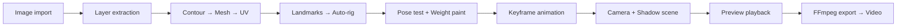

# Milestone 1: Image → 2.5D Pipeline

## Mục tiêu

> Acceptance: "A real image produces a 5–10 second clip with correct deformation
> and alpha/light shadows, and the project reopens."

Triển khai end-to-end pipeline: **AI tạo ảnh → MCP import → mesh/rig → camera/shadow → preview → export clip → project save/reopen**.

## Phạm vi triển khai



---

## Proposed Changes

### 1. Editor UI (`apps/editor/`)

Xây dựng skeleton React app với panel layout chuyên nghiệp theo [UI_SPECIFICATION.md](file:///D:/_DuAn/App_Desktop/workflows/2d-animator-video/docs/UI_SPECIFICATION.md).

#### [NEW] `src/app/App.tsx`
- Root layout: MenuBar + 3-panel (Left/Center/Right) + Timeline bottom
- Mode toggle: Setup / Animate
- Panel resize (CSS Grid + drag handles)
- Keyboard shortcut router

#### [NEW] `src/app/layout/PanelLayout.tsx`
- Resizable panel container (Left, Center, Right, Bottom)
- Panel collapse/expand

#### [NEW] `src/app/layout/MenuBar.tsx`
- File menu (New, Open, Save, Export)
- Mode toggle (Setup ↔ Animate)
- Tool indicators

#### [NEW] `src/app/layout/StatusBar.tsx`
- FPS counter, frame indicator, GPU status

#### [NEW] `src/features/assets/AssetBrowser.tsx`
- Import image button
- Asset list with thumbnails
- Layer tree view

#### [NEW] `src/features/rig/HierarchyPanel.tsx`
- Bone tree view
- Layer tree view
- View set selector

#### [NEW] `src/features/rig/PropertiesPanel.tsx`
- Context-sensitive inspector (Layer / Bone / Keyframe)
- Transform inputs

#### [NEW] `src/features/stage/Viewport.tsx`
- Three.js canvas container
- Overlay toggle buttons (mesh, skeleton, heatmap)
- Mouse/keyboard interaction forwarding

#### [NEW] `src/features/timeline/TimelinePanel.tsx`
- Track list with keyframe diamonds
- Playhead scrubber
- Play/Pause/Stop controls

#### [NEW] `src/ui/` (Design System)
- `Button.tsx`, `Input.tsx`, `Select.tsx`, `Slider.tsx`
- `Panel.tsx`, `SplitPane.tsx`, `Tree.tsx`
- `Icon.tsx` — Lucide wrapper + custom SVG fallback
- `tokens.css` — Color palette, spacing, typography

---

### 2. Application Service (`apps/service/`)

#### [NEW] `apps/service/src/http/routes.ts`
- Express/Fastify HTTP routes proxying to CommandBus

#### [NEW] `apps/service/src/adapters/persistence/fs-storage.ts`
- `StoragePort` implementation for local filesystem
- Atomic writes (temp → rename)

#### [NEW] `apps/service/src/adapters/encoding/ffmpeg-encoder.ts`
- `EncoderPort` implementation — FFmpeg process
- NVENC probe + CPU fallback

#### [NEW] `apps/service/src/bootstrap.ts`
- Wire CommandBus + handlers + ports → start HTTP server

---

### 3. MCP Server (`apps/mcp/`)

#### [NEW] `apps/mcp/src/tools/asset-tools.ts`
- `asset.import_image` — import image file to project
- `asset.list_assets` — list project assets

#### [NEW] `apps/mcp/src/tools/rig-tools.ts`
- `rig.apply_rig_template` — auto-rig with landmark detection
- `rig.get_hierarchy` — inspect bone tree

#### [NEW] `apps/mcp/src/tools/animation-tools.ts`
- `animation.set_keyframe` — insert keyframes
- `animation.apply_template` — apply motion preset

#### [NEW] `apps/mcp/src/tools/export-tools.ts`
- `export.start_job` — start render job
- `export.get_job_status` — poll job progress

#### [NEW] `apps/mcp/src/server.ts`
- MCP SDK server wiring with tool catalog

---

### 4. Command Handlers (`packages/application/`)

#### [NEW] `src/handlers/asset-handlers.ts`
- `asset.import_image` → validate + copy source + create manifest entry
- `asset.set_draw_order` → reorder layers

#### [NEW] `src/handlers/mesh-handlers.ts`
- `mesh.generate` → contour → triangulate → UV → validate

#### [NEW] `src/handlers/rig-handlers.ts`
- `rig.apply_rig_template` → landmarks → auto-skeleton → auto-weights
- `rig.set_weights` → paint weights
- `rig.test_pose` → evaluate pose (no commit)

#### [NEW] `src/handlers/animation-handlers.ts`
- `animation.set_keyframe` → insert/update keyframe in track
- `animation.apply_template` → create tracks from preset

#### [NEW] `src/handlers/export-handlers.ts`
- `export.start_job` → queue render job
- `export.cancel_job` → cancel running job

---

### 5. Runtime Additions (`packages/runtime/`)

#### [NEW] `src/shadows/shadow-pass.ts`
- Alpha-based shadow projection
- Light direction → shadow mesh generation
- Two modes: silhouette shadow, soft artistic shadow

#### [NEW] `src/materials/layer-material.ts`
- Color + alpha + optional normal map
- Tint support

#### [NEW] `src/playback/apply-pose.ts`
- Map core `ComposedVertex[]` to Three.js buffer attributes

---

### 6. Core Additions (`packages/core/`)

#### [NEW] `src/geometry/uv-mapping.ts`
- Image-space UV generation (pixel coords → [0,1])

#### [NEW] `src/deformation/warp-grid.ts`
- Control-grid-based warp deformation for face turns

---

## Open Questions

> [!IMPORTANT]
> **Local service architecture**: MODULE_MAP.md đề xuất `apps/service/` (HTTP server riêng) và `apps/editor/` (React app riêng). Hiện tại project là single Vite app. Bạn muốn:
> - A) **Monolith**: Embed application logic trực tiếp trong React app (CommandBus in-process)
> - B) **Client-Server**: Tách editor UI + local HTTP service (như MODULE_MAP mô tả)
>
> Option A đơn giản hơn cho Milestone 1, Option B đúng kiến trúc nhưng phức tạp hơn.

> [!IMPORTANT]
> **MCP Server**: MCP server cần chạy như process riêng (Node.js) hay embed trong app?
> - A) **Standalone**: `apps/mcp/` chạy riêng, giao tiếp qua HTTP với service
> - B) **In-process**: MCP server share CommandBus trực tiếp với editor

> [!IMPORTANT]
> **Tauri/Desktop**: Milestone 1 có cần wrap trong Tauri chưa hay chạy browser trước?
> - A) **Browser-first**: Chạy Vite dev server, export qua API
> - B) **Tauri ngay**: Desktop wrapper + native FFmpeg access

---

## Verification Plan

### Automated Tests
```sh
node --test packages/core/tests/
node --test packages/application/tests/
npx tsc --noEmit --project packages/contracts/tsconfig.json
npx tsc --noEmit --project packages/core/tsconfig.json
npx tsc --noEmit --project packages/application/tsconfig.json
npx tsc --noEmit --project packages/runtime/tsconfig.json
npx tsc --noEmit
npx vite build
node scripts/quality/check-source-limits.mjs
node scripts/quality/check-doc-sync.mjs
```

### Manual Verification
1. Import một ảnh PNG → thấy trong asset browser
2. Auto-rig → hiển thị skeleton trên viewport
3. Tạo keyframes → chạy preview playback
4. Export → file video .mp4 đúng FPS/resolution
5. Save → Close → Reopen → project state intact

### Acceptance Criteria (from PLAN.md)
- [ ] Real image → 5–10 second clip
- [ ] Correct deformation (bones, weights)
- [ ] Alpha/light shadows visible
- [ ] Project saves and reopens correctly
