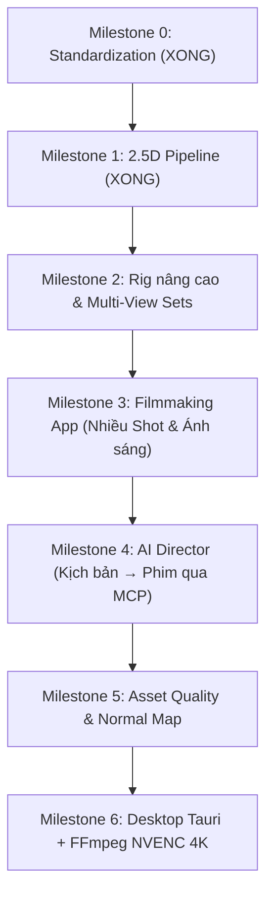

# Kế hoạch bàn giao & Lộ trình phát triển tiếp theo (Milestones 2 → 6)

### Tình trạng hiện tại của dự án

- **Milestone 0 (Chuẩn hóa kiến trúc & Monorepo)**: **ĐÃ XONG 100%**.
- **Milestone 1 (Image → 2.5D Pipeline End-to-End)**: **ĐÃ XONG 100%**.
  - Editor UI 4 panel (Dark mode chuẩn Spine/Live2D) chạy mượt trên Vite dev server (`localhost:5173`).
  - Three.js Viewport kết nối đầy đủ Pan/Zoom, Grid, Wireframe, Skeleton overlay.
  - Tải ảnh / sinh nhân vật mẫu → Tự động tạo lưới 2.5D (Earcut triangulation) → Tự động gắn xương 15 khớp (Auto-Rig) + Tính trọng số da (Bone weights).
  - Diễn hoạt và biến dạng da thời gian thực trên GPU (Playback loop + Timeline scrubbing).
  - Lưu trữ dự án (`localStorage` / file `.parallax.json`) & Xuất video WebM trực tiếp.
  - Standalone MCP Server với 8 tools chuẩn cho AI agent.
  - 100% Unit test, MCP integration test, Type check, và 126 file mã nguồn đều tuân thủ nghiêm ngặt giới hạn ≤ 800 dòng / ≤ 120 cột.

---

### Tổng hợp Plan những phần CHƯA XONG (Milestone 2 → 6)

Dự án Parallax Studio theo thiết kế tổng thể gồm **7 Milestones (0 đến 6)**. Dưới đây là kế hoạch chi tiết của **những phần chưa làm** để bạn tạo task tiếp theo hoặc bàn giao cho dev khác tiếp tục code:



---

#### 📌 Milestone 2: Rig nâng cao & Multi-Angle Views (Hệ thống góc nhìn đa hướng)
*Mục tiêu: Nhân vật có thể quay các góc (Front, 3/4, Side, Back), chớp mắt, há miệng và có công cụ tô trọng số thủ công.*

* **Các tính năng cần làm**:
  1. **View Set Management**: Hỗ trợ chuyển đổi giữa các góc nhìn (`front`, `quarter-left`, `quarter-right`, `side`, `back`) với ngưỡng mượt mà (threshold), không rách lưới hay nhảy pivot.
  2. **Warp / Morph Deformers (Free-Form Deformation)**: Lưới điều khiển (control grid) để làm biểu cảm gương mặt (chớp mắt, há miệng, nhíu mày, squash & stretch) dựa trên `packages/core/src/deformation/`.
  3. **Weight Painting Brush Tool**: Hoàn thiện công cụ cọ vẽ trọng số trực quan ngay trên Viewport (`tool-weight-paint`) khi người dùng click vào xương.
  4. **Inverse Kinematics (IK)**: 2-bone IK solver cho tay và chân (khi kéo bàn chân thì đầu gối và đùi tự gập).
* **Files/Modules sở hữu**:
  - `packages/core/src/views/` (hoàn thiện view selection & interpolation)
  - `packages/core/src/deformation/` (warp grid)
  - `src/features/stage/weight-painter.ts` & `src/features/rig/`
* **Tiêu chí nghiệm thu (Acceptance)**: Chuyển đổi giữa các góc nhìn Front và 3/4 không bị lỗi hiển thị; chớp mắt và cử động mặt mượt mà.

---

#### 📌 Milestone 3: Filmmaking App (Ứng dụng dựng phim 2.5D nhiều cảnh)
*Mục tiêu: Dựng một thước phim ngắn hoàn chỉnh gồm nhiều nhân vật, đạo cụ, camera thị sai và ánh sáng đổ bóng.*

* **Các tính năng cần làm**:
  1. **Multi-Instance 2.5D Scene**: Sắp xếp nhiều nhân vật, background và đạo cụ theo trục chiều sâu $Z$ (Depth Sorting).
  2. **Camera Parallax & Focal Depth**: Điều khiển camera phối cảnh 3D lướt ngang/dọc tạo hiệu ứng thị sai rõ nét giữa tiền cảnh, nhân vật và hậu cảnh.
  3. **Directional Light & Shadow Pass**: Đèn đổ bóng mềm (alpha/light shadow) từ nhân vật xuống mặt đất hoặc tường theo thời gian thực.
  4. **Multi-Shot Timeline & Clip Blending**: Tạo nhiều shot nối tiếp nhau; blend chuyển động mượt giữa các clip (ví dụ: đang đứng yên → chuyển sang bước đi).
* **Files/Modules sở hữu**:
  - `packages/runtime/src/cameras/` & `packages/runtime/src/shadows/`
  - `src/features/timeline/` (multi-track, clip transitions)
  - `src/features/stage/scene-composer.ts`
* **Tiêu chí nghiệm thu (Acceptance)**: Tạo được cảnh phim ngắn 2–3 shots với camera lướt thị sai, có bóng đổ tự nhiên và chuyển shot không giật.

---

#### 📌 Milestone 4: AI Director (Đạo diễn ảo qua MCP)
*Mục tiêu: AI nhận kịch bản chữ, tự động lập danh sách cú máy, dàn dựng nhân vật và xuất video qua MCP.*

* **Các tính năng cần làm**:
  1. **Script Parsing Tool**: MCP tool nhận văn bản kịch bản → phân tích thành Shot List (nhân vật nào, hành động gì, góc máy nào).
  2. **Automated Scene Staging**: MCP tự động gọi các command xếp nhân vật vào scene, đặt keyframe chuyển động và đặt camera.
  3. **Visual Feedback Loop**: MCP render thumbnail/preview các shot để AI tự kiểm tra góc máy/bố cục và tự chỉnh sửa nếu chưa đạt.
* **Files/Modules sở hữu**:
  - `mcp/src/tools/director-tools.ts`
  - `packages/contracts/src/director/`
* **Tiêu chí nghiệm thu (Acceptance)**: AI tự tạo được một đoạn phim 3 shot từ câu lệnh prompt mà không cần người dùng can thiệp thủ công vào timeline.

---

#### 📌 Milestone 5: Asset Quality & Layer Ingestion (Chất lượng Asset & Normal Map)
*Mục tiêu: Hỗ trợ file đồ họa chuyên nghiệp (PSD phân lớp) và ánh sáng khối 3D.*

* **Các tính năng cần làm**:
  1. **PSD Layer Ingestion**: Tích hợp thư viện đọc file PSD (`ag-psd`) để tự tách từng bộ phận (đầu, thân, tóc, phụ kiện) thành các Layer riêng.
  2. **Normal Map & Roughness**: Hỗ trợ nạp Normal Map cho từng layer để bắt ánh sáng đèn chân thực, tạo cảm giác khối nổi 3D dù là ảnh 2D.
  3. **Expression Preset Library**: Bộ thư viện các biểu cảm chuẩn (vui, buồn, ngạc nhiên, giận dữ) áp dụng nhanh cho các nhân vật.
* **Files/Modules sở hữu**:
  - `packages/core/src/material/`
  - `packages/runtime/src/materials/`
  - `src/features/assets/psd-importer.ts`
* **Tiêu chí nghiệm thu (Acceptance)**: Import file PSD giữ nguyên vị trí phân lớp; bật đèn di chuyển thấy khối nhân vật bắt sáng theo Normal map.

---

#### 📌 Milestone 6: Desktop Tauri & Native NVENC 4K (Đóng gói Desktop & Xuất phim 4K@120FPS)
*Mục tiêu: Ứng dụng Desktop độc lập (.exe/.msi), tận dụng phần cứng card RTX 3060 để xuất video 4K siêu nhanh.*

* **Các tính năng cần làm**:
  1. **Tauri Wrapper**: Khởi tạo `src-tauri` (Rust) bọc lấy giao diện web, quản lý tiến trình và file hệ thống máy tính.
  2. **Hardware NVENC FFmpeg Encoder**: Cầu nối gọi FFmpeg với cờ phần cứng `h264_nvenc` / `hevc_nvenc`, fallback về CPU nếu máy không có card NVIDIA.
  3. **Job Queue & Headless Export**: Hỗ trợ render nền không chiếm dụng màn hình, xuất video chuẩn 2K/4K ở tốc độ 60/120 FPS đúng timestamp.
* **Files/Modules sở hữu**:
  - `src-tauri/` (Rust)
  - `packages/application/src/ports/encoder-port.ts`
  - `apps/service/src/adapters/encoding/ffmpeg-encoder.ts`
* **Tiêu chí nghiệm thu (Acceptance)**: Cài đặt và chạy được ứng dụng desktop trên Windows; xuất file video MP4 4K@60FPS bằng card RTX 3060 với thời gian render nhanh hơn realtime.

### Gợi ý bước tiếp theo & Hướng dẫn khi chuyển sang máy khác:

#### 1. Các lệnh khởi động & kiểm tra nhanh khi tải source về máy mới:
```sh
# Cài đặt dependencies
pnpm install

# Kiểm tra chất lượng & giới hạn code (126 files PASS)
node scripts/quality/check-source-limits.mjs

# Chạy kiểm thử Unit test & MCP Integration test
npm run test
npm run test:mcp

# Khởi động Editor UI trên trình duyệt
npm run dev
# Mở trình duyệt tại: http://localhost:5173
```

#### 2. Quy tắc cốt lõi cần nhớ (cho dev mới / AI agent mới):
- **Cấu trúc 4 lớp sạch**:
  - `packages/contracts/`: Zod schemas & types duy nhất.
  - `packages/core/`: Thuật toán thuần túy (Geometry, Rig, Animation, Earcut).
  - `packages/application/`: CommandBus, ProjectState, Handlers. UI và MCP đều đi qua lớp này.
  - `packages/runtime/`: Three.js adapters (SkinnedMesh, Camera, FrameLoop).
  - `src/`: Giao diện React desktop 4-panel (Spine/Live2D aesthetic).
  - `mcp/`: Standalone server Model Context Protocol cho AI.
- **Giới hạn mã nguồn**: Mỗi file tối đa 800 dòng vật lý, mỗi dòng tối đa 120 ký tự. Chạy `node scripts/quality/check-source-limits.mjs` để kiểm tra.

#### 3. Prompt mẫu để dán vào AI ở máy mới làm tiếp Milestone 2:
> "Tôi vừa chuyển repo sang máy này. Milestone 0 và Milestone 1 đã hoàn thành 100%. Hãy đọc file `plans/plan_2.md` và `docs/PLAN.md` để nắm kiến trúc và tiến hành triển khai tiếp **Milestone 2 (Rig nâng cao & Multi-Angle Views + Warp biểu cảm mặt)** cho Parallax Studio."


"Tôi vừa chuyển repo Parallax Studio sang máy này. Milestone 0 và Milestone 1 đã hoàn thành 100%. Hãy đọc file plans/plan_2.md và docs/PLAN.md để nắm kiến trúc hiện tại và tiến hành triển khai tiếp Milestone 2: Rig nâng cao & Multi-Angle Views (Hệ thống góc nhìn đa hướng + Warp biểu cảm mặt)."