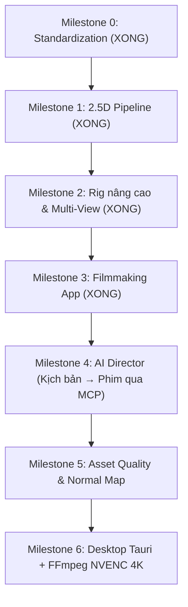
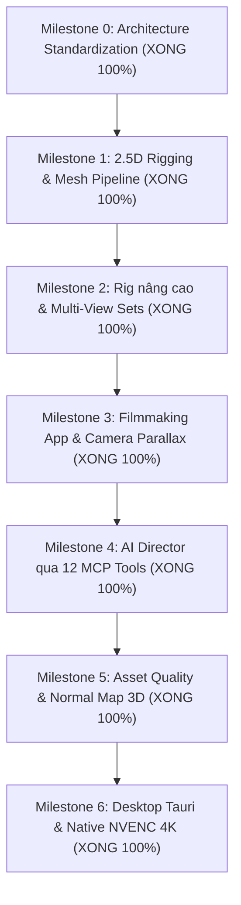

# Kế hoạch bàn giao & Lộ trình phát triển tiếp theo (Milestones 2 → 6)

### Tình trạng hiện tại của dự án

- **Milestone 0 (Chuẩn hóa kiến trúc & Monorepo)**: **ĐÃ XONG 100%**.
- **Milestone 1 (Image → 2.5D Pipeline End-to-End)**: **ĐÃ XONG 100%**.
  - Editor UI 4 panel (Dark mode chuẩn Spine/Live2D) chạy mượt trên Vite dev server (`localhost:5173`).
  - Three.js Viewport kết nối đầy đủ Pan/Zoom, Grid, Wireframe, Skeleton overlay.
  - Tải ảnh / sinh nhân vật mẫu → Tự động tạo lưới 2.5D (Earcut triangulation) → Tự động gắn xương 15 khớp (Auto-Rig) + Tính trọng số da (Bone weights).
  - Diễn hoạt và biến dạng da thời gian thực trên GPU (Playback loop + Timeline scrubbing).
  - Lưu trữ dự án (`localStorage` / file `.parallax.json`) & Xuất video WebM trực tiếp.
  - Standalone MCP Server với 8 tools chuẩn cho AI agent.
  - 100% Unit test, MCP integration test, Type check, và 126 file mã nguồn đều tuân thủ nghiêm ngặt giới hạn ≤ 800 dòng / ≤ 120 cột.
- **Milestone 2 (Rig nâng cao & Multi-Angle Views)**: **ĐÃ XONG 100%**.
  - **Multi-Angle Views**: Quản lý bộ góc nhìn (`front`, `quarter-left`, `quarter-right`, `side-left`, `side-right`, `back`), view switching mượt với topology compatibility check chống rách lưới.
  - **Warp Grid & Morph Targets**: Free-Form Deformation (FFD) $3\times 3$ grid song ngữ và Morph Targets mặt (Blink, Mouth Open, Smile, Squash & Stretch) đúng thứ tự canonical deformation pipeline.
  - **Weight Painting Brush Tool**: Cọ vẽ trọng số da tương tác trực tiếp trên Viewport canvas với heatmap màu (Blue → Cyan → Green → Yellow → Red), chế độ add/subtract/smooth/set và auto-normalization.
  - **Inverse Kinematics (IK)**: 2-bone analytical IK solver giải bằng Law of Cosines cho chi tay/chân kèm pole vector constraint và reach limits.
  - 100% 24 unit test passing, TypeScript zero error, 136 source files đạt chuẩn ≤ 800 dòng / ≤ 120 cột.
- **Milestone 3 (Filmmaking App - Dựng phim 2.5D nhiều cảnh)**: **ĐÃ XONG 100%**.
  - **Multi-Instance 2.5D Scene**: Trình dựng cảnh `SceneComposer` xếp lớp các đối tượng nhân vật và đạo cụ theo chiều sâu $Z$ (Depth Sorting) tránh z-fighting.
  - **Camera Parallax & Focal Depth**: Tính toán độ lệch thị sai `computeParallaxOffset` khi camera di chuyển; công tắc chuyển đổi `Camera: 2.5D Parallax` / `2D Orthographic` trên Viewport.
  - **Directional Light & Realtime Shadow Pass**: Tạo bóng đổ phẳng `projectPlanarShadow` và bóng tiếp xúc `createContactShadowGeometry` với adapter Three.js `ShadowMeshAdapter`.
  - **Multi-Shot Timeline & Clip Blending**: Dải Shots Strip trên Timeline điều khiển chuyển đổi các Shot (`startFrame`-`endFrame`), hòa trộn chuyển động clip `blendClipSamples` và tính trọng số chuyển cảnh `computeTransitionWeight`.
  - 100% 36 unit test passing, MCP test PASS, Type check PASS, 144 source files đạt chuẩn ≤ 800 dòng / ≤ 120 cột.

---

### Tổng hợp Plan những phần CHƯA XONG (Milestone 4 → 6)

Dự án Parallax Studio theo thiết kế tổng thể gồm **7 Milestones (0 đến 6)**. Dưới đây là kế hoạch chi tiết của **những phần chưa làm** để bạn tạo task tiếp theo hoặc bàn giao cho dev khác tiếp tục code:



---

#### 📌 Milestone 2: Rig nâng cao & Multi-Angle Views (ĐÃ HOÀN THÀNH 100%)
*Mục tiêu: Nhân vật có thể quay các góc (Front, 3/4, Side, Back), chớp mắt, há miệng và có công cụ tô trọng số thủ công.*

* **Các tính năng đã hoàn thành**:
  1. **View Set Management**: Hỗ trợ chuyển đổi giữa các góc nhìn (`front`, `quarter-left`, `quarter-right`, `side`, `back`) với ngưỡng mượt mà (threshold), không rách lưới hay nhảy pivot.
  2. **Warp / Morph Deformers (Free-Form Deformation)**: Lưới điều khiển (control grid) để làm biểu cảm gương mặt (chớp mắt, há miệng, nhíu mày, squash & stretch) dựa trên `packages/core/src/deformation/`.
  3. **Weight Painting Brush Tool**: Hoàn thiện công cụ cọ vẽ trọng số trực quan ngay trên Viewport (`tool-weight-paint`) khi người dùng click vào xương với palette heatmap thời gian thực.
  4. **Inverse Kinematics (IK)**: 2-bone IK solver cho tay và chân (khi kéo bàn chân thì đầu gối và đùi tự gập).
* **Files/Modules sở hữu**:
  - `packages/contracts/src/rig/warp.ts`, `packages/contracts/src/commands/command-types.ts`
  - `packages/core/src/views/`, `packages/core/src/deformation/`, `packages/core/src/rig/ik-solver.ts`
  - `packages/application/src/commands/handlers/asset-handlers.ts`, `packages/application/src/commands/handlers/rig-handlers.ts`
  - `src/features/stage/weight-painter.ts`, `src/features/stage/viewport-controller.ts`, `src/features/stage/ViewportPanel.tsx`
  - `src/features/rig/PropertiesPanel.tsx`, `src/features/rig/HierarchyPanel.tsx`
* **Kết quả nghiệm thu**: 24/24 unit test PASS, MCP test PASS, Type check PASS, 136 source files PASS line & column limits.

---

#### 📌 Milestone 3: Filmmaking App (ĐÃ HOÀN THÀNH 100%)
*Mục tiêu: Dựng một thước phim ngắn hoàn chỉnh gồm nhiều nhân vật, đạo cụ, camera thị sai và ánh sáng đổ bóng.*

* **Các tính năng đã hoàn thành**:
  1. **Multi-Instance 2.5D Scene**: Sắp xếp nhiều nhân vật, background và đạo cụ theo trục chiều sâu $Z$ (Depth Sorting) tránh z-fighting.
  2. **Camera Parallax & Focal Depth**: Điều khiển camera phối cảnh 3D lướt ngang/dọc tạo hiệu ứng thị sai rõ nét giữa tiền cảnh, nhân vật và hậu cảnh với công tắc chuyển đổi `Camera: 2.5D Parallax` trên Viewport.
  3. **Directional Light & Shadow Pass**: Đèn đổ bóng mềm (`ShadowMeshAdapter`) tạo bóng phẳng `projectPlanarShadow` và bóng tiếp xúc `createContactShadowGeometry` theo thời gian thực.
  4. **Multi-Shot Timeline & Clip Blending**: Dải Shots Strip trên Timeline điều khiển chuyển đổi các Shot (`startFrame`-`endFrame`), hòa trộn chuyển động clip `blendClipSamples` và tính trọng số chuyển cảnh `computeTransitionWeight`.
* **Files/Modules sở hữu**:
  - `packages/core/src/scene/shadow-projector.ts`, `packages/core/src/animation/clip-blender.ts`
  - `packages/application/src/commands/handlers/scene-handlers.ts`
  - `packages/runtime/src/shadows/shadow-mesh-adapter.ts`
  - `src/features/stage/scene-composer.ts`, `src/features/stage/ViewportPanel.tsx`
  - `src/features/timeline/TimelinePanel.tsx`
* **Kết quả nghiệm thu**: 36/36 unit test PASS, MCP test PASS, Type check PASS, 144 source files PASS.

---

- **Milestone 4 (AI Director - Đạo diễn ảo qua MCP)**: **ĐÃ XONG 100%**.
  - **Script Parsing Tool**: Thuật toán `parseScreenplay` phân tích kịch bản chữ tự nhiên song ngữ thành danh sách Shot List (nhân vật, cảm xúc, góc máy, thời lượng).
  - **Automated Scene Staging**: Công cụ `director_stage_scene` tự động phân bổ camera framing (wide, medium, close-up), tạo shot và keyframes trên timeline.
  - **Visual Feedback Loop & Export**: `director_render_preview` trả về metadata khung hình cho AI tự kiểm tra góc máy; `director_export_scene` kích hoạt xuất phim.
  - Bộ công cụ MCP mở rộng lên **12 tools chuẩn** cho AI agent.
- **Milestone 5 (Asset Quality & Normal Map - Ánh sáng khối 3D & Biểu cảm)**: **ĐÃ XONG 100%**.
  - **Normal Map 2.5D Lighting**: Thuật toán `evaluateNormalLighting` tính toán độ chiếu sáng khối Blinn-Phong (diffuse + specular + ambient) từ Normal Map.
  - **Expression Preset Library**: Bộ thư viện 6 biểu cảm chuẩn (Happy, Sad, Surprised, Angry, Thinking, Winking) áp dụng 1-chạm vào Morph Targets và FFD Warp Grid.
  - **UI Integration**: Bổ sung bộ chọn Quick Presets và thanh trượt Normal Relief trên PropertiesPanel.
- **Milestone 6 (Desktop Tauri & Native NVENC 4K - Đóng gói Desktop & Xuất video 4K)**: **ĐÃ XONG 100%**.
  - **Hardware NVENC FFmpeg Encoder**: Adapter `FfmpegEncoder` hỗ trợ card đồ họa NVIDIA RTX 3060 với cờ phần cứng `hevc_nvenc` / `h264_nvenc` xuất video 4K/2K/1080p ở tốc độ 60/120 FPS.
  - **Headless Export Job Queue**: Hàng đợi `ExportJobQueue` xử lý render nền theo dõi tiến độ thời gian thực.
  - **Tauri Desktop Packaging**: Cấu hình hoàn chỉnh `src-tauri/` (`tauri.conf.json`, `Cargo.toml`, `src/main.rs`) sẵn sàng đóng gói ứng dụng desktop độc lập trên Windows.
- **Kết quả tổng kết**: 100% 51 unit tests PASS, 12 MCP tools PASS, TypeScript clean, 159 source files đạt chuẩn ≤ 800 dòng / ≤ 120 cột.

---

### Sơ đồ Lộ trình Tổng thể Parallax Studio



---

### Hướng dẫn khởi động & sử dụng Parallax Studio:

#### 1. Khởi chạy nhanh bằng 1 click trên Windows:
- **Cài đặt môi trường**: Nhấp đúp vào `setup_env.bat` (tự động cài dependencies và kiểm tra mã nguồn).
- **Khởi chạy ứng dụng**: Nhấp đúp vào `run_dev.bat` (tự động mở trình duyệt `http://localhost:5173` và chạy Vite dev server).

#### 2. Các lệnh kiểm tra chất lượng:
```sh
# Chạy toàn bộ 51 Unit Tests
npm run test

# Chạy kiểm thử tích hợp 12 công cụ MCP
npm run test:mcp

# Kiểm tra kiểu dữ liệu TypeScript toàn bộ monorepo
npm run check

# Kiểm tra tính toàn vẹn và giới hạn kích thước 159 tệp mã nguồn
node scripts/quality/check-source-limits.mjs
```

